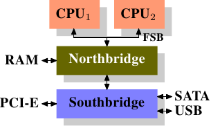
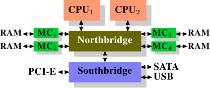
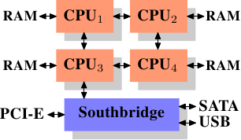

# 2. 現代商用硬體

由於專屬的硬體正在退潮，理解商用硬體是很重要的。時至今日，水平發展比起垂直發展更為常見。意味著現今使用許多較小的、連結在一起的商用電腦，而非少數幾個非常大型且異常迅速（且昂貴）的系統，是較符合成本效益的。這是因為快速且廉價的網路硬體隨處可見。雖然那些大型專門系統仍在一些情況中佔有一席之地，並仍舊有其商機，但整體市場已被商用硬體市場蠶食。Red Hat 於 2007 年預期，對於未來的產品，大多資料中心的「標準建構元件（building block）」將會是一台有著至多四個插槽（socket）的電腦，每個插槽插著一顆四核 CPU，這些 CPU ── 以 Intel CPU 而言 ── 都會採用超執行緒（[hyper-threading](https://en.wikipedia.org/wiki/Hyper-threading)，簡稱 HT）技術。[^2]這表示資料中心的標準系統將會有至多 64 個虛擬處理器（virtual processor）。當然也能夠支援更大的機器，但四槽、四核 CPU 是目前認為最適宜的配置，並且大多的最佳化都是針對這種機器。

由商用元件建構出的電腦，結構上也存在著巨大差異。即便如此，我們將專注於最重大的差異上，從而涵蓋超過 90% 這類硬體。請注意，這些技術細節日新月異，因此奉勸讀者將本文的撰寫日期納入考量。

這些年來，個人電腦以及小型伺服器被標準化為一張晶片組（chipset），其具有兩個部份：北橋（Northbridge）與南橋（Southbridge）。圖 2.1 示意這個結構。

<figure>
  
  <figcaption>圖 2.1：包含北橋與南橋的結構</figcaption>
</figure>

所有（在前面的例子中有兩顆，但可以有更多）CPU 都透過一條共用的匯流排（bus）── 前端匯流排（Front Side Bus，FSB）── 連接到北橋。北橋包含記憶體控制器（memory controller），而它的實作決定用在電腦中的 RAM 晶片類型。不同類型的 RAM ── 諸如 DRAM、Rambus、以及 SDRAM ── 需要不同記憶體控制器。為了與其它系統裝置聯繫，北橋必須與南橋溝通。南橋 ── 經常被稱作 I/O 橋 ── 藉由各種不同的匯流排與各個裝置溝通。
現今，PCI、PCI Express、SATA、與 USB 等最重要的匯流排，以及 PATA、IEEE 1394、序列埠（serial port）、與平行埠（parallel port）都被南橋所支援。較老舊的系統有附屬於北橋的 AGP 槽。這源於南北橋連線速度不夠快速的效能因素。然而現今的 PCI-E 槽都是連接到南橋上的。

這種系統結構有一些值得注意的結果：

* 從一顆 CPU 到另一顆 CPU 的所有資料通訊都必須經過與北橋溝通用的同一條匯流排。
* 所有與 RAM 的溝通都必須通過北橋。
* RAM 只有單埠。[^3]
* 一顆 CPU 與一個依附於南橋的裝置之間的溝通會路經北橋。

幾個瓶頸立刻顯露在這個設計上。其中一個瓶頸牽涉到裝置對 RAM 的存取。在最早期的 PC 中，不管在南北橋上，所有裝置的溝通都必須經過 CPU，負面地影響整體的系統效能。為了繞過這個問題，某些裝置變得能夠支援直接記憶體存取（Direct Memory Access，DMA）。DMA 允許裝置 ── 藉由北橋的幫助 ── 在沒有 CPU 介入（以及相應效能成本）的情況下直接儲存並接收 RAM 中的資料。現今所有依附於任何匯流排上的高效能裝置都能使用 DMA。雖然這大幅地降低 CPU 的工作量，這也引起北橋頻寬的爭奪，由於 DMA 請求與來自 CPU 的 RAM 存取相互競爭的緣故。因此，這個問題必須被納入考量。

第二個瓶頸涉及從北橋到 RAM 的匯流排。匯流排的確切細節視部屬的記憶體類型而定。在較老舊的系統中，只有一條匯流排連接所有的 RAM 晶片，因此平行存取是不可能的。近來的記憶體類型需要兩條分離的匯流排（或稱通道〔channel〕，如同 DDR2 所稱呼的，見圖 2.8），其加倍可用的頻寬。北橋交錯地使用通道進行記憶體存取。更加近代的記憶體技術（舉例來說，FB-DRAM）加入更多的通道。

由於有限的可用頻寬，以延遲最小化的方式排程記憶體存取，對效能來說是很重要的。如同我們將會看到的，處理器比起記憶體快許多，而且必須等待存取記憶體 ── 儘管使用 CPU 快取。假如多個 HT 或多處理器核同時存取記憶體，那麼記憶體存取的等待時間甚至會更長。對 DMA 操作依舊如此。

然而，除了並行（concurrency）之外，存取記憶體還有許多議題。存取模式（access pattern）本身也會大幅地影響記憶體子系統的效能，尤其是有多個記憶體通道的情況。在 2.2 節，我們將會涵蓋更多 RAM 存取模式的細節。

在一些比較昂貴的系統上，北橋並不真的包含記憶體控制器。作為替代，北橋可以連接到多個外部記憶體控制器（在下例中，共有四個）。

<figure>
  
  <figcaption>圖 2.2：包含外部控制器的北橋</figcaption>
</figure>

這個架構的優點是，有多於一個記憶體匯流排，因而提升整體的可用頻寬。這個設計也支援多個記憶體。並行（concurrent）記憶體存取模式藉由同時存取不同的記憶庫（memory bank）來減少延遲。尤其是多個處理器都直接連接到北橋上的情況，如圖 2.2。對於這種設計，主要的限制是北橋的內部頻寬──其對這種（來自於 Intel 的）架構而言是非常大的。[^4]

使用多個外部記憶體控制器並不是提升記憶體頻寬的唯一作法。另一個越來越受歡迎的方式是將記憶體控制器整合到 CPU，並將記憶體附加到每顆 CPU 上。這個架構因為基於 AMD 的 Opteron 處理器的 SMP 系統而流行起來。圖 2.3 展示這樣的系統。
Intel 將從 Nehalem 處理器開始支援通用系統介面（Common System Interface，CSI）；這基本上也是相同的方法：一個讓每個處理器都能擁有區域（local）記憶體的整合式記憶體控制器。

<figure>
  
  <figcaption>圖 2.3：整合式記憶體控制器</figcaption>
</figure>

採用像這樣的架構，有多少處理器，就有多少可用的記憶庫。在一台四核 CPU 的機器上，不需有著巨大頻寬的複雜北橋，記憶體頻寬就能變成四倍。一個整合到 CPU 的記憶體控制器也有些額外的優點；但我們不會在這裡繼續深入這些技術。

這個架構也有缺點。首先，因為機器仍需要讓系統上的所有記憶體都能被所有的處理器存取，記憶體就不再是均勻的（uniform）（於是這種系統便有了 NUMA ── 非均勻記憶體架構〔Non-Uniform Memory Architecture〕── 這個名字）。區域記憶體（附屬於處理器的記憶體）能夠以正常的速度存取。當存取附屬於其他處理器的記憶體時，情況就不同。在這種情況下，就必須用到處理器之間的交互連線（interconnect）。要從 CPU1 存取附屬於 CPU2 的記憶體，就需要通過一條交互連線。當同樣的 CPU 存取附屬於 CPU4 的記憶體就得通過兩條交互連線。

每次這樣的通訊都有其對應的成本。當我們在描述存取遠端（remote）記憶體所需的額外時間時，我們會稱之為「NUMA 因子（factor）」。圖 2.3 中的範例架構中，每個 CPU 都有兩個層級：緊鄰的 CPU，以及一顆相隔兩條交互連線的 CPU。在更加複雜的系統中，層級會顯著地成長。還有一些機器架構（像是 IBM 的 x445 與 SGI 的 Altix 系列）有著不只一種連線類型。CPU 被組織成節點；存取同一節點內的記憶體的時間會是一致的、或是僅需很小的 NUMA 因子。然而，節點間的連線非常昂貴，而且 NUMA 因子非常高。

如今已有商用的 NUMA 機器，而且可能會在未來扮演著更加重要的角色。預計在 2008 年末，每台 SMP 機器都會使用 NUMA。當一支程式執行在一台 NUMA 機器上時，認識到 NUMA 相應的成本是很重要的。我們將會在第五節討論更多機器架構，以及一些 Linux 核心（kernel）為這些程式提供的技術。

除了本節其餘部分描述的技術細節之外，還有許多影響 RAM 效能的額外因素。它們無法被軟體所控制，這也是其不會被涵蓋於本節的原因。感興趣的讀者可以在 2.1 節學到其中一些因素。這其實僅是為了對 RAM 的技術有比較完整的理解，而且可能會在購買電腦時做出更好的選擇。

接下來的兩節會以邏輯閘（gate）層級討論硬體細節，並接觸到記憶體控制器與 DRAM 晶片之間的通訊協定（protocol）。程式開發者或許會發現這些資訊令人豁然開朗，因為這些細節解釋為何 RAM 的存取會如此運作。不過，這都是選讀的知識，急著瞭解與日常生活更直接相關主題的讀者可以往前跳到 2.2.5 節。

[^2]: 超執行緒 (HT) 使得一顆處理器核僅需少量的額外硬體，就能被用來同時處理兩個或多個任務。
[^3]: 我們不會在本文討論到多埠 RAM，因為這種 RAM 並不見於商用硬體中，至少不在程式開發者得存取之處。它可以在仰賴極限速度的專門硬體 ── 像是網路路由器 ── 中找到。
[^4]: 完整起見，這裡需要提到一下，這類記憶體控制器佈局可以被用於其它用途，像是「記憶體 RAID」，它很適合與熱插拔（hotplug）記憶體組合使用。

