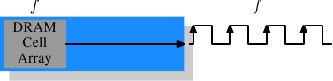
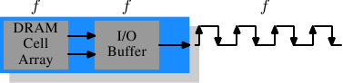
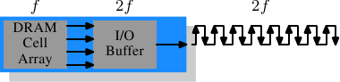
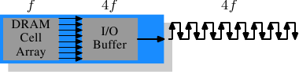

# 2.2.4. 記憶體類型

值得花點時間來看看目前以及即將到來的記憶體類型。我們將從 SDR（單倍資料傳輸速率，Single Data Rate）SDRAM 開始，因為它們是 DDR（雙倍資料傳輸速率，Double Data Rate）SDRAM 的基礎。SDR 十分簡單。記憶單元與資料傳輸速率是一致的。

<figure>
  
  <figcaption>圖 2.10：SDR SDRAM 的運作</figcaption>
</figure>

在圖 2.10 中，記憶單元陣列能夠以等同於經由記憶體匯流排傳輸的速率輸出記憶體內容。假如 DRAM 記憶單元陣列能夠以 100MHz 運作，單一記憶單元的匯流排的資料傳輸率便為 100Mb/s。所有元件的頻率 $$ f $$ 都是一樣的。由於耗能會隨著頻率增加而增加，因此提升 DRAM 晶片的吞吐量（throughput）的代價很高。由於使用大量的陣列單元，代價高得嚇人。[^11]實際上，提升頻率通常也需要提升電壓，以維持系統的穩定性，這更是一個問題。DDR SDRAM（追溯地稱為 DDR1）設法在不提高任何相關頻率的情況下提升吞吐量。

<figure>
  
  <figcaption>圖 2.11：DDR1 SDRAM 的運作</figcaption>
</figure>

SDR 與 DDR1 之間的差異是 ── 如同在圖 2.11 所見、以及從它們名稱來猜測的 ── 每個週期傳輸二倍的資料量。也就是說，DDR1 晶片會在上升*與*下降邊沿傳輸資料。這有時被稱作一條「二倍頻（double-pumped）」匯流排。為了不提升記憶單元陣列的頻率，必須引入一個緩衝區（buffer）。這個緩衝區會持有每條資料線的二個位元。這轉而要求令 ── 圖 2.7 的記憶單元陣列中的 ── 資料匯流排由二條線路組成。實作的方式很直觀：只要對二個 DRAM 記憶單元使用相同的行位址，並且平行存取它們就行。這個實作對記憶單元陣列的改變也非常小。

SDR DRAM 直接採用其頻率來命名（例如 PC100 代表 100MHz SDR）。由於 DDR1 DRAM 的頻率不會改變，廠商必須想出新的命名方式，讓它聽起來更厲害。他們提出的名字包含一個 DDR 模組（擁有 64 位元匯流排）能夠維持、以位元組為單位的傳輸速率：

$$
100\text{MHz} \times 64\text{bit} \times 2 = 1,600\text{MB/s}
$$

於是一個頻率為 100MHz 的 DDR 模組就稱為 PC1600。因為 1600 > 100，滿足一切銷售需求；這聽起來更棒，縱使實際上*只*提升成二倍而已。[^12]

<figure>
  
  <figcaption>圖 2.12：DDR2 SDRAM 的運作</figcaption>
</figure>

為了突破這些記憶體技術，DDR2 包含少許額外的革新。能從圖 2.12 上看到的最明顯的改變是，匯流排的頻率加倍。頻率加倍意味著頻寬加倍。由於頻率加倍對記憶單元陣列來說並不經濟，因此現在需要由 I/O 緩衝區在每個時脈週期讀取四個位元，然後才送到匯流排上。這代表 DDR2 模組的改變是，只讓 DIMM 的 I/O 緩衝區元件擁有能以更快速度運轉的能力。這當然是可能的，而且不需太多能量，因為這只是個小元件，而非整個模組。廠商為 DDR2 想出的名稱與 DDR1 的名稱相似，只是在計算值的時候，乘以二變成乘以四（我們現在有條四倍頻〔quad-pumped〕匯流排）。表 2.1 顯示現今使用的模組名稱。

<figure>
  <table>
    <tr>
      <th>陣列頻率</th>
      <th>匯流排頻率</th>
      <th>資料速率</th>
      <th>名稱（速率）</th>
      <th>名稱（FSB）</th>
    </tr>
    <tr>
      <td>133MHz</td>
      <td>266MHz</td>
      <td>4,256MB/s</td>
      <td>PC2-4200</td>
      <td>DDR2-533</td>
    </tr>
    <tr>
      <td>166MHz</td>
      <td>333MHz</td>
      <td>5,312MB/s</td>
      <td>PC2-5300</td>
      <td>DDR2-667</td>
    </tr>
    <tr>
      <td>200MHz</td>
      <td>400MHz</td>
      <td>6,400MB/s</td>
      <td>PC2-6400</td>
      <td>DDR2-800</td>
    </tr>
    <tr>
      <td>250MHz</td>
      <td>500MHz</td>
      <td>8,000MB/s</td>
      <td>PC2-8000</td>
      <td>DDR2-1000</td>
    </tr>
    <tr>
      <td>266MHz</td>
      <td>533MHz</td>
      <td>8,512MB/s</td>
      <td>PC2-8500</td>
      <td>DDR2-1066</td>
    </tr>
  </table>
  <figcaption>表 2.1：DDR2 模組名稱</figcaption>
</figure>

命名上還有個彆扭之處。用於 CPU、主機板、以及 DRAM 模組的 FSB 速度是使用*實質上的*頻率來指定的。也就是將時脈週期的二個邊沿都納入傳輸的因素，從而浮誇數字。因此，一個擁有 266MHz 匯流排的 133MHz 模組，它的 FSB「頻率」為 533MHz。

沿著轉變到 DDR2 的路線，DDR3（真正的 DDR3，而非用於顯卡中的假 GDDR3）的規範尋求更多的改變。電壓從 DDR2 的 1.8V 降至 DDR3 的 1.5V。由於功率消耗公式是使用電壓的平方來算的，因此光這點就改善 30%。加上晶粒（die）尺寸的縮小以及其它電氣相關的改進，DDR3 能夠在相同的頻率下降低一半的功率消耗。或者，在相同功率包絡（envelope）的情況下達到更高的頻率。又或者，在維持相同熱能排放量的情況下加倍容量。

DDR3 模組的記憶單元陣列會以外部匯流排的四分之一速度運轉，其需要將 DDR2 的 4 位元 I/O 緩衝區加大到 8 位元。示意圖見圖 2.13。

<figure>
  
  <figcaption>圖 2.13：DDR3 SDRAM 的運作</figcaption>
</figure>

起初，DDR3 模組的 $$ \overline{\text{CAS}} $$ 等待時間可能會略高一些，因為 DDR2  技術更為成熟。這會導致 DDR3 只有在頻率高於 DDR2 能達到的頻率時才有用，且更甚的是通常只有在頻寬比延遲更加重要的時候才有用。已有達到與 DDR2 相同 $$ \overline{\text{CAS}} $$ 等待時間的 1.3V 模組的風聲。無論如何，因更快的匯流排而達到更高速度的可能性將會比增加的延遲更重要。

一個 DDR3 的可能問題是，對於 1,600Mb/s 或更高的傳輸率，每個通道的模組數量可能會減至僅剩一個。在早期的版本中，對於任何頻率都有這個要求，所以可以期待在某個時間點，這項要求會被剔除。否則會嚴重地限制系統的能力。

表 2.2 列出我們很可能會看到的 DDR3 模組名稱。JEDEC 到目前為止接受前四種。鑑於 Intel 的 45nm 處理器擁有速度為 1,600Mb/s 的 FSB，1,866Mb/s 便為超頻市場所需。隨著 DDR3 的發展，我們大概會看到更多的類型。

<figure>
  <table>
    <tr>
      <th>陣列頻率</th>
      <th>匯流排頻率</th>
      <th>資料速率</th>
      <th>名稱（速率）</th>
      <th>名稱（FSB）</th>
    </tr>
    <tr>
      <td>100MHz</td>
      <td>400MHz</td>
      <td>6,400MB/s</td>
      <td>PC3-6400</td>
      <td>DDR3-800</td>
    </tr>
    <tr>
      <td>133MHz</td>
      <td>533MHz</td>
      <td>8,512MB/s</td>
      <td>PC3-8500</td>
      <td>DDR3-1066</td>
    </tr>
    <tr>
      <td>166MHz</td>
      <td>667MHz</td>
      <td>10,667MB/s</td>
      <td>PC3-10667</td>
      <td>DDR3-1333</td>
    </tr>
    <tr>
      <td>200MHz</td>
      <td>800MHz</td>
      <td>12,800MB/s</td>
      <td>PC3-12800</td>
      <td>DDR3-1600</td>
    </tr>
    <tr>
      <td>233MHz</td>
      <td>933MHz</td>
      <td>14,933MB/s</td>
      <td>PC3-14900</td>
      <td>DDR3-1866</td>
    </tr>
  </table>
  <figcaption>表 2.2：DDR3 模組名稱</figcaption>
</figure>

所有的 DDR 記憶體都有個問題：匯流排頻率的提升，會使得建立平行資料匯流排變得困難。DDR2 模組有 240 根針腳。必須要規劃所有連結到資料與位址針腳的佈線，以讓它們有大略相同的長度。還有個問題是，假如多過一個 DDR 模組被菊花鏈結（daisy-chain）在同一條匯流排上，對於每個附加的模組而言，訊號會變得越來越歪曲。DDR2 規範只允許在每個匯流排（亦稱作通道）上有二個模組，DDR3 規範在高頻時只能有一個。由於每個通道有 240 根針腳，使得單一北橋無法合理地驅動多於二個通道。替代方式是擁有外部的記憶體控制器（如圖 2.2），但這代價不小。

這所代表的是，商用主機板受限於至多持有四個 DDR2 或 DDR3 模組。這大大地限制一個系統能夠擁有的記憶體總量。即使是老舊的 32 位元 IA-32 處理器都能擁有 64GB 的 RAM，即使對於家用，記憶體需求也在持續增長，所以必須做點什麼。

一個解決辦法是將記憶體控制器加到每個處理器中，如同第二節所述。AMD 的 Opteron 系列就是這麼做的，Intel 也將以他們的 CSI 技術來達成。只要處理器所能使用的、適當的記憶體容量都能被連接到單一處理器上，這會有所幫助。在某些情況下並非如此，這個設置會引入 NUMA 架構，伴隨著其負面影響。對某些情況來說，則需要另外的解法。

Intel 針對大型伺服器機器的解法 ── 至少在現在 ── 被稱為全緩衝 DRAM （Fully Buffered DRAM，FB-DRAM）。FB-DRAM 模組使用與現今 DDR2 模組相同的記憶體晶片，這使得它的生產相對便宜。差異在連結到記憶體控制器的連線中。FB-DRAM 使用的並非平行資料匯流排，而是一條序列匯流排（也能追溯 Rambus DRAM、PATA 的後繼者 SATA 以及 PCI/AGP 的後繼者 PCI Express）。序列匯流排能以極高頻驅動、恢復序列化的負面影響，甚至提升頻寬。使用序列匯流排的主要影響為

1. 每個通道能使用更多模組。
2. 每個北橋／記憶體控制器能使用更多通道。
3. 序列匯流排是被設計成全雙工的（fully-duplex）（二條線）。
4. 實作一條差動（differential）匯流排（每個方向二條線）足夠便宜，因而能提高速度。

相比於 DDR2 的 240 根針腳，一個 FB-DRAM 模組只有 69 根針腳。由於能較為妥善地處理匯流排的電氣影響，菊花鏈結 FB-DRAM 模組要簡單許多。FB-DRAM 規範允許每通道至多 8 個 DRAM 模組。

以雙通道北橋的連線需求來比較，現在可能以更少的針腳來驅動 FB-DRAM 的六個通道：2 × 240 根針腳對比於 6 × 69 根針腳。每個通道的佈線更為簡單，這也有助於降低主機板的成本。

對於傳統 DRAM 模組來說，全雙工平行匯流排貴得嚇人，因為要將所有線路變為二倍的成本高昂。使用序列線路（即使是如 FB-DRAM 所需的差動式）情況就不同，序列匯流排因而被設計為全雙工，意味著在某些情況下，理論上光是如此頻寬就能加倍。但這並非唯一使用平行化來提升頻寬之處。由於一個 FB-DRAM 控制器能夠同時連接多達六個通道，即使對於較小 RAM 容量的系統，使用 FB-DRAM 也能夠提升頻寬。在具有四個模組的 DDR2 系統擁有二個通道的情況下，相同的能力得以使用一個普通的 FB-DRAM 控制器，經由四個通道來達成。序列匯流排的實際頻寬取決於用在 FB-DRAM 模組的 DDR2（或 DDR3） 晶片類型。

我們能像這樣總結優點：

 | DDR2 | FB-DRAM
--- | --- | ---
針腳數 | 240 | 69
通道數 | 2 | 6
DIMM 數／通道數 | 2 | 8
最大記憶體[^13] | 16GB[^14] | 192GB
吞吐量[^15] | ~10GB/s | ~40GB/s

如果要在一個通道上使用多個 DIMM，FB-DRAM 有幾個缺點。在鏈結的每個 DIMM 上，訊號會被延遲 ── 儘管很小，因而增加等待時間。第二個問題是，由於非常高的頻率和驅動匯流排的需求，晶片驅動序列匯流排需要大量的能量。但有著同樣頻率、同樣記憶體容量的 FB-DRAM 總是比 DDR2 與 DDR3 還快，至多四個的 DIMM 每個都能擁有自己的通道；對於大型記憶體系統，DDR 完全沒有任何使用商用元件的解決方法。

[^11]: 功率 = 動態電容 × 電壓2 × 頻率

[^12]: 我會使用二作為倍率，但我不必喜歡浮誇的數字。

[^13]: 假設為 4GB 模組。

[^14]: 一份 Intel 的簡報 ── 基於某些我不理解的原因 ── 說是 8GB...

[^15]: 假設為 DDR2-800 模組。

