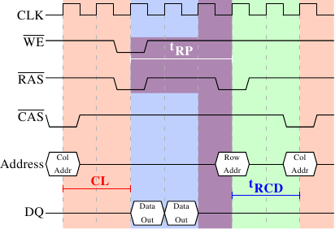

# 2.2.2. 預充電與有效化

圖 2.8 並沒有涵蓋整個週期。它只顯示出存取 DRAM 的完整循環的一部分。在能夠發送新的 $$ \overline{\text{RAS}} $$ 訊號之前，必須無效化（deactivate）當前鎖上的列，並對新的列預充電（precharge）。這裡我們僅聚焦在藉由明確命令來執行的情況。有些協定上的改進––在某些情況下––能夠避免這個額外步驟。不過由預充電引入的延遲仍然會影響操作。

<figure>
  
  <figcaption>圖 2.9：SDRAM 預充電與有效化</figcaption>
</figure>

圖 2.9 示意從 $$ \overline{\text{CAS}} $$ 訊號開始、到另一列的 $$ \overline{\text{CAS}} $$ 訊號為止的活動。與先前一樣，經過 CL 週期後，便能夠取得以第一個 $$ \overline{\text{CAS}} $$ 訊號請求的資料。在這個例子中，請求兩個字組，其––在一個簡易的 SDRAM 上––花了兩個週期來傳輸。也可以想像成是在一張 DDR 晶片上傳輸四個字組。

即使在命令速率為 1 的 DRAM 模組上，也無法立即發出預充電命令。它必須等待與傳輸資料一樣長的時間。在這個例子中，它花了兩個循環。雖然與 CL 相同，但這只是巧合。預充電訊號沒有專用的線路；有些實作是藉由同時降低允寫（Write Enable，$$ \overline{\text{WE}} $$）與 $$ \overline{\text{RAS}} $$ 的電位來發出這個命令。這個組合本身沒什麼特別意義（編碼細節見 [18]）。

一旦發出預充電命令，它會花費 tRP（列預充電時間）個週期，直到列能被選取為止。在圖 2.9 中，大部分的時間（以紫色標示）與記憶體傳輸時間（淺藍）重疊。這滿好的！但 tRP 比傳輸時間還長，所以下一個 $$ \overline{\text{RAS}} $$ 訊號會被延誤一個週期。

假使我們延伸圖表的時間軸，我們會發現下一次資料傳輸發生在前一次停止的 5 個週期之後。這表示在七個週期中，只有兩個週期有用到資料匯流排。將這乘上 FSB 的速度，對 800MHz 匯流排而言，理論上的 6.4GB/s 就變成 1.8GB/s。這太糟，而且必須避免。在第六節描述的技術能幫忙提升這個數字。程式開發者通常也得盡一份力。

對於 SDRAM 模組，還有一些沒有討論過的時間值。在圖 2.9 中，預充電命令受限於資料傳輸時間。另一個限制是，在 $$ \overline{\text{RAS}} $$ 訊號之後，SDRAM 模組需要一些時間才能夠為另一列預充電（記作 tRAS）。這個數字通常非常大，為 tRP 值的兩到三倍。假如––在 $$ \overline{\text{RAS}} $$ 訊號之後––只有一個 $$ \overline{\text{CAS}} $$ 訊號，並且資料傳輸在少數幾個週期內就完成，這就是問題。假設在圖 2.9 中，起始的 $$ \overline{\text{CAS}} $$ 訊號是直接接在 $$ \overline{\text{RAS}} $$ 訊號之後，並且 tRAS 為 8 個週期。預充電命令就必須要延遲一個額外的週期，因為 tRCD、CL、與 tRP（因為它比資料傳輸時間還長）的總和只有 7 個週期。

DDR 模組經常以一種特殊的標記法描述：w-x-y-z-T。舉例來說：2-3-2-8-T1。這代表：

<table>
  <tr>
    <td>w</td>
    <td>2</td>
    <td>$$ \overline{\text{CAS}} $$ 等待時間（CL）</td>
  </tr>
  <tr>
    <td>x</td>
    <td>3</td>
    <td>$$ \overline{\text{RAS}} $$ 至 $$ \overline{\text{CAS}} $$ 等待時間（tRCD）</td>
  </tr>
  <tr>
    <td>y</td>
    <td>2</td>
    <td>$$ \overline{\text{RAS}} $$ 預充電（tRP）</td>
  </tr>
  <tr>
    <td>z</td>
    <td>8</td>
    <td>有效化至預充電延遲（tRAS）</td>
  </tr>
  <tr>
    <td>T</td>
    <td>T1</td>
    <td>命令速率</td>
  </tr>
<table>

還有許多其它會影響命令的發送或處理方式的時間常數。不過在實務上，這五個常數就足以判定模組的效能。

知道這些關於電腦的資訊，有時有助於解釋某些量測結果。購買電腦的時候，知道這些細節顯然是有用的，因為它們––以及 FSB 與 SDRAM 模組的速度––是決定一台電腦速度的最重要因素。

非常大膽的讀者也可以試著調校（tweak）系統。有時候 BIOS 允許修改某些或者全部的值。SDRAM 模組擁有能夠設定這些值的可程式化暫存器（register）。通常 BIOS 會挑選最佳的預設值。如果 RAM 模組的品質很好，可能可以在不影響電腦穩定性的前提下降低某些延遲。網路上眾多的超頻網站提供大量的相關文件。儘管如此，請自行承擔風險，可別說你沒被警告過。

