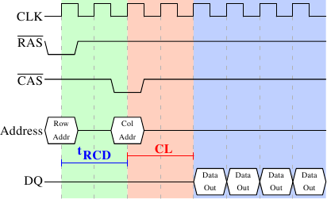

# 2.2.1. 讀取協定

<figure>
  
  <figcaption>圖 2.8：SDRAM 讀取時序</figcaption>
</figure>

圖 2.8 顯示了 DRAM 模組上一些連線的活動，發生在三個標上不同顏色的階段。像往常一樣，時間從左到右流動。許多細節被省略了。這裡我們僅討論匯流排時鐘、$$ \overline{\text{RAS}} $$ 與 $$ \overline{\text{CAS}} $$ 訊號、以及位址與資料匯流排。讀取週期從記憶體控制器在位址匯流排提供列位址、並降低 $$ \overline{\text{RAS}} $$ 訊號的電位開始。所有訊號都會在時鐘（CLK）的上升邊沿（rising edge）被讀取，因此若是訊號並不是完全的方波也無所謂，只要在讀取的這個時間點是穩定的就行了。設置列位址會使得 RAM 晶片鎖上（latch）指定的列。

經過 tRCD（$$ \overline{\text{RAS}} $$ 至 $$ \overline{\text{CAS}} $$ 的延遲）個時脈週期之後，便能發出 $$ \overline{\text{CAS}} $$ 訊號。這時行位址便能藉由位址匯流排提供、以及降低 $$ \overline{\text{CAS}} $$ 線路的電位來傳輸。這裡我們可以看到，位址的兩個部分（約莫是對半分，其餘的情況並不合理）是如何透過同樣的位址匯流排來傳輸。

現在定址已經完成，可以傳輸資料了。為此 RAM 晶片需要一點時間準備。這個延遲通常被稱作 $$ \overline{\text{CAS}} $$ 等待時間（$$ \overline{\text{CAS}} $$ Latency，CL）。在圖 2.8 中，$$ \overline{\text{CAS}} $$ 等待時間為 2。這個值可高可低，取決於記憶體控制器、主機板、以及 DRAM 模組的品質。等待時間也可以是半週期。以 CL=2.5 而言，資料將能夠在藍色區塊的第一個*下降*邊沿時取得。

對於取得資料的這些準備工作而言，僅傳輸一個字組的資料是很浪費的。這即是為何 DRAM 模組允許記憶體控制器指定要傳輸多少資料。通常選擇在 2、4、或 8 字組之間。這便能在不提供新的 $$ \overline{\text{RAS}} $$／$$ \overline{\text{CAS}} $$ 序列的情況下填滿快取中的整行（line）。記憶體控制器也能夠在不重設列的選取的情況下發出新的 $$ \overline{\text{CAS}} $$ 訊號。藉由這種方式，能夠非常快速地讀取或寫入連續的記憶體位址，因為不必發出 $$ \overline{\text{RAS}} $$ 訊號，也不必將列無效化（deactivate）（見後文）。記憶體控制器必須決定是否讓列保持「開啟（open）」。一直任其開啟，對實際的應用程式來說有些負面影響（見 [3]）。發出新的 $$ \overline{\text{CAS}} $$ 訊號僅受 RAM 模組的命令速率（command rate）控制（通常設為 T*x*，其中 *x* 為像是 1 或 2 的值；每個週期都接受命令的高效能 DRAM 模組會設為 1）。

在這個例子中，SDRAM 在每個週期吐出一個字組。第一世代就是這麼做的。DDR 能夠在每個週期傳輸兩個字組。這減少了傳輸時間，但沒有改變等待時間。雖然在實務上看起來不同，但原理上 DDR2 運作如斯。這裡沒有再深入細節的必要了。能夠注意到 DDR2 可以變得更快、更便宜、更可靠、並且更省電（更多資訊見 [6]）就夠了。

