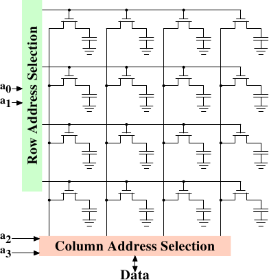

# 2.1.3. DRAM 存取

一支程式使用虛擬位址（virtual address）來選擇記憶體位置。處理器將其翻譯成實體位址（physical address），最終由記憶體控制器選擇對應於這個位址的 RAM 晶片。為了選擇 RAM 晶片中的個別記憶單元，實體位址的一部分會以數條位址線（address line）的形式被傳遞進去。

由記憶體控制器個別定址（address）記憶體位置是極為不切實際的：4GB 的 RAM 會需要 232 條位址線。作為替代，位址會使用較小的一組位址線，編碼成二進位數字傳遞。以這種方式傳遞到 DRAM 晶片的位址必須先被解多工（demultiplex）。有 $$ N $$ 條位址線的解多工器（demultiplexer）將會有 2$$ N $$ 條輸出線（output line）。這些輸出線能被用以選擇記憶單元。對於小容量的晶片而言，使用這種直接的方法是沒什麼大問題的。

但假如記憶單元的數量增加，這個方法就不再合適。一個 1Gbit[^6] 容量的晶片將會需要 30 條位址線以及 230 選擇線（select line）。在不犧牲速度的前提下，解多工器的大小會隨著輸入線（input line）的數量以指數成長。用於 30 條位址線的解多工器需要大量的晶片空間，外加解多工器的（尺寸與時間）複雜度。更重要的是，同時在位址線上傳輸 30 個脈衝（impulse）比「只」傳輸 15 個脈衝還要難得多。Fewer lines have to be laid out at exactly the same length or timed appropriately.[^7]

<figure>
  
  <figcaption>圖 2.7：動態 RAM 示意圖</figcaption>
</figure>

圖 2.7 顯示了以極高階角度示意的 DRAM 晶片。DRAM 記憶單元被組織在列（row）與行（column）中。雖然它們可以全都排成一列，但 DRAM 晶片會因而需要一個龐大的解多工器。藉由這種排列方式，便能夠以各為一半大小的一個解多工器與一個多工器達到這種目的。[^8]這從各方面來說都是個大大的節約。在這個例子中，位址線 $$ \mathbf{a_{0}} $$ 與 $$ \mathbf{a_{1}} $$ 透過*列位址選擇（row address selection）*（$$ \overline{\text{RAS}} $$）[^9]解多工器選擇一整列記憶單元的位址線。在讀取時，所有記憶單元的內容都能夠被*行位址選擇（column address selection）*多工器（multiplexer）（$$ \overline{\text{CAS}} $$）取得。基於位址線 $$ \mathbf{a_{2}} $$ 與 $$ \mathbf{a_{3}} $$，其中一行的內容便能夠提供給 DRAM 晶片的資料針腳（pin）。這會在許多 DRAM 晶片上平行地發生多次，以產生對應於資料匯流排寬度的所有位元。

對於寫入操作，新的記憶單元的值會被置於資料匯流排中，然後——當記憶單元藉由 $$ \overline{\text{RAS}} $$ 與 $$ \overline{\text{CAS}} $$ 選取時——儲存到資料單元中。相當直觀的設計。這實際上有著——顯然地——更多的困難。需要規範發出訊號之後，在資料能夠由資料匯流排讀取之前有多少延遲。如同上節所述，電容無法立即充放電。來自於記憶單元的訊號太微弱了，以致於它非得被放大（amplify）不可。對於寫入操作，必須指定設置完 $$ \overline{\text{RAS}} $$ 與 $$ \overline{\text{CAS}} $$ 之後，資料必須在匯流排維持多久，才能夠成功地在記憶單元中儲存新值（再提醒一次，電容不會立即被充放電）。這些時間常數（constant）對於 DRAM 晶片的效能而言是至關重要的。我們將會在下一節討論這些。

一個次要的可擴展性問題是，令 30 條位址線都連接到每個 RAM 晶片也不大可行。一個晶片的針腳是個寶貴的資源。必須盡可能多地平行傳輸資料（像是一次 64 位元）已經夠「糟」了。記憶體控制器必須能夠定址每個 RAM 模組（module）（RAM 晶片的集合）。假如因為效能因素，需要平行存取多個 RAM 模組，並且每個 RAM 模組需要它所擁有的一組 30 條或者更多條位址線，那麼僅為了處理位址，記憶體控制器就必須要有——以 8 個 RAM 模組而言——多達 240+ 根針腳。

為了克服這些次要的可擴展性問題，DRAM 晶片——長期以來——必須自行多工位址。這代表位址會被轉變成兩個部分。由位址位元（圖 2.7 的例子中的 $$ \mathbf{a_{0}} $$ 與 $$ \mathbf{a_{1}} $$）組成的第一個部分選取列。這個選擇直到撤銷之前都會維持有效。接著第二個部分，位址位元 $$ \mathbf{a_{2}} $$ 與 $$ \mathbf{a_{3}} $$，選取行。決定性的差異在於，只需要兩條外部的位址線。[^譯註]需要額外一些少量的線路來代表能否取得 $$ \overline{\text{RAS}} $$ 與 $$ \overline{\text{CAS}} $$ 的線路，但這對於減半位址線來說，這只是個很小的代價。不過，這種位址多工帶來了一些自身的問題。我們將會在 2.2 節討論這些問題。

[^6]: 我厭惡這些 SI 前綴（prefix）。對我來說一個 giga-bit 永遠是 230 而非 109 位元。
[^7]: Modern DRAM types like DDR3 can automatically adjust the timing but there is a limit as to what can be tolerated.
[^8]: 多工器與解多工器是對等的，並且這裡的多工器在寫入時需要如解多工器一般運作。所以從現在開始我們要忽略其差異。
[^9]: 名字上的線表示訊號是反相的（negated）。
[^譯註]: 這裡的意思單看字面可能比較難理解。以圖 2.7 為例，記憶體由 4 × 4 的記憶單元組成。對外僅提供兩條位址線。在選擇記憶單元時，首先由兩條外部位址線指定列，並將結果暫存起來。接著，再利用同樣的兩條外部位址線指定行。便能夠只用兩條外部位址線來指定 16 個記憶單元中的一個。詳見 2.2 節。

