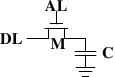
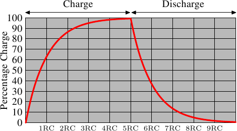

# 2.1.2. 動態 RAM

動態 RAM 在其結構上比靜態 RAM 簡單許多。圖 2.5 示意了常見的 DRAM 記憶單元設計結構。它僅由一個電晶體以及一個電容（capacitor）組成。複雜度上的巨大差異，自然意味著其與靜態 RAM 的運作方式非常不同。

<figure>
  
  <figcaption>圖 2.5：1-T 動態 RAM</figcaption>
</figure>

一個動態 RAM 的記憶單元在電容 $$ \mathbf{C} $$ 中保存其狀態。電晶體 $$ \mathbf{M} $$ 用以控制狀態的存取。為了讀取記憶單元的狀態，要提高存取線路 $$ \mathbf{AL} $$ 的電位；這要不使得電流流經資料線路（data line） $$ \mathbf{DL} $$、要不沒有，取決於電容中的電量。要寫到記憶單元中，則要適當地設置資料線路 $$ \mathbf{DL} $$，然後提高 $$ \mathbf{AL} $$ 的電位一段足以讓電容充電或放電的時間。

動態 RAM 有許多設計上的難題。使用電容意味著讀取記憶單元時會對電容放電。這件事無法不斷重複，必須在某個時間點上對電容重新充電。更糟的是，為了容納大量的記憶單元（晶片有著 109 或者更多的記憶單元在現今是很普遍的），電容的電量必須很低（在飛〔femto，10-15〕法拉範圍內或者更小）。完全充電後的電容容納了數萬個電子。儘管電容的電阻很高（幾兆歐姆），耗盡電容仍舊只需要很短的時間。這個問題被稱為「洩漏（leakage）」。

這種洩漏是 DRAM 必須被持續充電的原因。對於現今大部分 DRAM 晶片，每 64ms 就必須重新充電一次。在重新充電的期間內是無法存取記憶體的，因為重新充電基本上就是直接丟棄結果的讀取操作。對某些工作而言，這個額外成本可能會延誤高達 50% 的記憶體存取（見 [3]）。

第二個––因微小電量而造成––的問題是，從記憶單元讀取的資訊無法直接使用。資料線路必須被連接到感測放大器（sense amplifier），其能夠根據仍需計作 1 的電量範圍來分辨儲存的 0 或 1。

第三個問題是，從記憶單元進行讀取會消耗電容的電量。這代表每次的讀取操作都必須接著進行重新對電容充電的操作。這能夠透過將感測放大器的輸出餵回到電容裡頭來自動達成。雖然這代表讀取記憶體內容需要額外的電力以及––更為重要地––時間。

第四個問題是，對電容充放電並不是立即完成的。由於感測放大器接收到的訊號並不是直角的，因此必須使用一個謹慎的估計，以得知何時可以使用記憶單元的輸出。對電容充放電的公式為

$$
\begin{aligned}
Q_{\text{Charge}}(t) &= Q_{0}(1 - e^{-\frac{t}{RC}})
\\
Q_{\text{Discharge}}(t) &= Q_{0} e^{-\frac{t}{RC}}
\end{aligned}
$$

這代表讓電容充電或放電需要一些時間（由電量 C 與電阻 R 決定）。這也代表無法立即使用能被感測放大器偵測的電流。圖 2.6 顯示了充電與放電的曲線。X 軸以 RC（電阻乘上電量）為單位，這是一種時間單位。

<figure>
  
  <figcaption>圖 2.6：電容充電與放電時間</figcaption>
</figure>

不像靜態 RAM 能夠在字組存取線路的電位提高時立即取得輸出結果，它會花費一些時間以讓電容被充分放電。這個延遲嚴重地限制了 DRAM 能夠達到的速度。

簡單的方法也有其優點。最主要的優點是大小。比起一個 SRAM 的記憶單元，一個 DRAM 的記憶單元所需的晶片面積要小好幾倍。SRAM 記憶單元也需要個別的電力來維持電晶體的狀態。DRAM 記憶單元的結構也較為簡單，這代表能較輕易地將許多記憶單元緊密地塞在一起。

總體來說，贏在（極為戲劇性的）成本差異。除了在專門的硬體––舉例來說，網路路由器––之外，我們必須採用基於 DRAM 的主記憶體。這對程式設計師有著巨大的影響，我們將會在本文的其餘部分討論它們。但首先，我們需要先多理解一些實際使用 DRAM 記憶單元的細節。

