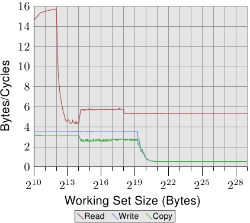
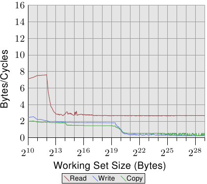
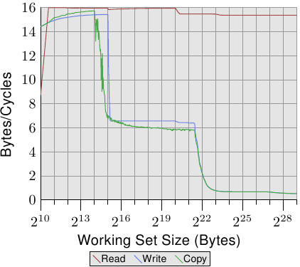
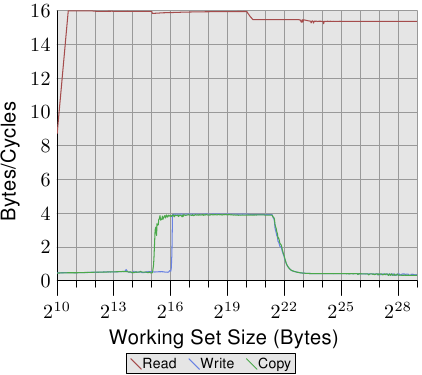
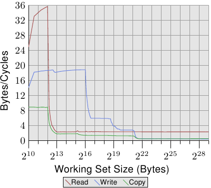

# 3.5.1. 快取與記憶體頻寬

為了更好地理解處理器的能力，我們要量測在最理想情況下的可用頻寬。這個量測格外有趣，因為不同處理器版本的差異很大。這即是本節充滿著數個不同機器數據的原因。量測效能的程式使用了 x86 與 x86-64 處理器的 SSE 指令以同時載入或儲存 16 位元組。就如同我們的其它測試一樣，工作集從 1kB 增加到 512MB，並量測每個週期能夠載入或儲存多少位元組。

<figure>
  
  <figcaption>圖 3.24：Pentium 4 的頻寬</figcaption>
</figure>

圖 3.24 顯示了在一台 64 位元 Intel Netburst 處理器上的效能。對於能夠塞進 L1d 的工作集大小，處理器每個週期能夠讀取完整的 16 位元組––即，每個週期執行一次載入指令（`movaps` 指令一次搬移 16 位元組）。測試不會對讀取的資料做任何事，我們測試的僅有讀取指令本身。一旦 L1d 不再足夠，效能就立刻大幅地降低到每週期少於 6 位元組。在 218 的一步是因為 DTLB 快取的枯竭，表示每個新分頁的額外工作。由於讀取是循序的，預取能夠完美地預測存取，並且對於所有工作集大小，FSB 能以大約每週期 5.3 位元組傳輸記憶體內容。不過，預取的資料不會傳播到 L1d。這些當然是真實程式中永遠無法達到的數字。將它們想成實際上的極限吧。

比起讀取的效能，令人更為吃驚的是寫入與複製的效能。寫入的效能––即便對於很小的工作集大小––始終不會上升到每週期 4 位元組以上。這暗示著，在這些 Netburst 處理器上，Intel 為 L1d 選擇使用了回寫模式，其中的效能顯然受限於 L2 的速度。這也代表複製測試––其從一個記憶體區域複製到第二個、不重疊的記憶體區域––的效能並沒有顯著地變差。所需的讀取操作要快得多，並且能夠與寫入操作部分重疊。寫入與複製量測中，最值得注意的細節是，當 L2 快取不再足夠時的低效能。效能跌落到每週期 0.5 位元組！這表示寫入操作比讀取操作慢了十倍。這意味著，對於這個程式的效能而言，最佳化那些操作是更加重要的。

<figure>
  
  <figcaption>圖 3.25：有著 2 條超執行緒的 P4 頻寬</figcaption>
</figure>

在圖 3.25 中，我們看到在相同處理器上、但以兩條執行緒執行的結果，每條執行緒各自歸屬於處理器的兩條超執行緒的其中一條上。這張圖表與前一張使用相同的刻度，以闡明兩者的差異。曲線有些微抖動，僅是因為量測兩條共時執行緒的問題。結果如同預期。由於超執行緒共享了暫存器以外的所有資源，每條執行緒都只有一半的快取與可用頻寬。這表示，即使每條執行緒都必須等待很久、並能夠將執行時間撥給另一條執行緒，這也沒有造成任何不同，因為另一條執行緒也必須等待記憶體。這忠實地顯示了使用超執行緒的最差情況。

<figure>
  
  <figcaption>圖 3.26：Core 2 的頻寬</figcaption>
</figure>

<figure>
  
  <figcaption>圖 3.27：有著 2 條超執行緒的 Core 2 頻寬</figcaption>
</figure>

對比圖 3.24 與圖 3.25，對於 Intel Core 2 處理器，圖 3.26 與 3.27 的結果看起來差異甚大。這是一個有著共享 L2 的雙核處理器，其 L2 是 P4 機器上的 L2 的四倍大。不過，這只解釋了寫入與複製效能延後下降的原因。

有另一個、更大的不同。整個工作集範圍內的讀取效能停留在大約是最佳的每週期 16 位元組。讀取效能在 220 位元組之後的下降同樣是因為工作集對 DTLB 來說太大了。達到這麼高的數字代表處理器不僅能夠預取資料、還及時傳輸了資料。這也代表資料被預取至 L1d 中。

寫入與複製的效能也大為不同。處理器沒有回寫策略；寫入的資料被儲存在 L1d 中，而且僅會在必要時逐出。這使得寫入速度接近於最佳的每週期 16 位元組。一旦 L1d 不再足夠，效能便顯著地降低。如同使用 Netburst 處理器的情況，寫入的效能顯著地降低了。由於讀取效能很高，這裡的差距甚至更大。事實上，當 L2 也不再足夠時，速度差異甚至提升到了 20 倍！這不代表 Core 2 處理器表現得很糟。相反的，它們的效能一直都比 Netburst 核心還好。

在圖 3.27 中，測試執行了兩條執行緒，各自在 Core 2 處理器兩顆核心的其中一顆上。兩條執行緒都存取相同的記憶體，不過不需要完美地同步。讀取效能的結果跟單執行緒的情況沒什麼不同。看得到稍微多一點的抖動，這在任何多執行緒的測試案例裡都在預期之中。

有趣的一點是，對於能塞進 L1d 的工作集大小的寫入與複製效能。如同圖中能看到的，效能就像是資料必須從主記憶體讀取一樣。兩條執行緒都爭奪著相同的記憶體位置，因而必須送出快取行的 RFO 訊息。麻煩之處在於，即使兩顆核心共享了快取，這些請求也不是以 L2 快取的速度處理。一旦 L1d 快取不再足夠，被修改的項目會從每顆核心的 L1d 沖出到共享的 L2。這時，由於 L1d 的錯失被 L2 快取所彌補、而且只有在資料還沒被沖出時才需要 RFO 訊息，效能便顯著地增加。這即是我們看到，對於這些工作集大小，速度降低了 50% 的原因。這個漸近行為如同預期一般：由於兩顆核心共享了相同的 FSB，每顆核心會得到一半的 FSB 頻寬，這表示對於大工作集而言，每條執行緒的效能大約是單執行緒時的一半。

<figure>
  
  <figcaption>圖 3.28：AMD 10h 家族 Opteron 的頻寬</figcaption>
</figure>

即使同個供應商的處理器版本之間都有顯著的差異，所以當然也值得看看其它供應商的處理器效能。圖 3.28 顯示了一個 AMD 10h 家族 Opteron 處理器的效能。這個處理器擁有 64kB L1d、512kB L2、以及 2MB 的 L3。L3 快取被處理器的所有核心所共享。效能測試的結果能在圖 3.28 看到。

注意到的第一個關於數字的細節是，假如 L1d 快取足夠的話，處理器每個週期能夠處理兩條指令。讀取效能超過了每週期 32 位元組，甚至連寫入效能都很高––每週期 18.7 位元組。不過，讀取的曲線立刻就掉了下去，而且非常低––每週期 2.3 位元組。對於這個測試，處理器沒有預取任何資料，至少不怎麼有效。

另一方面，寫入曲線的表現則取決於不同快取的大小。在 L1d 全滿時達到效能高峰，於 L2 降到 6 位元組，於 L3 降到 2.8 位元組，最後在連 L3 也無法容納所有資料時，降到每週期 .5 位元組。在 L1d 快取時的效能超越了（較舊的）Core 2 處理器，L2 存取一樣快（因為 Core 2 有個比較大的快取），而 L3 與主記憶體存取則比較慢。

複製的效能無法比讀取或寫入的效能還要來得好。這即是我們看到，這條曲線起初被壓在讀取效能下面、而後又被壓在寫入效能下面的原因。

<figure>
  
  <figcaption>圖 3.29：有著 2 條超執行緒的 AMD 10h 家族的頻寬</figcaption>
</figure>

Opteron 處理器的多執行緒效能顯示於圖 3.29。讀取效能基本上不受影響。每條執行緒的 L1d 與 L2 如先前一般運作，而在這個例子下的 L3 快取也沒預取得很好。兩條執行緒沒有因其目的而過分地壓榨 L3。在這個測試中的大問題是寫入的效能。所有執行緒共享的資料都得通過 L3 快取。這種共享看起來非常沒有效率，因為即使 L3 快取的大小足以容納整個工作集，成本也遠大於一次 L3 存取。將這張圖與圖 3.27 相比，我們看到在適當的工作集大小範圍中，Core 2 處理器的兩條執行緒是以共享的 L2 快取的速度來運作的。對於 Opteron 處理器，這種效能水平*只有*在一個非常小範圍的工作集大小內才能達到，而即使在這裡，它也只能接近 L3 的速度，比 Core 2 的 L2 還慢。

