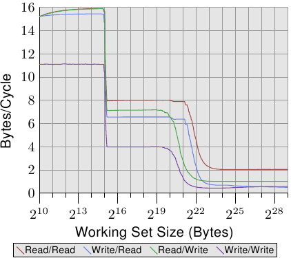

# 3.5.3. 快取的配置

快取在與 HT 及處理器核的關係中的位置並不在程式開發者的控制之下。但程式開發者能夠決定執行緒要在何處執行，於是快取如何與使用的 CPU 共處就變得很重要。

這裡我們不會深入在何時選擇哪顆處理器核來執行執行緒的細節。我們只會描述在設置執行緒的親和性（affinity）時，程式開發者必須要考慮的架構細節。

HT，根據定義，共享暫存器集以外的所有東西。這包含 L1 快取。這裡沒什麼好說的。有趣之處從一個處理器的個別處理器核開始。每顆處理器核至少擁有它自己的 L1 快取。除此之外，現今共有的細節並不多：

* 早期的多核處理器完全不共享快取。
* 之後的 Intel 模型的雙核處理器擁有共享的 L2 快取。對於四核處理器，我們必須為由兩顆處理器核組成的每一對處理個別的 L2 快取。沒有更高層級的快取。
* AMD 的 10h 處理器家族擁有獨立的 L2 快取與一個統一式 L3 快取。

在處理器供應商的宣傳品中已經寫許多關於它們各自的模型的優點。若是由處理器核處理的工作集並不重疊，擁有不共享的快取就有一些優勢。這對於單執行緒程式而言非常有用。由於這仍經常是當下的真實情況，因此這種做法並不怎麼差。但總是會有一些重疊的。快取都包含通用執行期函式庫（runtime library）中最活躍使用的部分，代表有一些快取空間會被浪費。

與 Intel 的雙核處理器一樣完全共享 L1 以外的所有快取有個大優點。若是在兩顆處理器核上的執行緒工作集有大量的重疊，可用的快取記憶體總量也會增加，工作集也能夠更大而不致降低效能。若是工作集沒有重疊，Intel 的進階智慧型快取（Advanced Smart Cache）管理應該要防止任何一顆處理器核獨占整個快取。

不過，如果兩顆處理器核為了它們各自的工作集使用大約一半的快取，也會有一些衝突。快取必須不斷地掂量兩顆處理器核的快取使用量，而作為這個重新平衡的一部分而執行的逐出操作可能會選得很差。為了看到這個問題，讓我們看看另一個測試程式的結果。

測試程式擁有一個不斷––使用 SSE 指令––讀取或寫入一個 2MB 記憶體區塊的行程。選擇 2MB 是因為這是這個 Core 2 處理器的 L2 快取大小的一半。行程被釘在一顆處理器核上，而第二個行程則被釘在另一顆處理器核上。第二個行程讀寫一塊可變大小的記憶體區域。圖表顯示每週期被讀取或寫入的位元組數。顯示四條不同的曲線，每條代表一種行程讀取與寫入的組合。其中 read/write 曲線代表一個總是寫入 2MB 工作集的背景行程，和一個讀取可變工作集、用於測量的行程。

<figure>
  
  <figcaption>圖 3.31：兩個行程的頻寬</figcaption>
</figure>

這張圖有趣的部分在於 220 與 223 位元組之間。若是兩顆處理器核的 L2 快取完全分離，我們能夠預期四個測試的效能全都會在 221 與 222 之間––這表示，L2 快取耗盡的時候––往下掉。如同我們能在圖 3.31 中看到的，情況並非如此。以在背景行程寫入的情況而言，這是最明顯的。效能在工作集大小達到 1MB 之前就開始下降。兩個行程沒有共享記憶體，因此行程也不會導致 RFO 訊息被產生。這純粹是逐出的問題。智慧型快取管理有它的問題，導致感覺到的快取大小比起每顆處理器核可用的 2MB，更接近於 1MB。只能期望，若是在處理器核之間共享的快取依舊是未來處理器的特徵的話，智慧型快取管理所使用的演算法會被修正。

有一個擁有兩個 L2 快取的四核處理器僅是能夠引入更高層級快取之前的權宜之計。比起獨立的插槽與雙核處理器，這個設計並沒有什麼顯著的效能優勢。兩顆處理器核透過在外部被視為 FSB 的相同的匯流排溝通。沒有什麼特別快的資料交換。

針對多核處理器的快取設計的未來將會有更多的層級。AMD 的 10h 處理器家族起個頭。我們是否會繼續看到被一個處理器核的一個子集所共享的更低層級的快取仍有待觀察（在 2008 年處理器的世代中，L2 快取沒有被共享）。額外的快取層級是必要的，因為高速與頻繁使用的快取無法被多顆處理器核所共享。效能會受到影響。也會需要非常大的高關聯度快取。快取大小以及關聯度兩者都必須隨著共享快取的處理器核數量而增長。使用一個大的 L3 快取以及合理大小的 L2 快取是個適當的權衡。L3 快取較慢，但它理想上並不如 L2 快取一樣常被使用。

對程式開發者而言，所有這些不同的設計都代表進行排程決策時的複雜性。為了達到最好的效能，必須知道工作負載以及機器架構的細節。幸運的是，我們擁有確定機器架構的依據。這些介面會在之後的章節中介紹。

