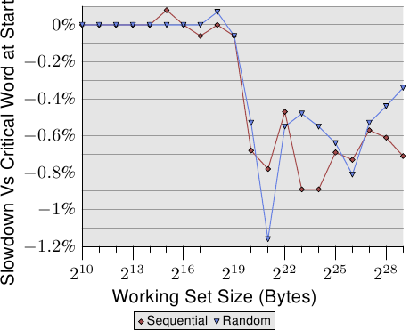

# 3.5.2. 關鍵字組的載入

記憶體以比快取行大小還小的區塊從主記憶體傳輸到快取中。現今是一次傳輸 64 *位元*，而快取行的大小為 64 或 128 *位元組*。這表示每個快取行需要 8 或 16 次傳輸。

DRAM 晶片能夠以突發（burst）模式傳輸那些 64 位元組的區塊。這能夠在沒有來自記憶體控制器的額外命令、以及可能伴隨的延遲的情況下填滿快取行。若是處理器預取快取行，這可能是最好的操作方式。

若是一支程式的資料或快取存取沒有命中（這表示，這是個強制性快取錯失〔compulsory cache miss〕–– 因為資料是第一次使用、或者是容量性快取錯失〔capacity cache miss〕–– 因為受限的快取大小需要逐出快取行），情況便不同。程式繼續執行所需的快取行裡頭的字組也許不是快取行中的第一個字組。即使在突發模式下、並以雙倍資料速率來傳輸，個別的 64 位元區塊也會在明顯不同的時間點抵達。每個區塊會在前一個區塊抵達之後 4 個 CPU 週期以上抵達。若是程式繼續執行所需的字組是快取行的第八個，程式就必須在第一個字組抵達之後，等待額外的 30 個週期以上。

事情並不必然非得如此。記憶體控制器能夠以不同的順序隨意請求快取行的字組。處理器能夠傳達程式正在等待哪個字組 –– 即*關鍵字組*，而記憶體控制器能夠先請求這個字組。一旦這個字組抵達，程式便能夠在快取行其餘部分抵達、並且快取還不在一致狀態的期間繼續執行。這個技術被稱為關鍵字組優先與提早重新啟動（Critical Word First & Early Restart）。

現今的處理器實作這項技術，但有些不可能達成的情況。若是處理器預取資料，並且關鍵字組是未知的。萬一處理器在預取操作的途中請求這個快取行，就必須在不能夠影響順序的情況下，一直等到關鍵字組抵達為止。

<figure>
  
  <figcaption>圖 3.30：在快取行末端的關鍵字組</figcaption>
</figure>

即使在適當的地方有了這些最佳化，關鍵字組在快取行的位置也很重要。圖 3.30 顯示循序與隨機存取的 Follow 測試結果。顯示的是以用來巡訪的指標位在第一個字組來執行測試，對比指標位在最後一個字組的情況下的速度減慢的結果。元素大小為 64 位元組，與快取行的大小一致。數字受到許多雜訊干擾，但能夠看到，一旦 L2 不再足以持有工作集大小，關鍵字組在末端時的效能立刻就慢約 0.7%。循序存取似乎受到多一點影響。這與前面提及的、預取下個快取行時的問題一致。

