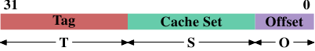
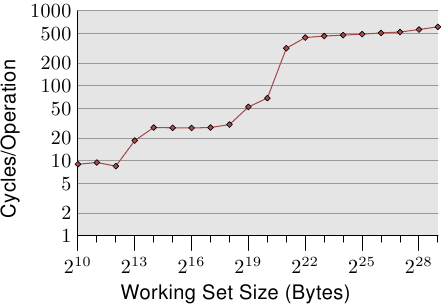

# 3.2. 高階快取操作

我們必須結合第二節所學到的機器架構與 RAM 技術、以及前一節所描述的快取結構，以瞭解使用快取的開銷與節約之處。

預設情況下，由 CPU 核讀取或寫入的所有資料都存在快取中。有些記憶體區域無法被快取，但只有作業系統實作者得去掛慮這點；這對應用程式開發者而言是不可見的。也有一些指令能令程式開發者刻意地繞過某些快取。這些將會在第六節中討論。

假如 CPU 需要一個資料字組，會先從快取開始搜尋。顯而易見地，快取無法容納整個主記憶體的內容（不然我們就不需要快取），但由於所有記憶體位址都能被快取，所以每個快取項目（entry）都會使用資料字組在主記憶體中的位址來*標記（tag）*。如此一來，讀取或寫入到某個位址的請求便會在快取中搜尋符合的標籤。在這個情境中，位址可以是虛擬或實體的，視快取的實作而有所不同。

除了真正的記憶體之外，標籤也會需要額外的空間，因此使用一個字組作為快取的粒度（granularity）是很浪費的。對於一台 x86 機器上的一個 32 位元字組而言，標籤本身可能會需要 32 位元以上。再者，由於空間局部性是作為快取基礎的其中一個原理，不將此納入考量並不太好。由於鄰近的記憶體很可能會一起被用到，所以它也應該一起被載入到快取中。也要記得我們在 2.2.1 節所學到的：假如 RAM 模組能夠在不需新的 $$ \overline{\text{CAS}} $$、甚至是 $$ \overline{\text{RAS}} $$ 訊號的情況下傳輸多個資料字組，這是更有效率的。所以儲存在快取中的項目並非單一字組，而是多個連續字組的「行（line）」。在早期的快取中，這些行的長度為 32 位元組；如今一般是 64 位元組。假如記憶體匯流排的寬度是 64 位元，這表示每個快取行要傳輸 8 次。DDR 有效地支援這種傳輸方式。

當記憶體內容為處理器所需時，整個快取行都會被載入到 L1d 中。每個快取行的記憶體位址會根據快取行的大小，以遮罩（mask）位址值的方式來計算。對於一個 64 位元組的快取行來說，這表示低 6 位元為零。捨棄的位元則用作快取行內的偏移量（offset）[^譯註]。剩餘的位元在某些情況下用以定位快取中的行、以及作為標籤。在實務上，一個位址值會被切成三個部分。對於一個 32 位元的位址來說，這看來如下：

一個大小為 2$$ \mathbf{O} $$ 的快取行，低 $$ \mathbf{O} $$ 位元用作快取行內的偏移量。接下來的 $$ \mathbf{S} $$ 位元選擇「快取集（cache set）」。我們馬上就會深入更多為何快取行會使用集合––而非一個一組（single slot）––的細節。現在只要知道有 2$$ \mathbf{S} $$ 個快取行的集合就夠。剩下的 $$ 32 - \mathbf{S} - \mathbf{O} = \mathbf{T} $$ 位元組成標籤。這 $$ \mathbf{T} $$ 個位元是與每個快取行相關聯、以區分在同一快取集中所有*別名（alias）*[^18]的值。不必儲存用以定址快取集的 $$ \mathbf{S} $$ 位元，因為它們對同個集合中的所有快取行而言都是相同的。

當一個指令修改記憶體時，處理器依舊得先載入一個快取行，因為沒有指令能夠一次修改一整個快取行（這個規則有個例外：合併寫入〔write-combining〕，會在 6.1 節說明）。因此在寫入操作之前，得先載入快取行的內容。快取無法持有不完全的快取行。已被寫入、並且仍未寫回主記憶體的快取行被稱為「髒的（dirty）」。一旦將其寫入，髒旗標（dirty flag）便會被清除。

為了能夠在快取中載入新的資料，幾乎總是得先在快取中騰出空間。從 L1d 的逐出操作（eviction）會將快取行往下推入 L2（使用相同的快取行大小）。這自然代表 L2 也得騰出空間。這可能轉而將內容推入 L3，最終到主記憶體中。每次逐出操作都會越來越昂貴。這裡所描述的是現代 AMD 與 VIA 處理器所優先採用的*獨占式快取（exclusive cache）*模型。Intel 實作*包含式快取（inclusive caches）*[^19]，其中每個在 L1d 中的快取行也會存在 L2 中。因此，從 L1d 進行逐出操作是更為快速的。有了足夠的 L2 快取的話，將內容存在兩處而造成記憶體浪費的缺點是很小的，而這在逐出操作時會帶來回報。獨占式快取的一個可能的優點是，載入一個新的快取行只需碰到 L1d 而不需 L2，這會快上一些。

只要為了處理器架構而規定的記憶體模型沒有改變，CPU 是被允許以它們想要的方式來管理快取的。舉例來說，善用少量或沒有記憶體匯流排活動的時段，並主動地將髒的快取行寫回到主記憶體中，對處理器來說是非常好的。x86 與 x86-64––不同廠商、甚至是同一廠商的不同型號之間––的處理器之間有著各式各樣的快取架構，證明記憶體模型抽象化的能力。

在對稱式多處理器（Symmetric Multi-Processor，SMP）系統中，CPU 的快取無法獨立於彼此運作。所有處理器在任何時間都假定要看到相同的記憶體內容。這種記憶體一致觀點的維持被稱為「快取一致性（cache coherency）」。假如一個處理器只看它自己擁有的快取與主記憶體，它就不會看到其它處理器中的髒快取行的內容。提供從一個處理器到另一個處理器快取的直接存取會非常昂貴，而且是個極大的瓶頸。取而代之地，處理器會在另一個處理器要讀取或寫入到某個快取行時察覺到。

假如偵測到一次寫入存取，並且處理器在其快取中有這個快取行的乾淨副本，這個快取行就會被標為無效（invalid）。未來的查詢會需要重新載入這個快取行。注意到在另一顆 CPU 上的讀取存取並不需要進行無效化，多個乾淨副本能夠被保存得很好。

更加複雜的快取實作容許其它的可能性發生。假設在一個處理器快取中的一個快取行是髒的，並且第二個處理器想要讀取或寫入這個快取行。在這個情況下，主記憶體的內容太舊，而請求的處理器必須––作為替代––從第一個處理器取得快取行的內容。第一個處理器經由窺探注意到這個狀況，並自動地將資料寄送給請求的處理器。這個動作繞過主記憶體，雖然在某些實作中，是假定記憶體控制器會注意到這個直接傳輸、並將更新的快取行內容儲存到主記憶體中。假如是為了寫入而進行存取，第一個處理器便會將它的區域快取行的副本無效化。

許多快取一致化的協定隨著時間被逐漸發展出來。最重要的為 MESI，我們將會 3.3.4 節中介紹它。這所有的結果可以被總結為一些簡單的規則：

* 一個髒的快取行不會出現在任何其它處理器的快取中。
* 相同快取行的乾淨副本能夠存在任意數量的快取中。

假如能夠維持這些規則，即便在多處理器的系統中，處理器也能夠高效地使用它們的快取。所有處理器所需要做的，就是去監控其它處理器的寫入存取，並將這個位址與它們區域快取中的位址做比較。在下一節，我們將會深入更多實作、尤其是成本的一些細節。

最後，我們該至少給個快取命中（hit）與錯失（miss）相關成本的印象。這些是 Intel 針對 Pentium M 列出的數字：

到 | 週期
--- | ---
暫存器 | <= 1
L1d | ~3
L2 | ~14
主記憶體 | ~240

這些是以 CPU 週期測量的實際存取時間。有趣的是，對內建於晶片上的 L2 快取而言，大部分（甚至可能超過一半）的存取時間都是由線路延遲造成的。這是一個只會隨著快取大小變大而變糟的實體限制。只有製程的縮小（舉例來說，從 Intel 系列中 Merom 的 60nm 到 Penryn 的 45nm）能提升這些數字。

表格中的數字看起來很大，但––幸運地––不必在每次發生快取載入與錯失時都負擔全部的成本。一部分的成本可以被隱藏。現今的處理器全都會使用不同長度的內部管線，指令會在其中被解碼、並且為執行而準備。部份的準備是從記憶體（或快取）載入值，假如它們要被傳輸到暫存器的話。假如記憶體載入操作能夠足夠早就在管線中開始，它也許會與其它操作平行進行，而整個載入成本就可能被隱藏。這對 L1d 經常是可能的；對某些有著長管線的處理器來說，L2 亦是如此。

提早開始記憶體讀取有著諸多阻礙。也許簡單得像是沒有足夠的資源來存取記憶體，或者可能是載入的最終位址之後才會作為另一個指令的結果取得。在這些情況中，載入成本無法被（完全地）隱藏。

對於寫入操作，CPU 不必一直等到值被安然地儲存進記憶體中為止。只要接下來指令的執行就像是與值已被存入記憶體有著似乎相同的效果，就沒有什麼能阻止 CPU 走捷徑。它能夠早點開始執行下個指令。有著影子暫存器（shadow register）––其能夠持有一般暫存器無法取得的值––的幫助，甚至可能改變未完成的寫入操作所要儲存的值。

<figure>
  
  <figcaption>圖 3.4：隨機寫入的存取時間</figcaption>
</figure>

有關快取行為影響的圖表，見圖 3.4。我們稍候會談到產生資料的程式；這是個不停地以隨機的方式存取可控制記憶體總量的程式的簡易模擬。每筆資料有著固定的大小。元素的數量視選擇的工作集大小而定。Y 軸表示處理一個元素所花費的 CPU 週期的平均；注意到 Y 軸為對數刻度。這同樣適用於所有這類圖表的 X 軸。工作集的大小總是以二的冪次表示。

這張圖顯示三個不同的平穩階段。這並不讓人意外：這個處理器有 L1d 與 L2 快取，但沒有 L3。經由一些經驗，我們可以推論這個 L1d 大小為 213 位元組，而 L2 大小為 220 位元組。假如整個工作集能塞進 L1d 中，對每個元素的每次操作的週期數會低於 10。一旦超過 L1d 的大小，處理器就必須從 L2 載入資料，而平均時間則迅速成長到 28 左右。一旦 L2 也不夠大，時間便飆升到 480 個週期以上。這即是許多、或者大部分操作必須從主記憶體載入資料的時候。更糟的是：由於資料被修改，髒的快取行也必須被寫回。

這張圖應該有給予探究程式撰寫上的改進、以協助提升快取使用方式的充分動機。我們在這裡所談論的並不是幾個少得可憐的百分點；我們說的是有時可能的幾個數量級的提升。在第六節，我們將會討論能讓我們寫出更有效率的程式的技術。下一節會深入更多 CPU 快取設計的細節。有這些知識很好，但對於本文其餘部分並非必要。所以這一節可以跳過。

[^譯註]: 用來作為快取行內某個字組的索引。

[^18]: 所有位址有著相同 $$ \mathbf{S} $$ 部分的快取行都被視為相同的別名。

[^19]: 這個概括並不完全正確。一些快取是獨占式的，而部分包含式快取具有獨占式快取的特性。

