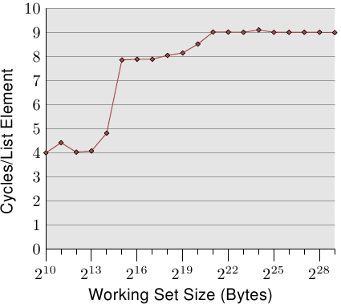
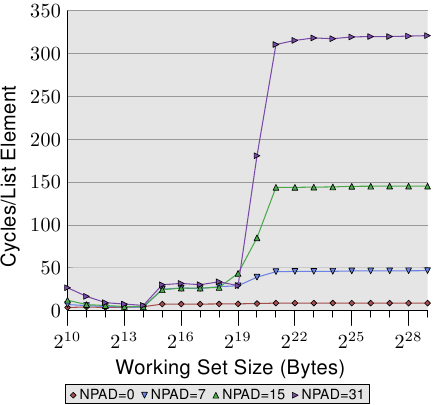
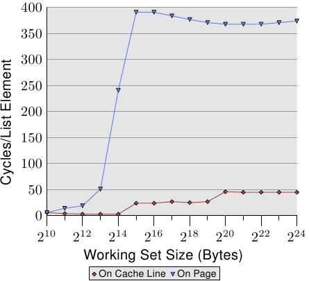
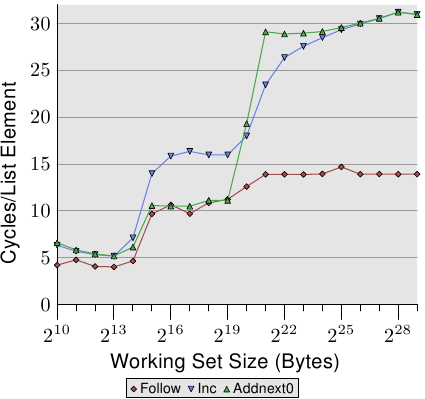
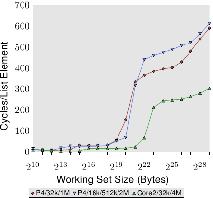
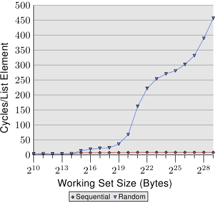
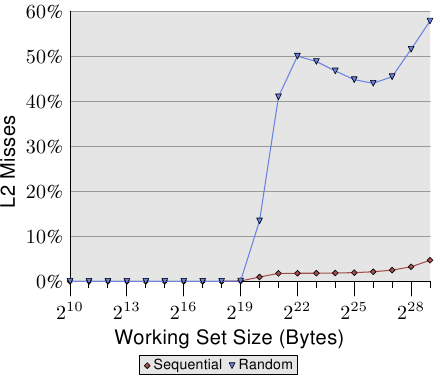

# 3.3.2. 快取影響的量測

所有的圖表都是由一支能模擬任意大小的工作集、讀取與寫入存取、以及循序或隨機存取的程式所產生的。我們已經在圖 3.4 中看過一些結果。這支程式會產生與工作集大小相同、這種型別的陣列：

```c
struct l {
  struct l *n;
  long int pad[NPAD];
};
```

所有的項目都使用 `n` 元素，以循序或是隨機的順序，鏈結在一個循環的串列中。即使元素是循序排列的，從一個項目前進到下一個項目總是會用到這個指標。`pad` 元素為資料負載（payload），並且能成長為任意大小。在某些測試中，資料會被修改，而在其餘的情況中，程式只會執行讀取操作。

在效能量測中，我們討論的是工作集的大小。工作集是由一個 `struct l` 元素的陣列所組成的。一個 2<sup>N</sup> 位元組的工作集包含 2<sup>N</sup> / `sizeof(struct l)` 個元素。顯而易見地，`sizeof(struct l)` 視 `NPAD` 的值而定。以 32 位元的系統來說，`NPAD`=7 代表每個陣列元素的大小為 32 位元組，以 64 位元的系統來說，大小為 64 位元組。


## 單執行緒循序存取

<figure>
  
  <figcaption>圖 3.10：循序讀取存取，NPAD=0</figcaption>
</figure>

最簡單的情況就是直接走遍串列中的所有項目。串列元素是循序排列、緊密地塞在一起的。不管處理的順序是正向或反向都無所謂，處理器在兩個方向上都能處理得一樣好。我們這裡 –– 以及在接下來的所有測試中 –– 所要量測的是，處理一個單向串列元素要花多久。時間單位為處理器週期。圖 3.10 顯示了這個結果。除非有另外說明，否則所有的量測都是在一台 Pentium 4 以 64 位元模式獲得的，這表示 `NPAD`=0 的結構 `l` 大小為八位元組。

前兩個量測結果受到了雜訊的污染。測量的工作量太小了，因而無法過濾掉其餘系統的影響。我們能夠放心地假設這些值都在 4 個週期左右。考慮到這點，我們能夠看到三個不同的水平（level）：

* 工作集大小至多到 2<sup>14</sup> 位元組。
* 從 2<sup>15</sup> 位元組到 2<sup>20</sup> 位元組。
* 2<sup>21</sup> 位元組以上。

這些階段能夠輕易地解讀：處理器擁有一個 16kB L1d 與 1MB L2。我們沒有在從一個水平到另一個水平的轉變之處看到尖銳的邊緣，因為快取也會被系統的其它部分用到，因此快取並不是專門給這支程式的資料所使用的。特別是 L2 快取，它是一個統一式快取（unified cache），也會被用來存放指令（註：Intel 使用包含式快取）。

或許完全沒有預期到的是，對於不同工作集大小的實際時間。L1d 命中的時間是預期中的：在 P4 上，L1d 命中之後的載入時間大約是 4 個週期。但 L2 存取怎麼樣呢？一旦 L1d 不足以保存資料，可以預期這會讓每個元素花上 14 個週期以上，因為這是 L2 的存取時間。但結果顯示只需要大約 9 個週期。這個差異能夠以處理器中的先進邏輯來解釋。預期使用連續的記憶體區域時，處理器會*預取*下一個快取行。這表示，當真的用到下個快取行時，它已經載入一半了。等待下一個快取行載入所需的延遲因而比 L2 存取時間要少得多。

一旦工作集大小成長到超過 L2 的大小，預取的效果甚至更明顯。先前我們說過，一次主記憶體存取要花費 200+ 個週期。只有利用有效的預取，處理器才可能讓存取時間維持在低至 9 個週期。如同我們能從 200 與 9 之間的差異所看到的，它的效果很好。

<figure>
  
  <figcaption>圖 3.11：循序讀取多種大小</figcaption>
</figure>

我們能夠在預取的時候 –– 至少間接地 –– 觀察處理器。在圖 3.11 中，我們看到的是相同工作集大小的時間，但這次我們看到的是不同 `l` 結構大小的曲線。這表示在串列中有比較少、但比較大的元素。不同大小有著令（仍然連續的）串列中的 `n` 元素之間的距離成長的影響。在圖中的四種情況，距離分別為 0、56、120、248 位元組。

在底部我們可以看到圖 3.10 的線，但這時它看起來差不多像是條平坦的線。其它情況的時間要糟得多了。我們也能在這張圖中看到三個不同的水平，我們也看到在工作集大小很小的情況下有著很大的誤差（再次忽略它們）。只要僅有 L1d 牽涉其中，這些線差不多都相互重合。
There is no prefetching necessary so all element sizes just hit the L1d for each access.

在 L2 快取命中的情況下，我們看到三條新的線相互重合得很好，但它們位在比較高的水平上（大約 28）。這是 L2 存取時間的水平。這表示從 L2 到 L1d 的預取基本上失效了。即使是 `NPAD`=7，我們在迴圈的每一次疊代都需要一個新的快取行；以 `NPAD`=0 而言，在需要下一個快取行之前，迴圈得疊代八次。預取邏輯無法每個週期都載入一個新的快取行。因此，我們看到的便是在每次疊代時，從 L2 載入的延誤。

一旦工作集大小超過 L2 的容量，甚至變得更有趣了。現在四條線全都離得很遠。不同的元素大小顯然在效能差異上扮演著一個重大的角色。處理器應該要識別出步伐（stride）的大小，不為 `NPAD`=15 與 31 獲取不必要的快取行，因為元素的大小是比預取窗（prefetch window）還小的（見 6.3.1 節）。元素大小妨礙預取效果之處，是一個硬體預取限制的結果：它無法橫跨分頁（page）邊界。我們在每次增加大小時，都減少了 50% 硬體排程器（scheduler）的效率。假如硬體預取器（prefetcher）被允許橫跨分頁邊界，並且下一個分頁不存在或者無效時，作業系統就得被捲入分頁的定位中。這表示程式要經歷並非由它自己產生的分頁錯誤（page fault）。這是完全無法接受的，因為處理器並不知道一個分頁是不在記憶體內還是不存在。在後者的情況下，作業系統必須要中斷行程。在任何情況下，假定 –– 以 `NPAD`=7 或以上而言 –– 每個串列元素都需要一個快取行，硬體預取器便愛莫能助了。由於處理器一直忙著讀取一個字組、然後載入下一個元素，根本沒有時間去從記憶體載入資料。

變慢的另一個主要原因是 TLB 快取的錯失。這是一個儲存了從虛擬位址到實體位址的轉譯結果的快取，如同在第四節所詳細解釋的那樣。由於 TLB 快取必須非常地快，所以它非常地小。假如重複存取的分頁數比 TLB 快取擁有的還多，就必須不斷地重算代表著虛擬到實體位址的轉譯結果的項目。這是一個非常昂貴的操作。對比較大的元素大小而言，一次 TLB 查詢的成本是分攤在較少的元素上的。這表示對於每個串列元素，必須要計算的 TLB 項目總數較多。

為了觀察 TLB 的影響，我們可以執行一個不同的測試。對於第一個量測，我們像往常一樣循序地擺放元素。我們使用 `NPAD`=7 作為佔據一整個快取行的元素。對於第二個量測，我們將每個串列元素放置在個別的分頁中。每個分頁的其餘部分維持原樣，我們不會將它算在工作集大小的總和中。[^20]結果是，對於第一個量測，每次串列疊代都需要一個新的快取行，並且每 64 個元素一個新的分頁。對第二個量測而言，每次疊代都需要載入一個在另一個分頁上的快取行。

<figure>
  
  <figcaption>圖 3.12：TLB 對循序讀取的影響</figcaption>
</figure>

結果可以在圖 3.12 中看到。量測都是在與圖 3.11 相同的機器上執行的。由於可用 RAM 的限制，工作集大小必須限制在 2<sup>24</sup> 位元組，其需要 1GB 以將物件放置在個別的分頁上。下方的紅色曲線正好對應到圖 3.11 中的 `NPAD`=7 曲線。我們看到了顯示了 L1d 與 L2 快取大小的不同階段。第二條曲線看起來完全不同。重要的特徵是，當工作集大小達到 2<sup>13</sup> 位元組時開始的大幅飆升。這即是 TLB 快取溢出（overflow）的時候了。由於一個元素大小為 64 位元組，我們能夠計算出 TLB 快取有 64 個項目。由於程式鎖定了記憶體以避免它被移出，所以成本不會受分頁錯誤影響。

可以看出，計算實體位址、並將它儲存在 TLB 中所花的週期數非常高。圖 3.12 中的曲線顯示了極端的例子，但現在應該能清楚的一點是，對於較大的 `NPAD` 值而言，一個變慢的重大因素即是 TLB 快取效率的降低。由於實體位址必須要在快取行能從 L2 或主記憶體讀取前算出來，因此位址轉譯的損失就被附加到了記憶體存取時間上。這在某種程度上解釋了，為何每個串列元素在 `NPAD`=31 的總成本會比 RAM 在理論上的存取時間還高的原因。

<figure>
  
  <figcaption>圖 3.13：循序讀取與寫入，NPAD=1</figcaption>
</figure>

我們可以透過觀察修改串列元素的測試執行的數據，來一瞥預取實作的多一些細節。圖 3.13 顯示了三條線。在所有情況中的元素寬度都是 16 位元組。第一條線是現在已經很熟悉的串列巡訪，它會被當作一條基準線。第二條線 –– 標為「Inc」–– 僅會在前往下一個元素前，增加當前元素的 `pad[0]` 成員的值。第三條線 –– 標為「Addnext0」–– 會取下一個元素的 `pad[0]` 的值，並加到當前串列元素的 `pad[0]` 成員中。

天真的假設大概是「Addnext0」測試跑得比較慢，因為它有更多工作得做。在前進到下一個串列元素之前，就必須載入這個元素的值。這即是看到這個測試實際上 –– 對於某些工作集大小而言 –– 比「Inc」測試還快這點會令人吃驚的原因了。對此的解釋是，載入下個串列元素基本上就是一次強制的預取。無論程式在何時前進到下個串列元素，我們都確切地知道這個元素已經在 L1d 快取中了。因此我們看到，只要工作集大小能塞進 L2 快取，「Addnext0」就執行得跟單純的「Follow」一樣好。

不過「Addnext0」測試比「Inc」測試更快耗盡 L2。因為它需要從主記憶體載入更多的資料。這即是在工作集大小為 2<sup>21</sup> 位元組時，「Addnext0」測試達到 28 個循環水平的原因了。28 循環水平是「Follow」測試所達到的 14 循環水平的兩倍高。這也很容易解釋。由於其它兩個測試都修改了記憶體，L2 快取為了騰出空間給新的快取行的逐出操作便不能直接把資料丟掉。它必須被寫到記憶體中。這表示 FSB 中的可用頻寬被砍了一半，因此加倍了資料從主記憶體傳輸到 L2 所花的時間。

<figure>
  
  <figcaption>圖 3.14：較大 L2／L3 快取的優勢</figcaption>
</figure>

循序、高效的快取管理的最後一個面向是快取的大小。雖然這應該很明顯，但仍需要被提出來。圖 3.14 顯示了以 128 位元組元素（在 64 位元機器上，`NPAD`=15）進行 Increment 測試的時間。這次我們看到量測結果來自三台不同的機器。前兩台機器為 P4，最後一台為 Core2 處理器。前兩台由不同的快取大小來區分它們自己。第一個處理器有一個 32k L1d 與一個 1M L2。第二個處理器有 16k L1d、512k L2、與 2M L3。Core2 處理器有 32k L1d 與 4M L2。

這張圖有趣的部分不必然是 Core2 處理器相對於其它兩個表現得有多好（雖然這令人印象深刻）。這裡主要有興趣的地方是，工作集大小對於各自的最後一階快取來說太大、並使得主記憶體得大大地涉入其中之處。

如同預期，最後一階的快取越大，曲線在相應於 L2 存取成本的低水平停留得越久。要注意的重要部分是它所提供的效能優勢。第二個處理器（它稍微舊了一點）在 2<sup>20</sup> 位元組的工作集上能夠以兩倍於第一個處理器的速度執行。這全都歸功於最後一階快取大小的提升。有著 4M L2 的 Core2 處理器甚至表現得更好。

對於隨機的工作量而言，這可能不代表什麼。但若是工作量能被裁剪成最後一階快取的大小，程式效能便能夠極為大幅地提升。這也是有時候值得為擁有較大快取的處理器花費額外金錢的原因。


## 單執行緒隨機存取

我們已經看過，處理器能夠藉由預取快取行到 L2 與 L1d，來隱藏大部分主記憶體、甚至是 L2 的存取等待時間。不過，這只有在能夠預測記憶體的存取時才能良好運作。

<figure>
  
  <figcaption>圖 3.15：循序 vs 隨機讀取，NPAD=0</figcaption>
</figure>

若是存取模式是不可預測、或者隨機的，情況便大大地不同。圖 3.15 比較了循序存取每個串列元素的時間（如圖 3.10）以及當串列元素是隨機分布在工作集時的時間。順序是由隨機化的鏈結串列所決定的。沒有讓處理器能夠確實地預取資料的方法。只有一個元素偶然在另一個在記憶體中也彼此鄰近的元素不久之後用到，這才能起得了作用。

在圖 3.15 中，有兩個要注意的重點。第一點是，增長工作集大小需要大量的週期數。機器能夠在 200-300 個週期內存取主記憶體，但這裡我們達到了 450 個週期以上。我們先前已經看過這個現象了（對比圖 3.11）。自動預取在這裡實際上起了反效果。

<figure>
  
  <figcaption>圖 3.16：L2d 錯失率</figcaption>
</figure>

第二個有趣的地方是，曲線並不像在循序存取的例子中那樣，在多個平緩階段變得平坦。曲線持續上升。為了解釋這點，我們能夠針對不同的工作集大小量測程式的 L2 存取次數。結果能夠在圖 3.16 與表 3.2 看到。

圖表顯示，當工作集大小大於 L2 的大小時，快取錯失率（L2 存取數 / L2 錯失數）就開始成長了。這條曲線與圖 3.15 的曲線有著相似的形式：它快速地上升、略微下降、然後再度開始上升。這與每串列元素所需循環數的曲線圖有著密切的關聯。L2 錯失率最終會一直成長到接近 100% 為止。給定一個足夠大的工作集（以及 RAM），任何隨機選取的快取行在 L2 或是載入過程中的機率便能夠被隨心所欲地降低。

<figure>
  <table>
    <tr>
      <th rowspan="2">集合大小</th>
      <th colspan="5">循序</th>
      <th colspan="5">隨機</th>
    </tr>
    <tr>
      <th>L2 命中數</th>
      <th>L2 錯失數</th>
      <th>疊代次數</th>
      <th>錯失／命中比率</th>
      <th>每疊代 L2 存取數</th>
      <th>L2 命中數</th>
      <th>L2 錯失數</th>
      <th>疊代次數</th>
      <th>錯失／命中比率</th>
      <th>每疊代 L2 存取數</th>
    <tr>
      <td>2<sup>20</sup></td>
      <td>88,636</td>
      <td>843</td>
      <td>16,384</td>
      <td>0.94%</td>
      <td>5.5</td>
      <td>30,462</td>
      <td>4721</td>
      <td>1,024</td>
      <td>13.42%</td>
      <td>34.4</td>
    </tr>
    <tr>
      <td>2<sup>21</sup></td>
      <td>88,105</td>
      <td>1,584</td>
      <td>8,192</td>
      <td>1.77%</td>
      <td>10.9</td>
      <td>21,817</td>
      <td>15,151</td>
      <td>512</td>
      <td>40.98%</td>
      <td>72.2</td>
    </tr>
    <tr>
      <td>2<sup>22</sup></td>
      <td>88,106</td>
      <td>1,600</td>
      <td>4,096</td>
      <td>1.78%</td>
      <td>21.9</td>
      <td>22,258</td>
      <td>22,285</td>
      <td>256</td>
      <td>50.03%</td>
      <td>174.0</td>
    </tr>
    <tr>
      <td>2<sup>23</sup></td>
      <td>88,104</td>
      <td>1,614</td>
      <td>2,048</td>
      <td>1.80%</td>
      <td>43.8</td>
      <td>27,521</td>
      <td>26,274</td>
      <td>128</td>
      <td>48.84%</td>
      <td>420.3</td>
    </tr>
    <tr>
      <td>2<sup>24</sup></td>
      <td>88,114</td>
      <td>1,655</td>
      <td>1,024</td>
      <td>1.84%</td>
      <td>87.7</td>
      <td>33,166</td>
      <td>29,115</td>
      <td>64</td>
      <td>46.75%</td>
      <td>973.1</td>
    </tr>
    <tr>
      <td>2<sup>25</sup></td>
      <td>88,112</td>
      <td>1,730</td>
      <td>512</td>
      <td>1.93%</td>
      <td>175.5</td>
      <td>39,858</td>
      <td>32,360</td>
      <td>32</td>
      <td>44.81%</td>
      <td>2,256.8</td>
    </tr>
    <tr>
      <td>2<sup>26</sup></td>
      <td>88,112</td>
      <td>1,906</td>
      <td>256</td>
      <td>2.12%</td>
      <td>351.6</td>
      <td>48,539</td>
      <td>38,151</td>
      <td>16</td>
      <td>44.01%</td>
      <td>5,418.1</td>
    </tr>
    <tr>
      <td>2<sup>27</sup></td>
      <td>88,114</td>
      <td>2,244</td>
      <td>128</td>
      <td>2.48%</td>
      <td>705.9</td>
      <td>62,423</td>
      <td>52,049</td>
      <td>8</td>
      <td>45.47%</td>
      <td>14,309.0</td>
    </tr>
    <tr>
      <td>2<sup>28</sup></td>
      <td>88,120</td>
      <td>2,939</td>
      <td>64</td>
      <td>3.23%</td>
      <td>1,422.8</td>
      <td>81,906</td>
      <td>87,167</td>
      <td>4</td>
      <td>51.56%</td>
      <td>42,268.3</td>
    </tr>
    <tr>
      <td>2<sup>29</sup></td>
      <td>88,137</td>
      <td>4,318</td>
      <td>32</td>
      <td>4.67%</td>
      <td>2,889.2</td>
      <td>119,079</td>
      <td>163,398</td>
      <td>2</td>
      <td>57.84%</td>
      <td>141,238.5</td>
    </tr>
  </table>
  <figcaption>表 3.2：循序與隨機巡訪時的 L2 命中與錯失，NPAD=0</figcaption>
</figure>

光是快取錯失率的提高就能夠解釋一部分成本。但有著另一個因素。看看表 3.2，我們能夠看到在 L2 / 疊代數那欄，程式每次疊代所使用的 L2 總數都在成長。每個工作集都是前一個的兩倍大。所以，在沒有快取的情況下，我們預期主記憶體的存取次數會加倍。有了快取以及（幾乎）完美的可預測性，我們看到顯示在循序存取的數據中，L2 使用次數增長得很保守。其增長除了工作集大小的增加以外，就沒有別的原因了。

<figure>
  
  <figcaption>圖 3.17：逐頁（page-wise）隨機化，NPAD=7</figcaption>
</figure>

對於隨機存取，每次工作集大小加倍的時候，每個元素的存取時間都超過兩倍。這表示每個串列元素的平均存取時間增加了，因為工作集大小只有變成兩倍而已。背後的原因是 TLB 錯失率提高了。在圖 3.17 中，我們看到在 `NPAD`=7 時隨機存取的成本。只是這次，隨機化的方式被修改了。一般的情況下，是將整個串列作為一個區塊（block）隨機化（以標籤〔label〕 $$ \infty $$ 表示），而其它的 11 條曲線則表示在比較小的區塊內進行隨機化。標記為「60」的曲線，代表每組由 60 個分頁（245,760 位元組）組成的集合會分別進行隨機化。這表示在走到下一個區塊的元素之前，會先巡訪過所有區塊內的串列元素。這使得在任何一個時間點使用的 TLB 項目的數量有所限制。

在 `NPAD`=7 時的元素大小為 64 位元組，這與快取行大小一致。由於串列元素的順序被隨機化了，因此硬體預取器不大可能有任何效果，尤其在有一堆元素的情況下。這表示 L2 快取的錯失率與在一個區塊內的整個串列隨機化相比並不會有顯著地不同。測試的效能隨著區塊大小增加而逐漸地逼近單一區塊隨機化的曲線。這表示後者的測試案例的效能顯著地受到了 TLB 錯失的影響。假如 TLB 錯失次數能夠降低，效能便會顯著地提升（在我們稍候將會看到的測試中，高達 38%）。


[^20]: 是的，這有點不一致，因為在其它的測試中，我們把結構中沒用到的部分也算在元素大小裡，而且我們能夠定義 `NPAD` 以讓每個元素填滿一個分頁。在這種情況中，工作集的大小會差得很多。不過這並不是這個測試的重點，而且無論如何預取都沒什麼效率，因此沒有什麼差別。

