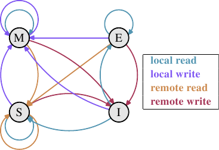
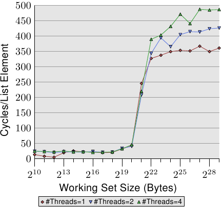
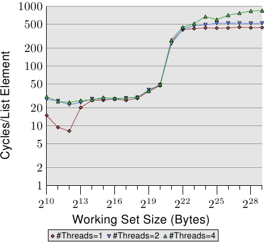
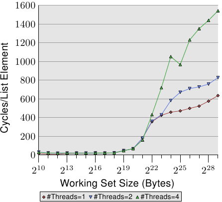
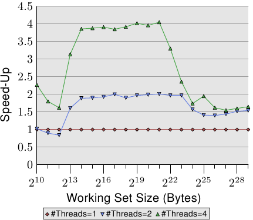
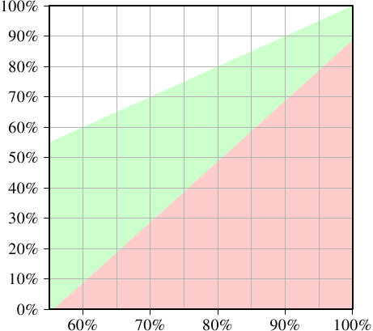

# 3.3.4. 多處理器支援

在上一節，我們已經指出，當多處理器開始起作用時我們會遇到的問題。多核處理器甚至有那些並沒有被共享的快取層級（至少 L1d）的問題。

提供從一個處理器到另一個處理器的快取的直接存取是完全不切實際的。首先，連線根本不夠快。實際的替代方案是，將快取內容傳輸給另一個處理器 –– 假如需要的話。注意到這也同樣適用於不在相同處理器上共享的快取。

現在的問題是，什麼時候得傳輸這個快取行？這是個相當容易回答的問題：當一個處理器需要讀取或寫入一個快取行，而其在另一個處理器的快取上是髒的。但處理器要怎麼樣才能判斷一個快取行在另一個處理器的快取上是髒的呢？僅因為一個快取行被另一個處理器載入就假定如此，（至多）也是次佳的（suboptimal）。通常，大多數的記憶體存取都是讀取操作，產生的快取行也不是髒的。處理器對快取行的操作是很頻繁的（那當然，不然我們怎麼會有這篇論文？），這表示在每次寫入操作之後，都去廣播被改變的快取行的資訊是不切實際的。

這些年來所發展出來的就是 MESI 快取一致性協定（修改〔Modified〕、獨占〔Exclusive〕、共享〔Shared〕、無效〔Invalid〕）。這個協定的名稱來自採用 MESI 協定時、一個快取行能夠變成的四個狀態：

<dl>
  <dt>修改</dt>
  <dd>本地的處理器已經修改過快取行。這也暗指它是在任何快取中的唯一副本。</dd>

  <dt>獨占</dt>
  <dd>快取行沒有被修改過，但已知沒有被載入到任何其它處理器的快取中。</dd>

  <dt>共享</dt>
  <dd>快取行沒有被修改過，並且可能存在於另一個處理器的快取中。</dd>

  <dt>無效</dt>
  <dd>快取行是無效的 –– 也就是說，沒有被使用。</dd>
</dl>

多年來，這個協定從比較不複雜、但也比較沒效率的較簡易版本開始發展。有了這四個狀態，便可能有效率地實作回寫式快取，而又支援同時在不同的處理器上使用唯讀的資料。

<figure>
  
  <figcaption>圖 3.18：MESI 協定的狀態轉換</figcaption>
</figure>

藉由處理器監聽 –– 或者窺探 –– 其它處理器的運作，不用太多精力便得以完成狀態改變。處理器執行的某些操作會被發佈在外部針腳上，因而讓處理器的快取處理能被外界看到。處理中的快取行位址能在位址匯流排上看到。在接下來對狀態與其轉換（顯示在圖 3.18）的描述中，我們會指出匯流排是何時被牽扯進來的。

起初所有快取行都是空的，因此也是**無效**的。若是資料是為了寫入而載入快取，則改為**修改**。若是資料是為了讀取而載入，新的狀態則取決於另一個處理器是否也已載入這個快取行。如果是的話，新的狀態為**共享**，否則為**獨占**。

若是一個**修改**的快取行從本地處理器被讀取或寫入，這個指令能夠使用目前的快取內容，並且狀態不變。若是第二個處理器想要讀取這個快取行，第一個處理器就必須將它的快取內容寄送給第二個處理器，然後它就能將狀態改為**共享**。寄送給第二個處理器的資料也會被記憶體控制器接收並處理，其會將內容儲存在記憶體中。假如沒有這麼做，快取行就不能被標為**共享**。若是第二個處理器想要寫入快取行，第一個處理器便會寄送快取行的內容，並將自己的快取行標為**無效**。這即是惡名昭彰的「所有權請求（Request For Ownership，RFO）」操作。在最後一個層級的快取中執行這個操作，就像是 I→M 的轉換一樣，相當昂貴。對直寫式快取而言，我們也得加上它將新的快取行內容寫入到更高階快取或主記憶體所花費的時間，進而提高了成本。

若是一個快取行處於**共享**狀態，並且本地處理器要讀取它，那麼就不必改變狀態，讀取請求能夠由這個快取來達成。若是快取行要在本地寫入，也能夠使用這個快取行，但狀態會被改成**修改**。這也需要令其它處理器的所有可能的快取行副本被標為**無效**。因此，寫入操作必須要透過一個 RFO 訊息發佈給其它處理器。若是快取行被第二個處理器請求讀取，那麼什麼也不必做。主記憶體包含目前的資料，本地的狀態也已經是**共享**了。在第二個處理器想要寫入到快取行的情況下（RFO），就直接將快取行標為**無效**。不需要匯流排操作。

**獨占**狀態與**共享**狀態大致相同，只有一個重大的不同：本地的寫入操作不必發佈到匯流排上。因為已經知道本地快取是唯一一個持有這個獨有的快取行的了。這會是一個巨大的優勢，所以處理器會試著令盡可能多的快取行維持在**獨占**狀態，而非**共享**。後者是在這種時刻，無法取得這個資訊的退而求其次。**獨占**狀態也能夠在完全不引發功能問題的情況下被省去。唯一會變糟的只有效能，因為 E→M 轉換比 S→M 轉換要快得多了。

從這些狀態轉換的描述中，應該很清楚多處理器操作特有的成本在哪了。是的，填入快取仍舊昂貴，但現在我們也必須留意 RFO 訊息。每當必須發送這種訊息時，工作就會變慢。

有二種必須要 RFO 訊息的情況：

* 一條執行緒從一個處理器遷移到另一個，並且所有快取行都必須一起移動到新的處理器上。
* 一個快取行真的被二個不同的處理器所需要。[^21]

在多執行緒或多行程的程式中，總是有一些同步的需求；這種同步是使用記憶體實作的。所以有些有根據的 RFO 訊息。它們仍舊得盡可能地降低頻率。不過，還有其他 RFO 訊息的來源。我們將會在第六節解釋這些情況。快取一致性協定的訊息必須被分發給系統中的處理器。MESI 轉換直到確定系統中的所有處理器都有機會回覆訊息之前都不會發生。這表示一個回覆能花上的最長可能時間決定了一致性協定的速度。[^22]可能會有匯流排上的衝突、NUMA 系統的等待時間會很長、而且突發的流量當然也會讓事情變慢。這全都是專注在避免不必要流量的好理由。

還有一個與擁有多於一個處理器有關的問題。這個影響是與機器高度相關的，但原理上這個問題總是存在：FSB 是一個共享的資源。在大多數機器上，所有處理器會透過單一一條匯流排連結到記憶體控制器（見圖 2.1）。假如單一個處理器能夠佔滿匯流排（通常是這樣），那麼共享相同匯流排的二或四個處理器甚至會更加地限制每個處理器的可用頻寬。

即使每個處理器都如圖 2.2 一樣，有它自己的、連結到記憶體控制器的匯流排，但仍舊有連結到記憶體模組的匯流排。通常這是唯一一條匯流排，而 –– 即使在圖 2.2 的擴充模型中 –– 同時存取相同的記憶體模組將會限制頻寬。

每個處理器都能擁有本地記憶體的 AMD 模型亦是如此。所有處理器確實能快速地並行存取它們的本地記憶體，尤其在使用整合式記憶體控制器的情況。但多執行緒與多行程程式 –– 至少偶爾 –– 必須存取相同的記憶體區域以進行同步。

並行是受可用於必要的同步實作的有限頻寬所嚴重地限制的。程式需要被小心地設計，以將不同處理器核對相同記憶體位置的存取降到最小。接下來的量測將會顯示這點、以及其它與多執行緒程式有關的快取影響。

## 多執行緒存取

為了確保大家理解在不同處理器上同時使用相同快取行所引入的問題的嚴重性，我們將會在這裡多看到一些針對我們先前用過的相同程式的效能圖表。不過，這次會同時執行多於一條執行緒。所要量測的是最快的執行緒的執行時間。這意味著完成所有執行緒的完整執行時間還會更長。使用的機器有四個處理器；測試使用至多四條執行緒。所有處理器共享連結到記憶體控制器的匯流排，而且僅有一條連結到記憶體模組的匯流排。

<figure>
  
  <figcaption>圖 3.19：循序讀取，多條執行緒</figcaption>
</figure>

圖 3.19 顯示了循序唯讀存取 128 位元組項目的效能（在 64 位元機器上，`NPAD`=15）。對於單執行緒的曲線，我們能預期是條與圖 3.11 相似的曲線。量測使用了一台不同的機器，所以實際的數字會有所不同。

這張圖中重要的部分當然是執行多條執行緒時的行為。注意到在走訪鏈結串列時，沒有記憶體會被修改，亦無讓執行緒保持同步的企圖。儘管不必有 RFO 訊息、而且所有的快取行都能被共享，但我們看到當使用二條執行緒時，效能減低了高達 18%，而使用四條執行緒時則高達 34%。由於沒有必須在處理器之間傳輸的快取行，因此變慢僅僅是由二個瓶頸中的一或二者所引起的：從處理器到記憶體控制的共享匯流排、以及從記憶體控制器到記憶體模組的匯流排。一旦工作集大小大於這臺機器的 L3 快取，圖上三種數量的執行緒都會預取新的串列元素。即便只有二條執行緒，可用頻寬也不足以線性延展（scale）（即，沒有執行多條執行緒帶來的損失）。

<figure>
  
  <figcaption>圖 3.20：循序 Increase，多條執行緒</figcaption>
</figure>

當我們修改記憶體時，情況變得更可怕了。圖 3.20 顯示了循序 Increase 測試的結果。這個圖表的 Y 軸使用了對數尺度。所以，別被看似很小的差異給騙了。我們在執行二條執行緒的時候仍有大約 18% 的損失，而執行四條執行緒則是驚人的 93% 損失。這表示，在使用四條執行緒時，預取流量加上回寫流量就把匯流排佔得非常滿了。

我們使用對數尺度來顯示 L1d 範圍的結果。能夠看到的是，一旦執行了多於一條執行緒，L1d 基本上就沒什麼效果了。只有在 L1d 不足以容納工作集的時候，單執行緒的存取時間才會超過 20 個週期。當執行了多條執行緒時，存取時間卻立即就達到了 –– 即便使用的是最小的工作集大小。

這裡沒有顯示出問題的一個面向。這個特定的測試程式是難以量測的。即使測試修改了記憶體、而我們因此預期必定會有 RFO 訊息，但當使用了多於一條執行緒時，我們並沒有在 L2 範圍內看到更高的成本。程式必須要使用大量的記憶體，並且所有執行緒必須要平行地存取相同的記憶體。沒有大量的同步 –– 其會佔據大多的執行時間 –– 這是很難實現的。

<figure>
  
  <figcaption>圖 3.21：隨機 Addnextlast，多條執行緒</figcaption>
</figure>

最後在圖 3.21，我們有 Addnextlast 測試以隨機的方式存取記憶體的數據。提供這張圖主要是為了顯示出這些高得嚇人的數字。現在在極端的狀況下，處理一個單一的串列元素要花上大約 1,500 個週期。使用更多執行緒的情況還要更加嚴重。我們能使用一張表格來總結多條執行緒的效率。

<figure>
  <table>
    <tr>
      <th>#執行緒</th>
      <th>循序讀取</th>
      <th>循序遞增</th>
      <th>隨機增加</th>
    </tr>
    <tr>
      <td>2</td>
      <td>1.69</td>
      <td>1.69</td>
      <td>1.54</td>
    </tr>
    <tr>
      <td>4</td>
      <td>2.98</td>
      <td>2.07</td>
      <td>1.65</td>
    </tr>
  </table>
  <figcaption>表 3.3：多條執行緒的效率</figcaption>
</figure>

表格顯示了在圖 3.19、3.20、與 3.21 中，多執行緒以最大工作集大小執行的效率。數據表示在使用二或四條執行緒處理最大的工作集大小時，測試程式可能達到的最佳加速。以二條執行緒而言，加速的理論極限為 2，對於四條執行緒而言為 4。二條執行緒的數據並沒有那麼糟。但對於四條執行緒，最後一個測試的數據顯示了，幾乎不值得擴展到超過二條執行緒。額外的獲益是非常小的。如果我們以略為不同的方式表示圖 3.21 的資料，我們便能更輕易地看出這點。

<figure>
  
  <figcaption>圖 3.22：經由平行化的加速</figcaption>
</figure>

圖 3.22 的曲線顯示了加速因子 –– 也就是相比於以單一執行緒執行的程式的相對效能。我們得忽略最小大小的情況，因為量測結果不夠精確。以 L2 與 L3 快取的範圍而言，我們能夠看到我們確實達到了幾乎是線性的加速。我們分別達到了差不多 2 與 4 倍速。但一旦 L3 快取不足以容納工作集，數字就往下掉了。二條與四條執行緒的加速因子都掉到一樣的值（見表 3.3 的第四行）。這是難以找到主機板有著超過四個全都使用同個記憶體控制器的 CPU 插槽的其中一個理由。有著更多處理器的機器必須要以不同的方式來做（見第五節）。

這些數字並不普遍。在某些情況下，甚至連能塞進最後一階快取的工作集都無法做到線性加速。事實上，這才是常態，因為執行緒通常並不若這個測試程式的例子一般解耦（decoupled）。另一方面，是可能運作在大工作集上，而仍舊擁有多於二條執行緒的優勢的。不過，做到這點需要一些思考。我們會在第六節討論一些方法。

## 特例：Hyper-Threading

Hyper-Threading (簡稱 HT，有時被稱為對稱多執行緒〔Symmetric Multi-Threading，SMT〕）由 CPU 實作，並且是個特例，因為個別執行緒無法真的同時執行。它們全都共享著暫存器集以外、幾乎所有的處理資源。個別的處理器核與 CPU 仍然平行地運作，但實作在每顆處理器核上的執行緒會受到這個限制。理論上，每顆處理器核可以有許多執行緒，但是 –– 到目前為止 –– Intel CPU 的每顆處理器核至多僅有二條執行緒。CPU 有時域多工（time-multiplex）執行緒的職責。不過單是如此並沒太大意義。實際的優點是，當同時執行的 HT 被延遲時，CPU 可以調度另一條 HT ，並善用像是算數邏輯一類的可用資源。在大多情況下，這是由記憶體存取造成的延遲。

假如二條執行緒執行在一顆 HT 核上，那麼只有在二條執行緒*合併的（combined）*執行時間小於單執行緒程式的執行時間時，程式才會比單執行緒程式還有效率。藉由重疊經常重複發生的不同記憶體存取的等待時間，這是可能的。一個簡單的計算顯示了為了達到某程度的加速，快取命中率的最小需求。

一支程式的執行時間能夠以一個僅有一層快取的簡易模型來估算，如下（見 [16]）：

$$
T_{\text{exe}} = N [ (1 - F_{\text{mem}}) T_{\text{proc}} + F_{\text{mem}} (G_{\text{hit}} T_{\text{cache}} + (1 - G_{\text{hit}}) T_{\text{miss}}) ]
$$

變數的意義如下：

$$
\begin{aligned}
N &= \text{指令數} \\
F_{\text{mem}} &= N \text{ 次中存取記憶體的比率} \\
G_{\text{hit}} &= \text{載入次數中命中快取的比率} \\
T_{\text{proc}} &= \text{每個指令的週期數} \\
T_{\text{cache}} &= \text{快取命中的週期數} \\
T_{\text{miss}} &= \text{快取錯失的週期數} \\
T_{\text{exe}} &= \text{程式執行時間}
\end{aligned}
$$

為了要讓使用二條執行緒有任何意義，二條執行緒任一的執行時間都必須至多為單執行緒程式碼的一半。在任一邊的唯一變數為快取命中的數量。若是我們求解方程式，以得到令執行緒的執行不減慢超過 50% 以上所需的最小快取命中率，我們會得到圖 3.23 的結果。

<figure>
  
  <figcaption>圖 3.23：加速的最小快取命中率</figcaption>
</figure>

輸入 –– 刻在 X 軸上 –– 為單執行緒程式碼的快取命中率 $$ G_{\text{hit}} $$。Y 軸顯示了多執行緒程式碼的快取命中率。這個值永遠不能高於單執行緒的命中率，不然單執行緒程式碼也會使用這個改良的程式碼。以單執行緒的命中率 –– 在這個特定的情況下 –– 低於 55% 而言，在所有情況下程式都能夠因為使用執行緒而獲益。由於快取錯失，CPU 或多或少有足夠的空閒來執行第二條 HT。

綠色的區域是目標。假如對執行緒而言的減慢小於 50%，且每條執行緒的工作量都減半，那麼合併的執行時間就可能會小於單執行緒的執行時間。以用作模型的處理器（使用一個有著 HT 的 P4 的數據）而言，一支命中率為 60% 的單執行緒程式，對雙執行緒程式來說需要至少 10% 的命中率。這通常是做得到的。但若是單執行緒程式的命中率為 95%，那麼多執行緒程式就需要至少 80% 的命中率。這更難了。尤其 –– 這是使用 HT 的問題 –– 因為現在每條 HT 可用的有效快取大小（這裡是 L1d，在實際上 L2 也是如此）被砍半了。 HT 都使用相同的快取來載入它們的資料。若是二條執行緒的工作集沒有重疊，那麼原始的 95% 命中率也會打對折，因而遠低於所需要的 80%。

HT 因而只有在有限範圍的情境中有用。單執行緒程式的快取命中率必須足夠低，以在給定上面的等式、以及減小的快取大小時，新的命中率仍然滿足要求。這時，也只有這時，才有任何使用 HT 的意義。實際上結果是否比較快，取決於處理器是否足以能將一條執行緒的等待時間重疊在另一條執行緒的執行時間上。平行化程式碼的間接成本必須被加到新的總執行時間上，這個額外成本經常無法忽視。

在 6.3.4 節，我們將會看到一種執行緒緊密合作、而通過共有快取的緊密耦合竟然是個優點的技術。這個技術能夠用於多種情境，只要程式開發者樂於將時間與精力投入到擴展他們的程式碼的話。

應該清楚的是，假如二條 HT 執行完全不同的程式碼（也就是說，二條硬體執行緒被作業系統如同單獨的處理器一般對待，以執行個別的行程），快取大小固然會減半，這表示快取錯失的顯著攀升。除非快取足夠大，不然這種作業系統排程的實行是有問題的。除非機器由行程組成的負載確實 –– 經由它們的設計 –– 能夠獲益於 HT ，否則最好在電腦的 BIOS 把 HT 關掉。[^23]

[^21]: 以相同處理器上的二顆處理器核而言，在較小的層級也是如此。成本只小了一點點。RFO 訊息可能會被多次送出。

[^22]: 這即是為何我們現今會看到 –– 舉例來說 –– 有三個插槽的 AMD Opteron 系統的原因。假定處理器只擁有三條超連結（hyperlink），而且一條是北橋連接所需，每個處理器都正好相隔一跳（hop）。

[^23]: 另一個令 HT 維持開啟的理由是除錯。SMT 令人驚訝地善於在平行程式中找出好幾組問題。

