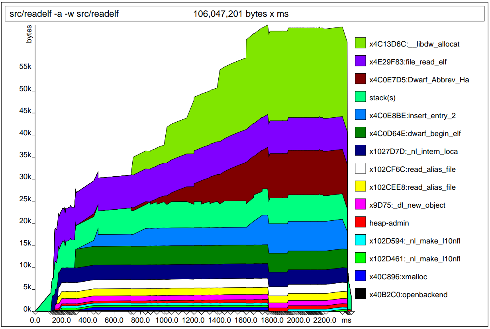
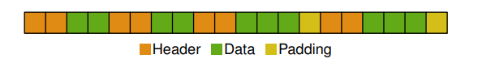

# 7.3 計算記憶體使用

了解程式使用了多少記憶體並更進一步知道實際發生的位置，是增進記憶體使用率的第一步。最棒的是目前有一些非常好用的工具可以參考，而且還不需要重新編譯或特別修改程式。

第一個要介紹的工具叫 [`massif`](https://valgrind.org/docs/manual/ms-manual.html) ，提供了以時間為單位計算記憶體使用情況的概觀而且還可以保留編譯器自動產生的除錯 (debug) 資訊。圖 7.7 為範例。`massif` 與 `cachegrind`（7.2）相同都是使用 `valgrind` 為基礎架構的工具。使用方法如下：

```c
valgrind --tool=massif command arg
```
<figure>
  
  <figcaption>圖 7.7： Massif 統計結果</figcaption>
</figure>

在行程終止之前，massif 會新增兩個檔案分別為：`massif.XXXXX.txt` 與 `massif.XXXXX.ps` ，其中 `XXXXX` 是行程的 `PID`。`.txt` 檔案是行程所有呼叫點的記憶體使用摘要，而 `.ps` 檔案的內容如圖 7.7 。

massif 還可以記錄程式的堆疊 (stack) 的使用情況，可以用來確定應用程式的總記憶體使用量，但並不適用於所有狀況。在某些情況下（線程堆疊或使用 signaltstack 時），`valgrind` 無法知道堆疊的使用限制，在這個例子就不會把這些堆疊數字加到總和中。還有一些情況，同樣也無法準確紀錄堆疊。如果程式屬於這些情況，可以在開始運行 massif 時將參數設定 --stacks=no 。要注意的是這些 `valgrind` 的使用參數，必須在加在觀察程式之前。

有些程式內建客製的記憶體配置器，或改寫系統提供的記憶體配置器。第一種情況，配置器通常會直接忽略；在第二種情況下，記錄會因為系統的記憶體配置程式被多包一層導致一些資訊被隱匿，因為只有在最外層的函式呼叫位址會被記錄下來。因此最好將這些記憶體配置程式紀錄下來。參數 `--alloc-fn=xmalloc` 指定的 xmalloc 也是一種記憶體配置函式，這在 GNU 程式中很常見。但這只能將 xmalloc 的呼叫次數被記錄下來，xmalloc 內部所做的呼叫不會被記錄。

第二個工具叫 `memusage` ，來自 GNU C 的函式庫。可以說是 `massif` 的陽春版（但比 massif 早推出很多）。它只記錄堆積 (heap) 的總使用量（包括可能的 mmap 使用等等，如果使用 `-m`），也可以選擇紀錄堆疊 (stack) 。結果圖是隨時間變化的總記憶體使用情況，或者是記憶體配置函式使用的線性變化圖。這些圖表是由 `memusage` 腳本單獨新增，就像使用 valgrind 一樣，必須使用 memusage 腳本來啟動應用程式如下：

```c
memusage command arg
```

必須使用 `-p IMGFILE` 參數來指定在 `PNG` 檔案 `IMGFILE` 中產生圖形。收集資料的程式碼會在程式中實際運行，而不像 valgrind 透過模擬機。因此 `memusage` 的速度比 `massif` 快得多，並且可適用於 `massif` 無法使用的情況下。除了總記憶體消耗外，程式碼還記錄記憶體的配置大小，在程式結束時，會以直方圖顯示所有使用的記憶體配置大小。並把這些資料寫進標準錯誤 (stderr) 。

有些情況是不太能夠直接呼叫待觀察程式。例如 gcc 編譯器的編譯階段是由 gcc 驅動程式啟動。在這種情況下使用 memusage 命令可以透過 -n NAME 提供被觀察程式的名稱，。就算被觀察的程式啟動了其他程式，也可以使用這個參數。如果沒有指定程式名稱，所有啟動的程式都會被記錄。

massif 和 memusage 都有提供額外的選項。程式開發者應該先查閱使用說明手冊來確認這些額外功能是否有提供。

現在我們已經知道如何捕獲有關記憶體配置的資料，要解讀這些資料就有必要在主記憶體和快取使用與互動來著手。有效的動態線性記憶體配置與高效率預取和減少快取未命中息息相關。

需要讀取特定數量資料才能進行後續動作的程式可以通過新增一個列表來達成，其中每個列表項目都包含一個新的資料。這種配置方法的開銷可能是最小的（使用單向鍊結串列），但是在使用資料時的快取效果可能會大大降低性能。

其中一個問題是，按時序配置的記憶體區塊在主記憶體 (RAM) 上並不一定是按順序排列。這有許多可能的原因：

- 由記憶體配置器管理的大型記憶體塊中的記憶體區塊實際上是從後面往前算
- 原本的記憶體區塊用盡，並在定址空間索取在不同位置的新記憶體區塊
- 配置請求的大小不同，從不同的記憶體池中提供服務
- 多線程程式的各個線程交錯配置記憶體區塊

如果程式必須事先配置記憶體才能進行後續動作，使用鍊結串列顯然不適合。因為列表中連續項目在主記憶體中的儲存位置並不一定是按順序排列。如果要確保主記憶體上的順序，那就不能以小記憶體區塊進行配置。必須使用另一層記憶體處理程式，軟體工程師可以自己實作客製化的記憶體配置器。另一個選擇是使用 GNU C 函式庫中的 obstack 實作。這個配置器從系統的記憶體配置器請求大塊記憶體，再分成任意大小的小記憶體區塊。但這些配置區塊會呈連續排列，除非大記憶體區塊已用盡，主要取決於要求的大小但非常罕見。Obstacks 不能完全取代記憶體配置器，他在釋放記憶體的部份有其限制。詳細訊息，請參閱 GNU C 函式庫的使用說明書。

那麼如何知道什麼時候是使用 obstacks（或類似技術）的絕佳時機？如果沒有人可以問，真的非常的困難。但是圖表提供一些線索。如果看到同一位置進行許多記憶體配置，這可能意味著一次大塊的記憶體配置可能有所幫助。在圖 7.7 中，我們可以在地址 `0x4c0e7d5` 的配置中看到這樣的情況。從800毫秒到1800毫秒，他是唯一一個記憶體增長的區域（除了綠色區域）。此外斜率不陡，這意味著我們有大量的小塊記憶體配置發生。這確實是使用 obstacks 或類似技術的絕佳時機。

另一個問題是圖中顯示的是總配置次數很高的情況。如果圖形不是按時間線性繪製，而是按呼叫次數線性繪製（ memusage 的原始設定），這就不容易看出來。在這種情況下，圖中的緩坡表示有很多小塊記憶體配置發生。memusage 不會顯示記憶體配置發生的位置，但是可以通過與 massif 輸出的比較來確定，或者使用者可能會立即看出來。許多小的記憶體配置應該被合併以實踐線性記憶體配置。

這表示程式使用的記憶體與系統或記憶體配置器所使用的記憶體互相交錯。因此我們可能會看到像以下的圖：

<figure>
  
  <figcaption></figcaption>
</figure>

圖中每一個方塊代表一個記憶體字元 (word) 。在比較小的記憶體區域中，有四個已配置的記憶體方塊。由於方塊內的標頭大小和對齊填充的開銷就佔50％ 。因為標頭的放置方式會讓處理器的有效預取率降低50％ 。如果按排列順序處理這些方塊（最適合預取），則處理器將讀取所有標頭和對齊填充字元到快取中，即便應用程式不應該讀取或寫入它們這些記憶體區塊。標頭字元只有在程式運行中與釋放記憶體時才會使用。

要改善這樣的情況其實可以改變實作方式，將管理資料的後設資料 (meta data) 放在其他地方。在某些狀況下可能會是個好主意。但是仍有許多事情需要考慮，其中安全性是個不可忽視的因素。不論未來有任何狀況，記憶體對齊所帶來的填充問題永遠不會消失（這個例子，如果忽略標頭則對齊填充佔了16％的資料）。只有當程式開發者直接控制記憶體配置器時，才能避免這種情況。就算有對齊造成的空洞，也在可控制範圍內。


