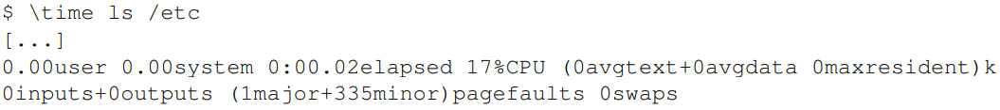

# 7.1 記憶體操作分析

進行記憶體操作分析需要與硬體的進行整合。當然也可以只透過軟體也可以收集某些資訊，但是這些資訊往往過於粗略的或是模擬而非真實。在第 7.2 和 7.5 節裡我們會展示一些模擬的例子。在此章節，我們會專注在可測量的記憶體所帶來的功效。

在 Linux 作業系統上，可以透過 Oprofile 來監控效能。如參考書目[2]所寫，Oprofile 提供不間斷的效能分析；除此之外更提供友善的界面來提供量測功能並以統計數據方式呈現。當然 Oprofile 並非效能測量的唯一的方式；值得一提的是，許多 Linux 開發者也正在開發 pfmon ，能夠更適用於某些特殊情境。

Oprofile 提供簡單而基本界面，就算使用 GUI ，但仍運行於非常底層的部份。使用者必須在處理器間發生的事件 (Event) 中選擇。儘管處理器的架構說明書記載了這些事件的細節，但若是需要對資料進行分析往往需要對處理器本身有深入的了解。另一個問題是對收集的數據進行解釋時。由於性能量測結果為絕對值且可以任意增長。對於一個某個已知的計數器來說，數字要高到多高才算太高呢？

針對這個問題首先是避免觀測單一計數器的絕對值，可以將多個計數器的數值一起納入參考。處理器一次可以監控不只一個事件 (Event) ；然後可以計算收集到的絕對值的比值。可能可以獲得更好比較的結果。在計算時通常是以處理時間 (Process time) 作為除數，例如時脈週期數 (Clock cycles) 或指令數。以程式性能的初步測試而言，參考這兩個數字蠻有用的。

圖 7.1 為對一個簡單隨機 “Follow” 測資進行量測的結果，縱軸為 CPI（Cycles Per Instruction）數值，橫軸則是不同的工作集 (Working set) 大小。在大多數 Intel 處理器上紀錄這個事件的變數名稱為 `CPU_CLK_UNHALTED` 和 `INST_RETIRED` 。從縮寫大概可以猜到，前者計算 CPU 的時脈週期，後者則計算指令數。我們看到了類似於我們使用的每個元素的週期量測的圖片。對於小工作集 (Working set) ，比值為 1.0 有時甚至會更低。這些計算結果是在 Intel Core 2 處理器上進行，該處理器具有多標量 (multi-scalar) 的特性，可以同時處理多個指令。對於不受記憶體頻寬限制的程式，比率可以顯著低於 1.0 ，但以這個案例來說，1.0 已經非常好了。

<figure>
  
  <figcaption>圖 7.1：時脈指令數</figcaption>
</figure>

當 L1d 快取無法除存所有計算數值時，CPI 會跳升到接近但低於 3.0 。需要注意的是，CPI 比率是將所有指令對 L2 的存取成本再取其平均，而非只計算記憶體存取的指令。透過列表上的資料的週期，可以計算出每個列表上的項目所需的指令數量。即使在 L2 快取不足時，CPI 比率會跳躍至超過 20。但這些都是可以預期的結果。

但是效能測量計數器應該要讓我們能更深入地了解處理器內部運作。因此我們需要思考處理器的實做細節。在這個章節，我們非常在乎快取處理的細節，因此必須查看與快取相關的事件。但這些事件以及相關的名稱與計數方式都與處理器息息相關。這就是為什麼 oprofile 有其窒礙難行的地方，就算它提供了簡單的使用者介面：使用者得自己去搞懂計數器的相關詳細資料。在附錄 B 中，我們將看到一些處理器的詳細資訊。

對於 Core 2 處理器，所對應的事件分別為 `L1D_REPL` 、`DTLB_MISSES` 和 `L2_LINES_IN`。後者可以測量所有未命中以及由指令所造成的未命中，而非硬體預取 (Prefetch) 。隨機 “Follow” 測試的結果如圖 7.2 所示。

所有的比值結果都是使用除役 (retired) 指令（`INST_RETIRED`）的數量計算。因此要計算快取未命中率，還必須從 `INST_RETIRED` 中減去所有讀取資料和儲存資料的指令，使得記憶體操作的實際快取未命中率甚至比圖中顯示的數字更高。

其中 L1d 的快取未命中占大多數，對於 Intel 處理器而言，由於使用包含快取（inclusive caches），代表可能會出現 L1d 快取未命中的情況。該處理器具有 32k 大小的 L1d 快取，因此可以看到，正如預期所見，L1d 未命中率從零開始上升到將近工作集的大小（除了列表資料集之外，還有可能有其他原因觸發快取，因此增加集中在 16k 和 32k 之間 。有趣的是，硬體預取可以將 L1d 快取未命中率保持在約 1％，直到工作集超過 64k 之後，L1d 未命中率急劇上升。

<figure>
  
  <figcaption>圖 7.2：快取未命中率 (Follow Random)</figcaption>
</figure>

L2 快取未命中率一直保持為零，直到 L2 快取完全用盡為止；由於 L2 的其他用途造成的未命中可以姑且忽略不計。一旦超過 L2 快取的大小（2
21位元），未命中率就會上升。同時另一件值得注意的是，L2 快取需求未命中率並非為零。這表明硬體預取器沒有加載後續指令所需的所有高速快取內容。當然因為隨機的存取能夠阻礙預取的優勢。可以跟圖 7.3 循序非隨機讀取的測試版本一起比較。

<figure>
  
  <figcaption>圖 7.3：快取未命中率 (Follow Sequential)</figcaption>
</figure>

在這張圖中，可以看到 L2 的需求未命中率基本上為零（請注意，此圖的度量衡與圖 7.2 不同）。對於循序存取情況，硬體預取器運作得非常完美：幾乎所有 L2 快取未命中都是由預取器所造成。從 L1d 和 L2 快取未命中率相同來表明，幾乎所有 L1d 快取未命中都被 L2 快取處理，並沒有造成進一步延遲。這樣的情境對於所有程式來說都是最理想的，但卻很難成真。

在這兩個圖中，第四條線是 DTLB 未命中率（ Intel 有專門為程式碼和資料所設置的 TLB ，DTLB 就是儲存資料用的 TLB ）。對於隨機存取的情況，DTLB 的未命中率就非常地高並且還會導致延遲。但有趣的地方在於，DTLB 的代價早在 L2 快取未命中之前就設定。對於循序存取情況，DTLB 的未命中率基本上為零。

回到 6.2.1 節中的矩陣乘法示例以及 A.1 節中的示例程式碼，我們可以利用另外三個計數器。`SSE_HIT_PRE` 、`SSE_PRE_MISS` 和 `LOAD_PRE_EXEC` 來查看軟體預取 (Prefetch) 的效果如何。如果執行 A.1 節中的程式碼，我們可以得到以下結果：

描述 | 比值
--- | ---
有用的 NTA 預取 | 2.84%
延遲的 NTA 預取 | 2.56%

NTA（非時間對齊）預取比率表示有多少的預取指令已被執行，因此不需要費額外的功夫來處理。這表示處理器必須浪費額外的時間來解譯預取的指令並到快取尋找相關內容。因此軟體的表現很大程度取決於所使用的處理器快取大小；以及硬體預取器的效能。

但若是只看 NTA 預取比值不太準確。因為這個比值表示所有預取指令中有 2.65％ 產生延遲無法即時發會效益。這些預取的指令在執行之前需要將相關的資料從快取中取出。因此從數值來看只有 2.84％ + 2.65％ = 5.5％ 的預取指令是有用的。以所有有用的 NTA 預取指令來看，48％ 沒有及時完成。由此得知，程式碼還有改進的空間如下：

* 大多數的預取指令沒有幫助
* 預取指令應該要因硬體特性做調整

這個部份就可以留給讀者去練習看看如何在硬體上調整出最佳解決方案。硬體規格扮演了至關重要的角色。對 Core 2 處理器而言，SSE 運算的延遲為 1 個時脈週期。若是較舊版本則為 2 個時脈週期，這表示硬體預取器和預取指令有更多的前置時間來讀取數據。

- 1. Oprofile 執行隨機分析。但只記錄某個事件的第 N 次（其中 N 是每個事件最小值的閾值），以避免造成系統的負擔。某些情況可能會觸發 100 次事件，但很有可能不會在報告中顯示。

- 2. 並非所有事件都能被精準的記錄。舉例來說，在記錄特定事件時指令計數器可的結果往往可能是錯誤的。處理器的多標量 (Multi-scalar) 特性可能使得計算結果很難 100％ 正確。但在某些處理器上，有些事件是可以精確的紀錄。

這些已標記的列表不僅有助於解讀預取資訊，每個事件都是以指令指標來記錄，因此也可以精準定位程式中的其他熱點。執行頻繁的位置通常會是許多 `INST_RETIRED` 事件的來源，因此值得進行額外的調整。如果觀測結果有許多快取未命中時，會需要透過預取指令以避免快取未命中。

有一種事件可以在沒有硬體支援的情況下測量頁面錯誤 (Page fault) 。作業系統負責解決頁面錯誤，在這些情況下，也會把他計算下來。並分成以下兩種類型的頁面錯誤：

- **次要頁面錯誤** 對於未使用的匿名頁面（未被任何檔案紀錄使用）、寫時複製 (copy-on-write) 頁面以及內容已經在記憶體某處的其他頁面。
- **主要頁面錯誤** 需要讀取磁碟以獲取由檔案支援（或替換頁面出去 (swapped-out) ）的資料。

很明顯，主要頁面錯誤比次要頁面錯誤要付出更多的代價。但次要頁面錯誤所造成的損失也不容忽視。在任何情況下，都需要進入作業系統核心來進行操作，無論是尋找新的頁面，清除或寫入需要的資料，也必須修改頁表樹 (Page table tree) 。最後還需要同步那些讀取或修改頁表樹的其他任務，並可能引發更多的延遲。

最簡單讀取頁面錯誤的方法是透過 time 工具。需要注意的是，要使用真正的工具，而不是 shell 的附給你的內建命令。如圖 7.4 中所示。

<figure>
  
  <figcaption>圖 7.4：time 工具的相關內容</figcaption>
</figure>

有趣的部分是圖的最後一行。time 顯示 1 個主要頁面錯誤的和 335 個次要的頁面錯誤。當然確切的數字可能會有所不同；特別是如果你立即重複運行可能會顯示現在完全沒有主要的頁面錯誤。如果程式執行相同的操作，在系統環境沒有任何變化的情況下，總頁面錯誤的數字會保持穩定。

對頁面錯誤而言，影響最大的階段是在程式啟動階段。使用每個頁面都會產生頁面錯誤；特別是對於 GUI 應用程式，使用的頁面越多，程式正式開始運作所需的時間的準備時間就越長。在第 7.5 節中，我們將看到一個專門用於測量初始化時間的工具。

time 的底層透過 `rusage` 來運作。`wait4` 系統呼叫在父行程等待子行程終止時會寫入 `strcut rusage` ; 這樣的行為正好符合 time 的需求。但行程還是可以獲取自己的資源使用情況（正是 `rusage` 命名的由來）或已終止的子行程的資源使用資訊。

```c
#include <sys/resource.h>
int getrusage(__rusage_who_t who, struct rusage *usage)
```

參數 `who` 明確表示是哪個行程要求資訊。目前只有 `RUSAGE_SELF` 和 
`RUSAGE_CHILDREN` 兩個變數有被定義。資源使用的狀況計算到當每個子行程截至終止為止的加總。而非個別使用情況。為了要能夠允許存取特定一個線程的資料，未來可能會新增 `RUSAGE_THREAD` 來處理單一個別的計算。`rusage` 結構定義了包括執行時間、發送和使用的 IPC 訊息數量以及頁面錯誤數在內的各項計算值。頁面錯誤的資訊可在 `ru_minflt` 和`ru_majflt` 中獲得。

對於想要透過減少頁面錯誤來增加程式效能的設計師可以常常查看這些資訊，收集分析並做出比較。從系統面來看，如果使用者擁有足夠系統權限權限，也可以透過 `/proc/<PID>/stat` 看到相關資訊。其中 `<PID>` 是想查看的行程 ID ，頁面錯誤的數值則位在第十到第十四欄。分別是行程及其子程的累進次要和主要頁面錯誤數。