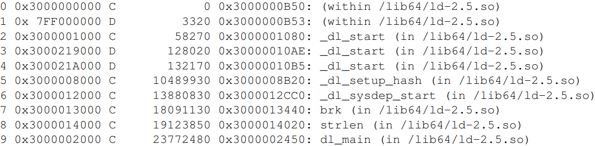

# 7.5 頁面錯誤最佳化

在像Linux這樣具有需求分頁功能的作業系統上，`mmap` 的使用只修改頁面表。它確保對於檔案支持的頁面，可以找到底層的資料，對於匿名的記憶體空間，則提供初始化的頁面並將內容設定為0。`mmap` 使用時並不會實際分配記憶體。第一次讀取頁面時不管是讀寫資料或執行程式碼時，才會真的分配內存頁面的操作。當出現頁面錯誤時，作業系統核心會根據頁表樹決定需要在頁面上出現的資料，進行頁面錯誤解析。處理頁面錯誤的成本很高，但在進程使用每個記憶體頁面都時常發生。

為了降低頁面錯誤的成本，必須減少使用的總頁面數。減少程式碼數量可以幫助實現此目的。為了減少特定程式路徑（例如程式啟動）的成本，重新排列代程式碼以便在該代碼路徑中，減少接觸到的頁面數量也會有幫助。但是要正確的排序並不容易。

圖 7.8 的範例中，程式從地址 3000000B5016開始執行，這導致系統讀取位於地址 300000000016 的頁面。不久後，下一個頁面也跟著被載入，被呼叫的函數 `_dl_start` 位於此頁面上。最初的程式碼存取位於地址 7FF00000016 的變數。這發生在第一次頁面錯誤後 3,320 個指令週期，很可能是程式的第二條指令（第一個指令後三個位元處）。如果查看程式碼，可以注意這個記憶體存取有一些奇怪的地方。此指令為呼叫指令，並沒有載入或除存任何資料，但是它會在堆疊上除存返回地址，這正是在這裡發生的事情。但是，這不是進程的堆疊，而是 valgrind 的內部堆疊。這表示，在解釋頁面置換的結果時，valgrind 也會有所影響。

<figure>
  
  <figcaption>圖 7.8：pagein輸出結果</figcaption>
</figure>

pagein 的輸出可用於確定程式碼中最理想相鄰順序。從 `/lib64/ld-2.5.so` 的程式碼可以發現，最初的指令呼叫了函數 `_dl_start` ，但這兩個函式位於不同的頁面上。重新排列程式碼以將程式碼移動到同一頁面上可以避免或延遲頁面錯誤。但要確認最佳程式碼順序是一個繁瑣的過程。由於設計上第二次使用頁面沒有記錄，因此要使用試錯法來查看更改的影響。使用呼叫圖型分析，可以猜出可能的呼叫序列，這可能有助於加快對函數和變數排序的過程。

pagein 的輸出可用於確定程式碼中最理想相鄰順序。從 `/lib64/ld-2.5.so` 的程式碼可以發現，最初的指令呼叫了函數 `_dl_start` ，但這兩個函式位於不同的頁面上。重新排列程式碼以將程式碼移動到同一頁面上可以避免或延遲頁面錯誤。但要確認最佳程式碼順序是一個繁瑣的過程。由於設計上第二次使用頁面沒有記錄，因此要使用試錯法來查看更改的影響。使用呼叫圖型分析，可以猜出可能的呼叫序列，這可能有助於加快對函數和變數排序的過程。

如果只是想有個概念，可以通過查看組成可執行檔或動態函式庫的目標檔案來查看呼叫序列。從一個或多個入口點（即函數名稱）開始，可以計算互相依賴的關係。以目標檔案上來說，這很容易做到。在每一輪中，確定包含所需函數和變量的目標文件。但種子(seed)集合必須明確指定。然後確定這些目標文件中的所有未定義引用，並將它們加到所需符號集中。重複執行直到集合穩定。

第二步驟是決定順序。各個目標檔案希望能使用最少的頁面數。作為額外的獎勵，沒有函數應該跨越頁面的邊界。在所有這些情況中的一個複雜之處是，為了最佳地安排目標檔案，必須知道鏈接器將之後的行為。在這裡的部份是，鏈接器將按照它們出現在輸入檔（例如，壓縮）和命令行中的順序將目標檔案放入可執行文件或 DSO 中。相對來說給程式設計師可控的情況。

對那些願意投入更多時間的人，可以使用自動追蹤呼叫的函式來成功重新排序，方法是使用gcc在 `-finstrument-functions` 選項時插入的 `__cyg_profile_func_enter` 和 `__cyg_profile_func_exit` 。詳細使用方式跟功能請參閱 gcc 手冊以獲取有關這些 `__cyg_*` 接口的更多信息。通過追蹤程式的執行，程式設計師可以更準確地確定調用鏈。 [17] 的結果是通過重新排序函式來減少 5％ 的啟動成本。主要好處是減少了頁面錯誤數量，但 TLB 快取也發揮了作用——在虛擬化環境中，TLB 未命中的代價變得更加昂貴。

透過pagein 工具的分析結果與呼叫順序資訊，可能對減少程式中某些階段（例如啟動階段），頁面錯誤數量有所幫助。

Linux 核心提供了兩個額外的機制可以避免頁錯誤。第一個機制是 mmap 的標誌，會告訴作業系統核心不去修改頁表資料，實際上是先對映射區域中的所有頁面先標記頁面錯誤。只需在 `mmap` 的第四個參數中加入 `MAP_POPULATE` 標誌即可作到。但這也會導致 mmap 使用的成本顯著增加，但如果該映射的所有頁面都會立即使用，則好處就會很明顯。相較於有一次多個頁面錯誤，每次處理單一的頁面錯誤成本可能更高，因為需要同步化等等的其他議題，與其如此不如讓程式只有一個昂貴的 `mmap` 呼叫。然而，使用這個標誌也有缺點，在映射頁面中有一大部分在呼叫後不久（或永遠）沒有使用時，會造成浪費時間和記憶體。預先處理的頁面，直到很久之後才使用，也會阻塞系統。記憶體在使用之前就已分配，這可能導致出現記憶體短缺。另一方面，在最壞的情況下，頁面可能會被重新使用（因為尚未修改），雖然不造成額外負擔，但仍會增加一些成本，加上記憶體的分配成本。

但 `MAP_POPULATE` 的方式有些過於粗糙。而且還有第二問題：這個最佳化的方式但並非必要，實際上沒有必要將所有頁面都映射進來。如果系統太忙無法執行操作，已經預取的頁面也可以被丟棄。一旦真的使用了頁面，程式就會出現頁面錯誤。另一種方法是使用 `posix_madvise` 函數的`POSIX_MADV_WILLNEED` 。這會提示作業系統程式在不久後會需要使用描述的目標頁面。當然作業系統核心也可以忽略此建議，但也可以預取先取好頁面。優點在於操作更細微，任何映射地址空間區域中的單個頁面或頁面範圍都可以被預先提取。對於許多在運行時不使用的資料的記憶體映射檔案，可能比使用 `MAP_POPULATE` 效果還好。

除了這些主動減少頁面錯誤的方法之外，還可以採用一些硬體設計師喜歡的方法。一個 DSO 佔據定址空間中的相鄰頁面。頁面大小越小，需要的頁面越多。這反過來也意味著，頁面錯誤的次數也會增加。相反來說。對於較大的頁面大小，映射（或匿名記憶體）所需的頁面數量減少，頁面錯誤的數量也隨之減少。

大多數的架構都支援 4K 的頁面大小。在 IA-64 和 PPC64 上，64K的頁面大小也十分常見。這表示分配記憶體的最小單位是 64K 。這個值必須在編譯核心時就設定好，而且無法在執行時動態更改（至少目前無法）。ABI 提供多種頁面大小設定可以讓應用程式選擇並在執行時會做出調整。較大的頁面空間頁面可能會浪費更多空間，但在某些情況下還算可以接受。

大多數架構還支援 1MB 或甚至更大的頁面大小。這樣的頁面在某些情況下也很有用，但這樣的記憶體分配法對實體RAM空間太過浪費。但大頁面也有其優點：如果使用巨大的資料集，以 x86-64 上的2MB頁面存儲它們比使用4k頁面節省了511個頁面錯誤（每個大頁面）。這可能會產生很大的差異。解決方法是有選擇地請求記憶體分配，僅某些地址範圍使用大型記憶體頁面，對於同一進程中的所有其他映射使用正常的頁面大小。

使用大頁面的代價在於用於物理記憶體空間必須是連續的，因此存在內存碎裂的問題，可能在一段時間後就無法分配新的頁面空間。但處理記憶體碎片化是非常複雜的。例如對於2MB的大頁面，取得512個連續頁面窒礙難行，除非在系統啟動時。這就是為什麼目前大頁面的解決方案是使用特殊的文件系統 `hugetlbfs` 。可以通過寫入要保留的大頁面數量來做分配，檔案位置如下：

```c
/proc/sys/vm/nr_hugepages
```

如果無法找到足夠連續的記憶體空間，操作可能會失敗。但在使用虛擬化技術時，情況會變得特別有趣。使用 VMM 模型的虛擬系統並不會直接管理實際的物理記憶體空間，因此無法自行分配 `hugetlbfs` 。必須依賴 VMM 來代為處理，但這個功能並不是在所有虛擬機都有。對於 KVM 模型，運行KVM模組的 Linux 作業系統核心可以執行 `hugetlbfs` 分配，並可能將其中的一部分頁面傳遞給其中一個客戶空間。

所以當一個程式需要大頁面時會多種可能性：
• 程式可以使用System V共享記憶體界面並設定 `SHM_HUGETLB` 標誌
• 可以實際掛載類型為 `hugetlbfs` 的檔案系統，然後程式可以在掛載點下新增一個檔案，並使用 `mmap` 將一個或多個頁面映射為記憶體空間。
第一種情況下，`hugetlbfs` 不需要被掛載。
請求一個或多個大頁面的程式碼可能如下：

```c
key_t k = ftok("/some/key/file", 42);
int id = shmget(k, LENGTH, SHM_HUGETLB|IPC_CREAT|SHM_R|SHM_W);
void *a = shmat(id, NULL, 0);
```

這段程式碼的關鍵實做是使用 `SHM_HUGETLB` 旗標和選擇正確的 `LENGTH` ，該值必須是系統的大頁面的倍數。不同的架構會有不同的值。使用 System V 共享記憶體介面有一個麻煩的問題，因為其透過 key 參數以區分（或共享）映射區域很容易跟 `ftok` 介面很產生衝突因此最好使用其他機制。

如果掛載 `hugetlbfs` 檔案系統沒問題，最好使用它而不是 System V 的共享記憶體。使用特殊檔案系統的唯一真正問題是作業系統必須支援，而且目前尚未有標準化的掛載點。一旦檔案系統成功掛載，例如在 `/dev/hugetlb` ，程式就可以輕鬆使用它：

```c
int fd = open("/dev/hugetlb/file1",O_RDWR|O_CREAT, 0700);
void *a = mmap(NULL, LENGTH,PROT_READ|PROT_WRITE,fd, 0);
```

透過在 `open` 呼叫中使用相同的檔名，多個進程可以共享相同的大頁面並共同協作。也可以將頁面設置為可執行，只是在 `mmap` 呼叫中必須設置`PROT_EXEC` 標誌。與System V共享記憶體示例相同，`LENGTH` 的值必須是系統的巨大頁面大小的倍數。

一個防寫入的程式（所有程式都應該如此）可以使用以下函式在運行時確定掛載點：

```c
char *hugetlbfs_mntpoint(void) {
char *result = NULL;
FILE *fp = setmntent(_PATH_MOUNTED, "r");
if (fp != NULL) {
    struct mntent *m;
    while ((m = getmntent(fp)) != NULL)
        if (strcmp(m->mnt_fsname, "hugetlbfs") == 0) {
            result = strdup(m->mnt_dir);
            break;
        }
    endmntent(fp);
}
return result;
}
```

這兩種情況的更多資訊可以在作業系統核心樹的 hugetlbpage.txt 檔案中找到。該檔案還描述了IA-64所需的特殊處理方式。
為了說明大頁面的優點，圖7.9顯示了對於 `NPAD=0` 的隨機Follow測試的結果。與圖3.15相同，但這次我們也測量了使用大頁面分配記憶體的數據。可以看到效能優勢非常大。對於 $2^{20}$ 位元組，使用巨頁的測試速度快了57％。這是由於這個大小完全適合一個2MB的頁面，因此不會發生DTLB未命中。

<figure>
  
  <figcaption>圖 7.9：Follow在大頁面的輸出結果</figcaption>
</figure>

數字一開始比較小，但隨著工作集大小增加而開始遞增。使用大頁面的測試，在512MB的工作集大小上快了38％。大頁面測試的曲線在大約250個週期處有形成一個高原。當工作集$2^{27}$個字元時數字再次顯著上升。高原形成的原因是64個2MB的TLB可以涵蓋$2^{27}$個字元。

正如這些數字所示的，使用大工作集的成本中有很大一部分來自TLB未命中。也因此使用本節中描述的界面可能會帶來不錯的成果。圖表中的數字很可能是理想的上限，但在現實世界中的應用程式也可以有顯著的加速效果。例如：資料庫，因為使用大量資料存取，是今天使用大頁面的應用程式之一。

數字一開始比較小，但隨著工作集大小增加而開始遞增。使用大頁面的測試，在512MB的工作集大小上快了38％。大頁面測試的曲線在大約250個週期處有形成一個高原。當工作集$2^{27}$個字元時數字再次顯著上升。高原形成的原因是64個2MB的TLB可以涵蓋$2^{27}$個字元。

正如這些數字所示的，使用大工作集的成本中有很大一部分來自TLB未命中。也因此使用本節中描述的界面可能會帶來不錯的成果。圖表中的數字很可能是理想的上限，但在現實世界中的應用程式也可以有顯著的加速效果。例如：資料庫，因為使用大量資料存取，是今天使用大頁面的應用程式之一。

目前沒有辦法使用大頁面映射檔案支持的資料。但到目前為止提出的實做方式無非都是明確使用大頁面，並且依賴 `hugetlbfs` 檔案系統。這種實做方式無法令人接受。大頁面的使用必須是透明。作業系統核心可以輕鬆地確定哪些映射適合並自動使用大頁面。一個問題是作業系統核心不會永遠知道使用模式。如果一個記憶體空間要求需要4k頁面精細度（例如，因為使用mprotect更改了部分記憶體的保護範圍），在線性的實體記憶體空間則會浪費很多寶貴的資源。因此，成功實現這種方法肯定需要更多時間。

