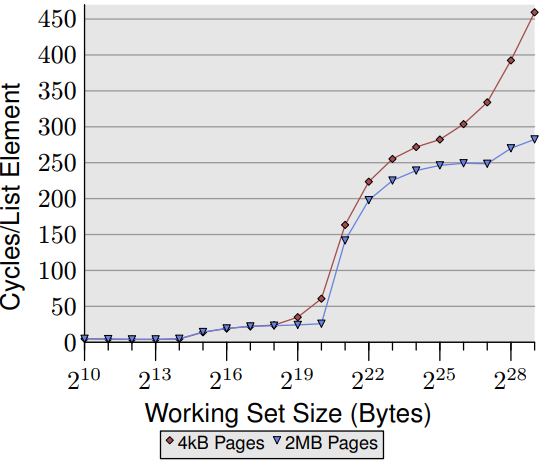

# 7.5 頁面錯誤最佳化

在像Linux這樣具有請求式的頁面調度系統 (demand paging) 的作業系統上，使用 `mmap` 只修改頁面表的內容。它確保對於檔案支持的頁面，可以找到底層的資料，對於匿名的記憶體空間，則提供初始化的頁面並將內容設定為 0。`mmap` 使用時並不會實際分配記憶體。第一次讀取頁面時不管是讀寫資料或執行程式碼時，才會真的分配記憶體空間。當出現頁面錯誤時，作業系統核心會根據頁表樹決定需要在頁面上出現的資料，進行頁面錯誤的處理。處理頁面錯誤的成本很高，但在行程使用每個記憶體頁面都時常發生。

為了降低頁面錯誤的成本，減少使用的總頁面數是個好方法。透過減少程式碼數量可以幫助實現此目的。為了減少特定程式路徑（例如程式啟動）的成本，重新排列程式碼以便在該程式路徑中，減少接觸到的頁面數量也會有幫助。但是要正確的排序並不容易。

圖 7.8 的範例中，程式從地址 3000000B5016 開始執行，系統接著讀取位於地址 300000000016 的頁面。不久後，下一個頁面也跟著被載入，被呼叫的函式 `_dl_start` 位於此頁面上。最初的程式碼存取位於地址 7FF00000016 的變數。發生在第一次頁面錯誤後 3,320 個指令週期，很可能是程式的第二條指令（第一個指令後三個位元處）。如果查看程式碼，可以注意這個記憶體存取有一些奇怪的地方。此指令為僅是呼叫指令，並沒有載入或除存任何資料，但是它會在堆疊上儲存返回位址，這正是在這裡發生的事情。但這並不是行程的堆疊 (stack) ，而是 valgrind 內部的堆疊 (stack) 。這表示在解釋頁面置換的結果時，valgrind 也會造成影響。

```c
0 0x3000000000 C           0 0x3000000B50: (within /lib64/ld-2.5.so)
1 0x 7FF000000 D        3320 0x3000000B53: (within /lib64/ld-2.5.so)
2 0x3000001000 C       58270 0x3000001080: _dl_start (in /lib64/ld-2.5.so)
3 0x3000219000 D      128020 0x30000010AE: _dl_start (in /lib64/ld-2.5.so)
4 0x300021A000 D      132170 0x30000010B5: _dl_start (in /lib64/ld-2.5.so)
5 0x3000008000 C    10489930 0x3000008B20: _dl_setup_hash (in /lib64/ld-2.5.so)
6 0x3000012000 C    13880830 0x3000012CC0: _dl_sysdep_start (in /lib64/ld-2.5.so)
7 0x3000013000 C    18091130 0x3000013440: brk (in /lib64/ld-2.5.so)
8 0x3000014000 C    19123850 0x3000014020: strlen (in /lib64/ld-2.5.so)
9 0x3000002000 C    23772480 0x3000002450: dl_main (in /lib64/ld-2.5.so)
```
圖 7.8：pagein 輸出結果

pagein 的輸出可用來確定程式碼中最理想相鄰順序。從 `/lib64/ld-2.5.so` 的程式碼可以發現，最初的指令呼叫了函式 `_dl_start` ，但這兩個函式位於不同的頁面上。重新排列程式碼會把程式碼移動到同一頁面以避免或延遲頁面錯誤。但要確認最佳程式碼順序是一個繁瑣的過程。由於設計上不會紀錄 pagein 不會紀錄第二次使用頁面的紀錄，因此要使用試錯法來查看更改的影響。並使用呼叫圖來分析，猜測可能的呼叫序列，有助於加快對函式和變數排序的過程。

如果只是想有個粗略概念，可以通過查看組成可執行檔或動態函式庫的目標檔來查看呼叫序列。從單個或多個進入點（即函式名稱）開始，可以計算函式的互相依賴的關係。以目標檔案上來說這很容易。在每一輪中，確定包含所需函式和變量的目標文件。但種子 (seed) 集合必須事先指定。然後確定在這些目標文件中的所有未定義引用，加到所需符號集合中。重複執行直到集合穩定。

第二步驟是決定順序。各個目標檔案希望能使用最少的頁面數。作為額外的獎勵，沒有函式應該跨越頁面的邊界。在所有這些情況中的一個複雜之處是，為了最佳地安排目標檔案，必須知道鏈接器 (linker) 將之後的行為。在這裡鏈接器將按照它們出現在輸入檔（例如，壓縮）和命令行中的順序將目標檔案放入可執行文件或 DSO 中。對程式設計師來說相對可預期。

對那些願意投入更多時間的人，可以使用自動追蹤呼叫的函式來重新排序，方法是使用 gcc 在 `-finstrument-functions` 選項時插入的 `__cyg_profile_func_enter` 和 `__cyg_profile_func_exit` 。詳細使用方式跟功能請參閱 gcc 使用手冊以獲取有關這些 `__cyg_*` 使用界面的更多資訊。通過追蹤程式的執行，程式設計師可以更準確地確定函式呼叫鏈。 [17] 的結果是通過重新排序函式來減少 5％ 的啟動成本。主要好處在於減少了頁面錯誤數量，但 TLB 快取也發揮了作用因為在虛擬化環境中，TLB 未命中的代價變得相對更加昂貴。

透過 pagein 工具的分析結果與呼叫順序資訊，可能對減少程式中某些階段（例如啟動階段），頁面錯誤數量有所幫助。

Linux 系統核心提供了兩個額外的機制可以避免頁錯誤。第一個機制是 mmap 的標誌 (flag) ，會告訴作業系統核心不去修改頁面表的資料，但去對映射區域中的所有頁面先標記頁面錯誤。只需在 `mmap` 的第四個參數中加入 `MAP_POPULATE` 標誌即可作到。但這也會導致 mmap 的使用的成本顯著增加，但如果這些映射空間的所有頁面都會立即使用，好處會非常明顯。相較於一次處理多個頁面錯誤，每次處理一個頁面錯誤的成本可能更高，因為還需要處理同步化等等的其他問題，與其如此不如讓程式只有一個昂貴的 `mmap` 呼叫。但使用這個標誌也有一些缺點，在映射頁面中如果有大部分的頁面在呼叫後沒有使用時，會造成造成時間和記憶體的浪費。預先處理的頁面，直到很久之後才被使用，也會造成系統阻塞。記憶體在使用之前就已分配，這可能導致出現記憶體短缺。另一方面，在最糟的情況下，頁面可能會被重新使用（因為尚未修改），雖然不造成額外負擔，但仍會增加一些成本，加上記憶體分配成本。

但 `MAP_POPULATE` 的方式有些過於粗糙。而且還有第二問題：因為最佳化的方式但並非必要，實際上沒有必要將所有頁面都映射進來。如果系統太忙無法執行操作，已經預取的頁面也可以被丟棄。一旦真的使用了頁面，程式就會出現頁面錯誤。另一種方法是使用 `posix_madvise` 函式的 `POSIX_MADV_WILLNEED` 。這會提示作業系統程式在不久後會需要使用描述的目標頁面。當然作業系統核心也可以忽略這個設定，但也可以預取先取好頁面。優點在於操作更細微，任何映射地址空間區域中的單個頁面或多個頁面範圍都可以被預先提取。對於許多在運行時不使用的資料的記憶體映射檔案，可能比使用 `MAP_POPULATE` 效果還好。

除了這些主動減少頁面錯誤的方法之外，還可以採用一些硬體設計師喜歡的方法。一個 DSO 佔據定址空間中的相鄰頁面。頁面大小越小，需要的頁面越多。反過來說，頁面錯誤的次數也會增加。相反來說。對於較大的頁面大小，映射（或匿名記憶體）所需的頁面數量減少，頁面錯誤的數量也隨之減少。

大多數的架構都支援 4K 的頁面大小。在 IA-64 和 PPC64 架構上，64K 的頁面大小也十分常見。這表示分配記憶體的最小單位是 64K 。這個值必須在編譯核心時就設定好，而且無法在執行時動態更改（至少目前無法）。 ABI 提供多種頁面大小設定可以讓應用程式選擇並在執行時會做出調整。較大的頁面空間頁面可能會浪費更多空間，但在某些情況下還算可以接受。

大多數架構還支援 1MB 或甚至更大的頁面大小。這樣的頁面在某些情況下也很有用，但這樣的記憶體分配法對實體RAM空間太過浪費。但大頁面也有其優點：如果使用巨大的資料集，以 x86-64 上的 2MB 頁面存儲它們比使用 4k 頁面節省了 511 個頁面錯誤（每個大頁面）。這可能會產生很大的差異。解決方法是有選擇地請求記憶體分配，僅某些地址範圍使用大型記憶體頁面，對於同一行程中的所有其他映射使用正常的頁面大小。

使用大頁面的代價在實體記憶體空間必須是連續的，因此存在內存碎裂的問題，可能在一段時間後就無法分配新的頁面空間。但要處理記憶體碎片化非常複雜。例如對於 2MB 的大頁面，要取得 512 個連續頁面窒礙難行，除非在系統啟動階段。這就是為什麼目前大頁面的解決方案是使用特殊的文件系統 `hugetlbfs` 。可以通過寫入要保留的大頁面數量來做分配，檔案位置如下：

```c
/proc/sys/vm/nr_hugepages
```

如果無法找到足夠連續的記憶體空間，操作可能會失敗。在使用虛擬化技術時，情況會變得特別有趣。使用 VMM 模型的虛擬系統並不能直接管理實體的記憶體空間，因此無法自行分配 `hugetlbfs` 。必須依賴 VMM 代為處理，但這個功能並不是所有虛擬機都有。對於 KVM 模型，運行 KVM 模組的 Linux 作業系統核心可以執行 `hugetlbfs` 分配，並可能將其中的一部分頁面傳遞給其中一個客戶空間。

當一個程式需要大頁面時有多種可行的方法：

-  程式可以使用 System V 共享記憶體界面並設定 `SHM_HUGETLB` 標誌 (flag) 
-  可以實際掛載 `hugetlbfs` 類型的檔案系統，然後程式可以在掛載點下新增一個檔案，並使用 `mmap` 將一個或多個頁面映射為記憶體空間。

第一種情況下，`hugetlbfs` 不需要被掛載。

請求一個或多個大頁面的程式碼可能如下：

```c
key_t k = ftok("/some/key/file", 42);
int id = shmget(k, LENGTH, SHM_HUGETLB|IPC_CREAT|SHM_R|SHM_W);
void *a = shmat(id, NULL, 0);
```

這段程式碼的關鍵實做是使用 `SHM_HUGETLB` 旗標和選擇正確的 `LENGTH` ，這個值必須是系統的大頁面的倍數。不同的架構會有不同的值。使用 System V 共享記憶體介面有一個麻煩的問題，因為其透過 key 參數以區分（或共享）映射區域而且很容易跟 `ftok` 介面產生衝突因此最好使用其他機制。

如果掛載 `hugetlbfs` 檔案系統沒問題，最好不要使用 System V 的共享記憶體。使用特殊檔案系統的唯一真正問題是作業系統必須支援，而且目前尚未有標準化的掛載點。一旦檔案系統成功掛載，例如在 `/dev/hugetlb` ，程式就可以輕鬆使用它：

```c
int fd = open("/dev/hugetlb/file1",O_RDWR|O_CREAT, 0700);
void *a = mmap(NULL, LENGTH,PROT_READ|PROT_WRITE,fd, 0);
```

透過在 `open` 呼叫中使用相同的檔名，多個行程可以共享相同的大頁面並共同協作。也可以將頁面設置為可執行，只是在 `mmap` 呼叫中必須設定 `PROT_EXEC`  標誌。與 System V 共享記憶體示例相同， `LENGTH` 的值必須是系統的巨大頁面大小的倍數。

一個防寫入的程式（所有程式都應該如此）可以使用以下函式在運行時確定掛載點存在：

```c
char *hugetlbfs_mntpoint(void) {
char *result = NULL;
FILE *fp = setmntent(_PATH_MOUNTED, "r");
if (fp != NULL) {
    struct mntent *m;
    while ((m = getmntent(fp)) != NULL)
        if (strcmp(m->mnt_fsname, "hugetlbfs") == 0) {
            result = strdup(m->mnt_dir);
            break;
        }
    endmntent(fp);
}
return result;
}
```

這兩種情況的更多使用資訊可以在作業系統核心樹的 hugetlbpage.txt 檔案中找到。該檔案還描述了 IA-64 所需的特殊處理方式。
為了說明大頁面的優點，圖 7.9 顯示了對於 `NPAD=0` 的隨機 Follow 測試的結果。與圖 3.15 相同，但這次我們也測量了使用大頁面分配記憶體的數據。可以看到效能優勢非常大。對於 $2^{20}$ 位元組，使用大頁面的測試速度快了 57％ 。這是由於這個大小完全適合一個 2MB 的頁面，因此不會發生 DTLB 未命中。

<figure>
  
  <figcaption>圖 7.9：Follow 在大頁面的輸出結果</figcaption>
</figure>

數字一開始比較小，但隨著工作集大小增加而開始遞增。使用大頁面的測試，在 512MB 的工作集上快了 38％ 。大頁面測試的曲線在大約 250 個週期處有形成一個高原。當工作集$2^{27}$個字元時數字再次顯著上升。高原形成的原因是 64 個 2MB 的 TLB 可以涵蓋$2^{27}$個字元。

正如這些數字所顯示，使用大工作集的成本中有很大一部分來自 TLB 未命中。也因此使用本節中描述的界面可能會帶來不錯的成果。圖表中的數字很可能是理想值的上限，但在現實世界中的某些應用程式也可以透過大頁面有顯著的加速效果。例如：資料庫，因為使用案例多是大量資料存取，是今天使用大頁面的應用程式之一。

目前沒有辦法使用大頁面映射檔案支持 (filebacked) 的資料。但到目前為止提出的實做方式無非都是明確使用大頁面，並搭配使用 `hugetlbfs` 檔案系統。這種實做方式無法令人接受。大頁面的使用必須是透明，這樣作業系統核心才可以輕鬆地確定哪些映射適合並自動使用大頁面。問在於作業系統核心不會永遠知道使用模式。如果一個可以使用大頁面的記憶體空間要求 4k 頁面精細度（例如，因為使用 mprotect 更改了部分記憶體的保護範圍），在線性的實體記憶體空間則會浪費很多寶貴的資源。因此成功實現這種方法肯定需要更多時間。

