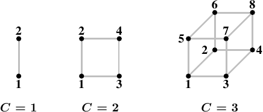

# 5.1. NUMA 硬體

非均勻記憶體架構正變得越來越普遍。在最簡單的 NUMA 類型中，一個處理器能夠擁有本地記憶體（見圖 2.3），存取它比存取其它處理器的本地記憶體還便宜。對這種類型的 NUMA 系統而言，成本差異並不大––即，NUMA 因子很小。

NUMA 也會––而且尤其會––用在大機器中。我們已經描述過擁有多個存取相同記憶體的處理器的問題。對商用硬體而言，所有處理器都會共享相同的北橋（此刻忽略 AMD Opteron NUMA 節點，它們有它們自己的問題）。這使得北橋成為一個嚴重的瓶頸，因為*所有*記憶體流量都會經過它。當然，大機器能夠使用客製的硬體來代替北橋，但除非使用的記憶體晶片擁有多個埠––即，它們能夠從多條匯流排使用––不然依舊有個瓶頸在。多埠 RAM 很複雜、而且建立與支援起來很昂貴，因此幾乎不會被使用。

下一個複雜度上的改進為 AMD 使用的模型，其中的互連機制（在 AMD 情況下為超傳輸〔Hyper Transport〕，是它們由 Digital 授權而來的技術）為沒有直接連接到 RAM 的處理器提供了存取。能夠以這種方式組成的結構大小是有限的，除非你想要任意地增加直徑（diameter）（即，任意兩節點之間的最大距離）。

<figure>
  
  <figcaption>圖 5.1：超立方體</figcaption>
</figure>

一種連接節點的高效拓撲（topology）為超立方體（hypercube），其將節點的數量限制在 $$ 2^{C} $$，其中 $$ C $$ 為每個節點擁有的交互連接介面的數量。以所有有著 $$ 2^{n} $$ 個 CPU 與 $$ n $$ 條交互連接的系統而言，超立方體擁有最小的直徑。圖 5.1 顯示了前三種超立方體。每個超立方體擁有絕對最小（the absolute minimum）的直徑 $$ C $$。AMD 第一世代的 Opteron 處理器，每個處理器擁有三條超傳輸連結。至少有一個處理器必須有個附屬在一條連結上的南橋，代表––目前而言––一個 $$ C = 2 $$ 的超立方體能夠直接且有效率地實作。下個世代將在某個時間點擁有四條連結，屆時將可能有 $$ C = 3 $$ 的超立方體。

不過，這不代表無法支援更大的處理器集合體（accumulation）。有些公司已經開發出能夠使用更大的處理器集合的 crossbar（例如，Newisys 的 Horus）。但這些 crossbar 提高了 NUMA 因子，而且在一定數量的處理器上便不再有效。

下一個改進為連接 CPU 的群組，並為它們全體實作一個共享的記憶體。所有這類系統都需要特製化的硬體，絕不是商用系統。這樣的設計存在多方面的複雜度。一個仍然十分接近於商用機器的系統為 IBM x445 以及類似的機器。它們能夠當作有著 x86 與 x86-64 的普通 4U、8 路機器購買。兩台（某些時候高達四台）這種機器就能夠被連接起來運作，如同一台有著共享記憶體的機器。使用的交互連接引入了一個 OS––以及應用程式––必須納入考量的重要的 NUMA 因子。

在光譜的另一端，像 SGI 的 Altix 這樣的機器是專門被設計來互連的。SGI 的 NUMAlink 互連結構非常地快，同時擁有很短的等待時間；兩個特性對於高效能計算（high-performance computing，HPC）都是必要條件，尤其是在使用訊息傳遞介面（Message Passing Interface，MPI）的時候。當然，缺點是，這種精密與特製化是非常昂貴的。它們令合理地低的 NUMA 因子成為可能，但以這些機器能擁有的 CPU 數量（幾千個）以及有限的互連能力，NUMA 因子實際上是動態的，而且可能因工作負載而達到不可接受的程度。

更常使用的解決方法是，使用高速網路將許多商用機器連接起來，組成一個集群（cluster）。不過，這些並非 NUMA 機器；它們沒有實作共享的定址空間，因此不會歸於這裡討論的任何一個範疇中。

