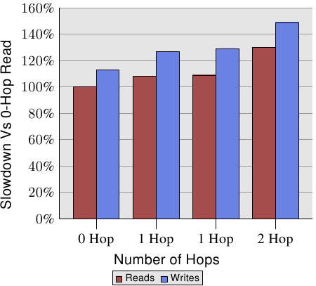
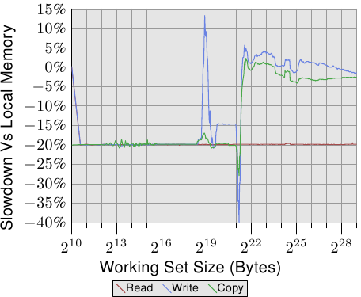

# 5.4. 遠端存取成本

<figure>
  
  <figcaption>圖 5.2：多節點的讀／寫效能</figcaption>
</figure>

不過，距離是有關係的。AMD 在 [1] 提供了一台四槽機器的 NUMA 成本的文件。寫入操作的數據顯示在圖 5.2。寫入比讀取還慢，這並不讓人意外。有趣的部分在於 1 與 2 跳（1- and 2-hop）情況下的成本。兩個 1 跳的成本實際上有略微不同。細節見 [1]。2 跳讀取與寫入（分別）比 0 跳讀取慢了 30% 與 49%。2 跳寫入比 0 跳寫入慢了 32%、比 1 跳寫入慢了 17%。處理器與記憶體節點的相對位置能夠造成很大的差距。來自 AMD 下個世代的處理器將會以每個處理器四條連貫的超傳輸連結為特色。在這個例子中，一台四槽機器的直徑會是一。但有八個插槽的話，同樣的問題又––來勢洶洶地––回來了，因為一個有著八個節點的超立方體的直徑為三。

所有這些資訊都能夠取得，但用起來很麻煩。在 6.5 節，我們會看到較容易存取與使用這個資訊的介面。

<figure>
  <pre><code>00400000 default file=/bin/cat mapped=3 N3=3
00504000 default file=/bin/cat anon=1 dirty=1 mapped=2 N3=2
00506000 default heap anon=3 dirty=3 active=0 N3=3
38a9000000 default file=/lib64/ld-2.4.so mapped=22 mapmax=47 N1=22
38a9119000 default file=/lib64/ld-2.4.so anon=1 dirty=1 N3=1
38a911a000 default file=/lib64/ld-2.4.so anon=1 dirty=1 N3=1
38a9200000 default file=/lib64/libc-2.4.so mapped=53 mapmax=52 N1=51 N2=2
38a933f000 default file=/lib64/libc-2.4.so
38a943f000 default file=/lib64/libc-2.4.so anon=1 dirty=1 mapped=3 mapmax=32 N1=2 N3=1
38a9443000 default file=/lib64/libc-2.4.so anon=1 dirty=1 N3=1
38a9444000 default anon=4 dirty=4 active=0 N3=4
2b2bbcdce000 default anon=1 dirty=1 N3=1
2b2bbcde4000 default anon=2 dirty=2 N3=2
2b2bbcde6000 default file=/usr/lib/locale/locale-archive mapped=11 mapmax=8 N0=11
7fffedcc7000 default stack anon=2 dirty=2 N3=2</code></pre>
  <figcaption>圖 5.3：<code>/proc/<strong>PID</strong>/numa_maps</code> 的內容</figcaption>
</figure>

系統提供的最後一塊資訊就在行程自身的狀態中。能夠確定記憶體映射檔、寫時複製（Copy-On-Write，COW）[^27]分頁與匿名記憶體（anonymous memory）是如何散布在系統中的節點上的。系統核心為每個處理器提供一個虛擬檔（pseudo-file） <code>/proc/<strong>PID</strong>/numa_maps</code>，其中 **PID** 為行程的 ID ，如圖 5.3 所示。檔案中的重要資訊為 `N0` 到 `N3` 的值，它們表示為節點 0 到 3 上的記憶體區域分配的分頁數量。一個可靠的猜測是，程式是執行在節點 3 的核上。程式本身與被弄髒的分頁被分配在這個節點上。唯讀映射，像是 `ld-2.4.so` 與 `libc-2.4.so` 的第一次映射、以及共享檔案 `locale-archive` 是被分配在其它節點上的。

如同我們已經在圖 5.2 看到的，當橫跨節點操作時，1 與 2 跳讀取的效能分別掉了 9% 與 30%。對執行來說，這種讀取是必須的，而且若是沒有命中 L2 快取的話，每個快取行都會招致這些額外成本。若是記憶體離處理器很遠，對超過快取大小的大工作負載而言，所有量測的成本都必須提高 9%／30%。

<figure>
  
  <figcaption>圖 5.4：在遠端記憶體操作</figcaption>
</figure>

為了看到在現實世界的影響，我們能夠像 3.5.1 節一樣測量頻寬，但這次使用的是在遠端、相距一跳的節點上的記憶體。這個測試相比於使用本地記憶體的數據的結果能在圖 5.4 中看到。數字在兩個方向都有一些大起伏，這是一個測量多執行緒程式的問題所致，能夠忽略。在這張圖上的重要資訊是，讀取操作總是慢了 20%。這明顯慢於圖 5.2 中的 9%，這極有可能不是連續讀／寫操作的數字，而且可能與較舊的處理器修訂版本有關。只有 AMD 知道了。

以塞得進快取的工作集大小而言，寫入與複製操作的效能也慢了 20%。當工作集大小超過快取大小時，寫入效能不再顯著地慢於本地節點上的操作。互連的速度足以跟上記憶體的速度。主要因素是花費在等待主記憶體的時間。

[^27]: 當一個記憶體分頁起初有個使用者，然後必須被複製以允許獨立的使用者時，寫時複製是一種經常在作業系統實作用到的方法。在許多情境中，複製––起初或完全––是不必要的。在這種情況下，只在任何一個使用者修改記憶體的時候複製是合理的。作業系統攔截寫入操作、複製記憶體分頁、然後允許寫入指令繼續執行。

