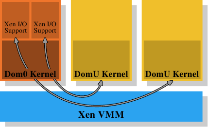
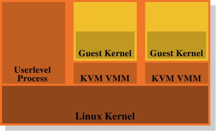

# 4.4. 虛擬化的影響

作業系統映像（image）的虛擬化會變得越來越流行；這表示記憶體管理的另一層會被加到整體中。行程（基本上為監獄〔jail〕）或作業系統容器（container）的虛擬化並不屬於這個範疇，因為只有一個作業系統會牽涉其中。像 Xen 或 KVM 這類技術能夠––無論有沒有來自處理器的協助––執行獨立作業系統映像。在這些情況下，只有一個直接控制實體記憶體存取的軟體。

<figure>
  
  <figcaption>圖 4.4：Xen 虛擬化模型</figcaption>
</figure>

在 Xen 的情況下（見圖 4.4），Xen VMM 即是這個軟體。不過 VMM 本身並不實作太多其它的硬體控制。不若在其它較早期的系統（以及首次釋出的 Xen VMM）上的 VMM，除了記憶體與處理器之外的硬體是由具有特權的 Dom0 域所控制的。目前，這基本上是與沒有特權的 DomU 系統核心相同的系統核心，而且––就所關心的記憶體管理而言––它們沒什麼區別。重要的是，VMM 將實體記憶體分發給了 Dom0 與 DomU 系統核心，其因而實作了普通的記憶體管理，就好像它們是直接執行在一個處理器上一樣。

為了實現完成虛擬化所需的域的分離，Dom0 與 DomU 系統核心中的記憶體處理並不具有無限制的實體記憶體存取。VMM 不是藉由分發獨立的實體分頁、並讓客戶端作業系統處理定址的方式來分發記憶體；這不會提供任何針對有缺陷或者流氓客戶域的防範。取而代之地，VMM 會為每個客戶域建立它自己擁有的分頁表樹，並使用這些資料結構來分發記憶體。好處是能夠控制對分頁表樹的管理資訊的存取。若是程式沒有合適的權限，它就什麼也無法做。

這種存取控制被利用在 Xen 提供的虛擬化之中，無論使用的是半虛擬化（paravirtualization）或是硬體虛擬化（亦稱全虛擬化）。客戶域採用了有意與半虛擬化以及硬體虛擬化十分相似的方式，為每個行程建立了它們的分頁表樹。無論客戶端作業系統在何時修改了它的分頁表，都會呼叫 VMM。VMM 於是使用在客戶域中更新的資訊來更新它自己擁有的影子分頁表。這些是實際被硬體用到的分頁表。顯然地，這個過程相當昂貴：分頁表樹每次修改都需要一次 VMM 的呼叫。在沒有虛擬化的情況下對記憶體映射的更動並不便宜，而它們現在甚至變得更昂貴了。

考慮到從客戶端作業系統到 VMM 的更改並返回，它們本身已經非常昂貴，額外的成本可能非常大。這即是為何處理器開始擁有額外的功能，以避免影子分頁表的建立。這很好，不僅因為速度的關係，它也減少了 VMM 的記憶體消耗。Intel 有擴充分頁表（Extended Page Table，EPT），而 AMD 稱它為巢狀分頁表（Nested Page Table，NPT）。基本上這兩個技術都擁有客戶端作業系統從「客戶虛擬位址（guest virtual address）」產生「宿主虛擬位址（host virtual address）」的分頁表。宿主虛擬位址接著必須被進一步––使用每個域的 EPT／NPT 樹––轉譯成真正的實體位址。這會令記憶體處理以幾乎是非虛擬化情況的速度來進行，因為大多數記憶體管理的 VMM 項目都被移除了。它也減少了 VMM 的記憶體使用，因為現在每個域（對比於行程）都僅有一個必須要維護的分頁。

這個額外的位址轉譯步驟的結果也會儲存在 TLB 中。這表示 TLB 不會儲存虛擬的實體位址，而是查詢的完整結果。已經解釋過 AMD 的 Pacifica 擴充引入了 ASID 以避免在每個項目上的 TLB 沖出。ASID 的位元數量在最初釋出的處理器擴充中只有一位；這足以區隔 VMM 與客戶端作業系統了。Intel 擁有用於相同目的的虛擬處理器 ID（virtual processor ID，VPID），只不過有更多的位元數。但是對於每個客戶域而言，VPID 都是固定的，因此它無法被用來標記個別的行程，也不能在這個層級避免 TLB 沖出。

每次定址空間修改所需的工作量是有著虛擬化作業系統的一個問題。不過，基於 VMM 的虛擬化還有另一個固有的問題：沒有辦法擁有兩層記憶體處理。但是記憶體處理很難（尤其在將像 NUMA 這類難題納入考慮的時候，見第五節）。Xen 使用一個分離 VMM 的方式使得最佳化的（甚至是好的）處理變得困難，因為所有的記憶體管理實作的難題––包含像記憶體區域的探尋這類「瑣碎」事––都必須在 VMM 中重複。作業系統擁有成熟且最佳化的實作；真的應該避免重複這些事。

<figure>
  
  <figcaption>圖 4.5：KVM 虛擬化模型</figcaption>
</figure>

這即是為何廢除 VMM／Dom0 模型是個如此有吸引力的替代方案。圖 4.5 顯示了 KVM Linux 系統核心擴充是如何試著解決這個問題的。沒有直接執行在硬體上、並控制所有客戶的分離 VMM；而是一個普通的 Linux 系統核心接管了這個功能。這表示在 Linux 系統核心上完整且精密的記憶體處理功能被用來管理系統中的記憶體。客戶域與被創造者稱為「客戶模式（guest mode）」的普通的使用者層級行程一同執行。虛擬化功能––半虛擬化或全虛擬化––是由 KVM VMM 所控制。這只不過是另一個使用者層級的行程，使用系統核心實作的特殊 KVM 裝置來控制一個客戶域。

這個模型相較於 Xen 模型的分離 VMM 的優點是，即使在使用客戶端作業系統時仍然有兩個運作的記憶體處理者，但只需要唯一一種在 Linux 系統核心中的實作。沒有必要像 Xen VMM 一樣在另一段程式碼中重複相同的功能。這導致更少的工作、更少的臭蟲、以及––也許––更少兩個記憶體管理者接觸的摩擦，因為在一個 Linux 客戶端中的記憶體管理者會與外部在裸機上執行的 Linux 系統核心的記憶體管理者做出相同的假設。

總而言之，程式開發者必須意識到，採用虛擬化的時候，快取錯失（指令、資料、或 TLB）的成本甚至比起沒有虛擬化還要高。任何減少這些工作的最佳化，在虛擬化的環境中甚至會獲得更多的回報。處理器設計者將會––隨著時間的推移––透過像是 EPT 與 NPT 這類技術來逐漸減少這個差距，但它永遠也不會完全消失。

