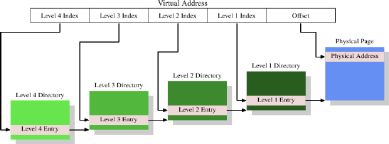

# 4.2. 多層級分頁表

4MB 的分頁並非常態，它們會浪費很多的記憶體，因為作業系統必須執行的許多操作都需要與記憶體分頁對齊（align）。以 4kB 分頁而言（32 位元機器、甚至經常是 64 位元機器上的常態），虛擬位址的偏移量部分的大小僅有 12 位元。這留了 20 位元作為分頁目錄的選擇器。一個有著 220 個項目的表格是不切實際的。即使每個項目只會有 4 位元組，表格大小也會有 4MB。由於每個行程都可能擁有它自己獨有的分頁目錄，這些分頁目錄會佔據系統中大量的實體記憶體。

解決方法是使用多個層級的分頁表。階層於是形成一個巨大、稀疏的分頁目錄；沒有真的用到的定址空間範圍不需要被分配的記憶體。這種表示法因而緊密得多了，使得記憶體中能夠擁有許多行程的分頁表，而不會太過於影響效能。

<figure>
  
  <figcaption>圖 4.2：四層位址轉譯</figcaption>
</figure>

現今最複雜的分頁表結構由四個層級所構成。圖 4.2 顯示了這種實作的示意圖。虛擬記憶體 –– 在這個例子中 –– 被切成至少五個部分。其中四個部分為不同目錄的索引。第四層目錄被 CPU 中一種特殊用途的暫存器所指涉。第二層到第四層目錄的內容為指向更低層級目錄的參考。若是一個目錄項目被標記為空，它顯然不需要指到任何更低層的目錄。如此一來，分頁表樹便能夠稀疏且緊密。第一層目錄的項目為 –– 就像在圖 4.1 一樣 –– 部份的實體位址，加上像存取權限這類輔助資料。

要確定對應到一個虛擬位址的實體位址，處理器首先會確定最高層目錄的位址。這個位址通常儲存在一個暫存器中。CPU 接著取出對應到這個目錄的虛擬記憶體的索引部分，並使用這個索引來挑選合適的項目。這個項目是下一個目錄的位址，使用虛擬位址的下一個部分來索引。這個過程持續到抵達第一層目錄，這時目錄項目的值為實體位址的高位部分。加上來自虛擬記憶體的分頁偏移位元便組成了完整的實體位址。這個過程被稱為分頁樹走訪（page tree walking）。有些處理器（像是 x86 與 x86-64）會在硬體中執行這個操作，其它的則需要來自作業系統的協助。

每個在系統中執行的行程會需要它自己的分頁表樹。部分地共享樹是可能的，但不如說這是個例外狀況。因此，如果分頁表樹所需的記憶體盡可能地小的話，對效能與延展性而言都是有益的。理想的情況是將用到的記憶體彼此靠近地擺在虛擬定址空間中；實際用到的實體位址則無關緊要。對一支小程式而言，僅僅使用在第二、三、四層各自的一個目錄、以及少許第一層目錄，可能還過得去。在有著 4kB 分頁以及每目錄 512 個項目的 x86-64 上，這能夠以總計 4 個目錄（每層一個）來定址 2MB。1GB 的連續記憶體能夠以一個第二到第四層目錄、以及 512 個第一層目錄來定址。

不過，假設能夠連續地分配所有記憶體也太過於簡化了。為了彈性起見，一個行程的堆疊（stack）與堆積（heap）區域 –– 在大多情況下 –– 會被分配在定址空間中極為相對的兩端。這令二個區域在需要時都能盡可能地增長。這表示，最有可能是二個需要的第二層目錄，以及與此相應的、更多低層級的目錄。

但即使如此也不總是符合當前的實際狀況。為了安全考量，一個可執行程式的多個部分（程式碼、資料、堆積、堆疊、動態共享物件〔Dynamic Shared Object，DSO〕，又稱共享函式庫〔shared library〕）會被映射在隨機化的位址上 [9]。隨機化擴大了不同部份的相對位置；這暗示著，在一個行程裡使用中的不同記憶體區域會廣泛地散布在虛擬定址空間中。藉由在隨機化的位址的位元數上施加一些限制也能夠限制範圍，但這無疑 –– 在大多情況下 –– 會讓一個行程無法以僅僅一或二個第二與第三層目錄來執行。

若是效能比起安全性真的重要太多了，也能夠把隨機化關閉。於是作業系統通常至少會在虛擬記憶體中連續地載入所有的 DSO。

