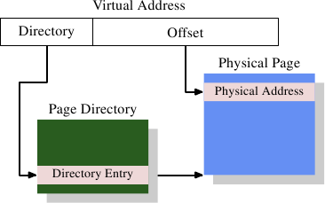

# 4.1. 最簡單的位址轉譯

有趣的部分是虛擬位址到實體位址的轉譯。MMU 能夠逐個分頁重新映射位址。就如同定址快取行的時候一樣，虛擬位址會被切成多個部分。這些部分用來索引多個用以建構最終實體位址的表格。以最簡單的模型而言，我們僅有一個層級的表格。

<figure>
  
  <figcaption>圖 4.1：一層位址轉譯</figcaption>
</figure>

圖 4.1 顯示了到底是怎麼使用虛擬位址的不同部分的。開頭的部分用以選擇一個分頁目錄（Page Directory）中的一個項目；在這個目錄中的每個項目都能由作業系統個別設定。分頁目錄項目決定了一個實體記憶體分頁的位址；在分頁目錄中，能夠有多於一個指到相同實體位址的項目。記憶單元的完整實體位址是由分頁目錄的分頁位址、結合虛擬位址的低位元所決定的。分頁目錄項目也包含一些像是存取權限這類關於分頁的額外資訊。

分頁目錄的資料結構儲存於主記憶體中。作業系統必須分配連續的實體記憶體、並將這個記憶體區域的基底位址（base address）儲存在一個特殊的暫存器中。虛擬記憶體中適當的位元量接著會被用作一個分頁目錄的索引 –– 它實際上是一個目錄項目的陣列。

作為一個實際的例子，以下是在 x86 機器上的 4MB 分頁所使用的佈局。虛擬記憶體的偏移量部分的大小為 22 位元，足以定址一個 4MB 分頁中的每個位元組。虛擬記憶體剩餘的 10 位元選擇了分頁目錄裡 1024 個項目中的其中一個。每個項目包含一個 4MB 分頁的一個 10 位元的基底位址，其會與偏移量結合以構成完整的 32 位元位址。

