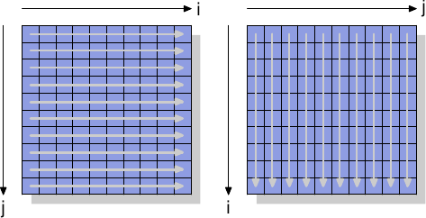

# 6.1. 繞過快取

當資料被產生、並且沒有（立即）被再次使用時，記憶體儲存操作會先讀取完整的快取行然後修改快取資料，這點對效能是有害的。這個操作會將可能再次用到的資料踢出快取，以讓給那些短期內不會再次被用到的資料。尤其是像矩陣––它會先被填值、接著才被使用––這類大資料結構。在填入矩陣的最後一個元素前，第一個元素就會因為矩陣太大被踢出快取，導致寫入快取喪失效率。

對於這類情況，處理器提供對*非暫存（non-temporal）*寫入操作的支援。這個情境下的非暫存指的是資料在短期內不會被使用，所以沒有任何快取它的理由。這些非暫存的寫入操作不會先讀取快取行然後才修改它；反之，新的內容會被直接寫進記憶體。

這聽來代價高昂，但並不是非得如此。處理器會試著使用合併寫入（見 3.3.3 節）來填入整個快取行。若是成功，那麼記憶體讀取操作是完全不必要的。如 x86 以及 x86-64 架構，gcc 提供若干 intrinsic 函式 [^譯註]：

```c
#include <emmintrin.h>
void _mm_stream_si32(int *p, int a);
void _mm_stream_si128(int *p, __m128i a);
void _mm_stream_pd(double *p, __m128d a);
#include <xmmintrin.h>
void _mm_stream_pi(__m64 *p, __m64 a);
void _mm_stream_ps(float *p, __m128 a);
#include <ammintrin.h>
void _mm_stream_sd(double *p, __m128d a);
void _mm_stream_ss(float *p, __m128 a);
```

最有效率地使用這些指令的情況是一次處理大量資料。資料從記憶體載入、經過一或多步處理、而後寫回記憶體。資料「流（stream）」經處理器，這些指令便得名於此。

記憶體位置必須各自對齊至 8 或 16 位元組。在使用多媒體擴充（multimedia extension）的程式碼中，也可以用這些非暫存的版本替換一般的 `_mm_store_*` 指令。我們並沒有在 A.1 節的矩陣相乘程式中這麼做，因為寫入的值會在短時間內被再次使用。這是串流指令無所助益的一個例子。6.2.1 節會更加深入這段程式碼。

處理器的合併寫入緩衝區可以將部分寫入快取行的請求延遲一小段時間。一個接著一個執行所有修改單一快取行的指令，以令合併寫入能真的發揮功用通常是必要的。以下是一個如何實踐的例子：

```c
#include <emmintrin.h>
void setbytes(char *p, int c)
{
  __m128i i = _mm_set_epi8(c, c, c, c,
                           c, c, c, c,
                           c, c, c, c,
                           c, c, c, c);
  _mm_stream_si128((__m128i *)&p[0], i);
  _mm_stream_si128((__m128i *)&p[16], i);
  _mm_stream_si128((__m128i *)&p[32], i);
  _mm_stream_si128((__m128i *)&p[48], i);
}
```

假設指標 `p` 被適當地對齊，呼叫這個函式會將指向的快取行中的所有位元組設為 `c`。合併寫入邏輯會看到四個生成的 `movntdq` 指令，並僅在最後一個指令被執行之後，才對記憶體發出寫入命令。總而言之，這段程式不僅避免在寫入前讀取快取行，也避免快取被並非立即需要的資料污染。這在某些情況下有著巨大的好處。一個經常使用這項技術的例子即是 C 函式庫中的 `memset` 函式，它在處理大塊記憶體時應該要使用類似於上述程式的作法。

某些架構提供專門的解法。PowerPC 架構定義 `dcbz` 指令，它能用以清除整個快取行。這個指令不會真的繞過快取，因為快取行仍會被分配來存放結果，但沒有任何資料會從記憶體被讀出來。這相比於非暫存儲存指令更加受限，因為快取行只能全部被清空而污染快取（在資料為非暫存的情況），但其不需合併寫入邏輯來達到這個結果。

為了一探非暫存指令的運作，我們將觀察一個用以測量矩陣––由一個二維陣列所組成––寫入效能的新測試。編譯器將矩陣置放於記憶體中，以令最左邊的（第一個）索引指向一列在記憶體中連續置放的所有元素。右邊的（第二個）索引指向一列中的元素。測試程式以兩種方式迭代矩陣：第一種是在內部迴圈增加行號，第二種是在內部迴圈增加列號。這代表其行為如圖 6.1 所示。

<figure>
  
  <figcaption>圖 6.1：矩陣存取模式</figcaption>
</figure>

我們測量初始化一個 3000 × 3000 矩陣所花的時間。為了觀察記憶體的表現，我們採用不會使用快取的儲存指令。在 IA-32 處理器上，「非暫存提示（non-temporal hint）」即被用在於此。作為比較，我們也測量一般的儲存操作。結果見於表 6.1。

<figure>
  <table>
    <tr>
      <th rowspan="2"></th>
      <th colspan="2">內部迴圈增加</th>
    </tr>
    <tr>
      <th>列</th>
      <th>行</th>
    </tr>
    <tr>
      <td>一般</td>
      <td>0.048s</td>
      <td>0.127s</td>
    </tr>
    <tr>
      <td>非暫存</td>
      <td>0.048s</td>
      <td>0.160s</td>
    </tr>
  </table>
  <figcaption>表 6.1：矩陣初始化計時</figcaption>
</figure>

對於使用快取的一般寫入操作，我們觀察到預期中的結果：若是記憶體被循序地使用，我們會得到比較好的結果，整個操作費 0.048s，相當於 750MB/s，幾近於隨機存取的情況卻花 0.127s（大約 280MB/s）。這個矩陣已經大到令快取沒那麼有效。

我們感興趣的部分主要是繞過快取的寫入操作。可能令人吃驚的是，在這裡循序存取跟使用快取的情況一樣快。這個結果的原因是處理器執行上述的合併寫入操作。此外，對於非暫存寫入的*記憶體排序（memory ordering）*規則亦被放寬：程式需要明確地插入記憶體屏障（memory barriers）（如 x86 與 x86-64 處理器的 `sfence` 指令）。意味著處理器在寫回資料時有著更多的自由，因此能盡可能地善用可用的頻寬。

內部迴圈以行向（column-wise）存取的情況就不同。無快取存取的結果明顯地慢於快取存取（0.16s，約 225MB/s）。這裡我們可以理解到，合併寫入是不可能的，每個記憶單元都必須被獨立處理。這需要不斷地從 RAM 晶片上選取新的幾列，附帶著與此相應的延遲。結果是比有快取的情況還慢 25%。

在讀取操作上，處理器––直到最近––除了非暫存存取（Non-Temporal Access，NTA）預取指令的弱提示之外，仍欠缺相應的支援。沒有與合併寫入對等的讀取操作，這對諸如記憶體對映 I/O（memory-mapped I/O）這類無法被快取的記憶體尤其糟糕。Intel 附帶 SSE4.1 擴充引入 NTA 載入。它們以一些串流載入緩衝區（streaming load buffer）實作；每個緩衝區包含一個快取行。針對一個快取行的第一個 `movntdqa` 指令會將快取行載入一個緩衝區––可能會替換掉另一個快取行。隨後，對同一個快取行、以 16 位元組對齊的存取操作將會由載入緩衝區以少量的成本來提供服務。除非有其它理由，快取行將不會被載入到快取中，於是便能夠在不污染快取的情況下載入大量的記憶體。編譯器為這個指令提供一個 intrinsic 函式：

```c
#include <smmintrin.h>
__m128i _mm_stream_load_si128 (__m128i *p);
```

這個 intrinsic 函式應該要以 16 位元組區塊的地址做為參數執行多次，直到每個快取行都被讀取為止。在這時才應該開始處理下一個快取行。由於只有少數幾個串流讀取緩衝區，可能要一次從兩個記憶體位置進行讀取。

我們應該從這個實驗得到的是，現代的 CPU 非常巧妙地最佳化無快取寫入––近來甚至包括讀取操作，只要它們是循序操作的。在處理只會被用到一次的大資料結構時，這個知識是非常有用的。再者，快取能夠降低一些––但不是全部––隨機記憶體存取的成本。在這個例子中，由於 RAM 存取的實作，導致隨機存取慢 70%。在實作改變以前，無論何時都應該避免隨機存取。

我們將會在談論預取的章節再次一探非暫存旗標。

[^譯註]: intrinsic 函式可簡稱 intrinsics，由編譯器提供，類似 inline 函式，但跟微處理器架構緊密相關，因為編譯器知道如何運用最佳的方式來輸出對應的微處理器指令。有些狀況下，intrinsics 可能會呼叫標準函式庫或執行環境的函式，甚至可能會有跨越處理器之間 intrinsics 的轉換，例如譯者維護的 [SSE2NEON](https://github.com/DLTcollab/sse2neon) 專案。
