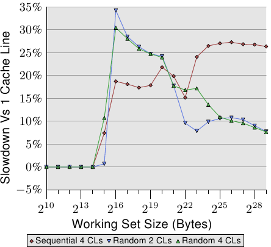
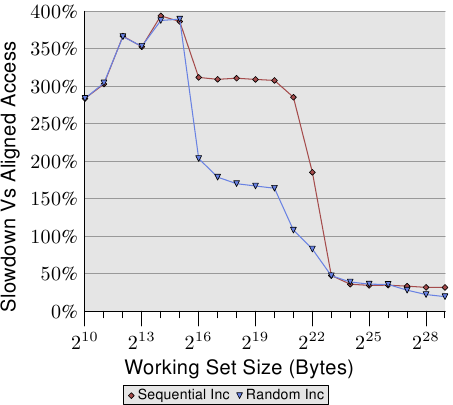

# 6.2.1. 最佳化一階資料快取存取

在 3.3 節，我們已經看過 L1d 快取的有效使用能夠提升效能。在這一節，我們會展示什麼樣的程式碼改變能夠協助改進這個效能。延續前一節，我們首先聚焦在循序存取記憶體的最佳化。如同在 3.3 節中看到的數字，處理器在記憶體被循序存取的時候會自動預取資料。

使用的範例程式碼為矩陣乘法。我們使用兩個 $$ 1000 \times 1000 $$ `double` 元素的方陣（square matrices）。對於那些忘記數學的人，給定元素為 $$ a_{ij} $$ 與 $$ b_{ij} $$ 的矩陣 $$ A $$ 與 $$ B $$，$$ 0 \leq i,j < N $$，乘積為

$$
(AB)_{ij} = \sum^{N - 1}_{k = 0} a_{ik} b_{kj} = a_{i1} b_{1j} + a_{i2} b_{2j} + \cdots + a_{i(N - 1)} b_{(N - 1)j}
$$

一個直觀的 C 實作看起來可能像這樣

```c
for (i = 0; i < N; ++i)
  for (j = 0; j < N; ++j)
    for (k = 0; k < N; ++k)
      res[i][j] += mul1[i][k] * mul2[k][j];
```

兩個輸入矩陣為 `mul1` 與 `mul2`。假定結果矩陣 `res` 全被初始化為零。這是個既好又簡單的實作。但應該很明顯的是，我們有個正好是在圖 6.1 解釋過的問題。在 `mul1` 被循序存取的時候，內部的迴圈增加了 `mul2` 的列號。這表示 `mul1` 是像圖 6.1 中左邊的矩陣那樣處理，而 `mul2` 是像右邊的矩陣那樣處理。這可能不太好。

有一個能夠輕易嘗試的可能補救方法。由於矩陣中的每個元素會被多次存取，是值得在使用第二個矩陣 `mul2` 之前將它重新排列（數學術語的話，「轉置〔transpose〕」）的。

$$
(AB)_{ij} = \sum^{N - 1}_{k = 0} a_{ik} b^{\text{T}}_{jk} = a_{i1} b^{\text{T}}_{j1} + a_{i2} b^{\text{T}}_{j2} + \cdots + a_{i(N - 1)} b^{\text{T}}_{j(N - 1)}
$$

在轉置之後（通常以上標「T」表示），我們現在循序地疊代兩個矩陣。就 C 程式而言，現在看起來像這樣：

```c
double tmp[N][N];
for (i = 0; i < N; ++i)
  for (j = 0; j < N; ++j)
    tmp[i][j] = mul2[j][i];
for (i = 0; i < N; ++i)
  for (j = 0; j < N; ++j)
    for (k = 0; k < N; ++k)
      res[i][j] += mul1[i][k] * tmp[j][k];
```

我們建立一個容納被轉置的矩陣的暫時變數（temporary variable）。這需要動到額外的記憶體，但這個成本會被––希望如此––彌補回來，因為每行 1000 次非循序存取是更為昂貴的（至少在現代的硬體上）。是進行一些效能測試的時候了。在有著 2666MHz 時脈的 Intel Core 2 上的結果為（以時鐘週期為單位）：

<table>
  <tr>
    <th></th>
    <th>原始</th>
    <th>轉置</th>
  </tr>
  <tr>
    <th>週期數</th>
    <td>16,765,297,870</td>
    <td>3,922,373,010</td>
  </tr>
  <tr>
    <th>相對值</th>
    <td>100%</td>
    <td>23.4%</td>
  </tr>
</table>

雖然只是個簡單的矩陣轉置，但我們能達到 76.6% 的加速！複製操作的損失完全被彌補了。1000 次非循序存取真的很傷。

下個問題是，我們是否能做得更好。無論如何，我們確實需要一個不需額外複製的替代方法。我們並不是總有餘裕能進行複製：矩陣可能太大、或者可用的記憶體太小。

替代實作的探尋應該從徹底地檢驗涉及到的數學與原始實作所執行的操作開始。簡單的數學知識讓我們能夠發現，只要每個加數（addend）正好出現一次，對結果矩陣的每個元素執行的加法順序是無關緊要的。[^28]這個理解讓我們能夠尋找將執行在原始程式碼內部迴圈的加法重新排列的解法。

現在，讓我們來檢驗在原始程式碼執行中的實際問題。被存取的 `mul2` 元素的順序為：$$ (0, 0) $$、$$ (1, 0) $$、 ... 、$$ (N - 1, 0) $$、$$ (0,1) $$、$$ (1, 1) $$、 ...。元素 $$ (0, 0) $$ 與 $$ (0, 1) $$ 位於同一個快取行中，但在內部迴圈完成一輪的時候，這個快取行早已被逐出了。以這個例子而言，每一輪內部迴圈都需要––對三個矩陣的每一個而言––1000 個快取行（Core 2 處理器為 64 位元組）。這加起來遠比 L1d 可用的 32k 還多。

但若是我們在執行內部迴圈的期間，一起處理中間迴圈的兩次疊代呢？在這個情況下，我們使用兩個來自必定在 L1d 中的快取行的 `double` 值。我們將 L1d 錯失率減半了。[^譯註]這當然是個改進，但––視快取行的大小而定––也許仍不是我們能夠得到的最好結果。Core 2 處理器有個快取行大小為 64 位元組的 L1d。實際的大小能夠使用

`sysconf (_SC_LEVEL1_DCACHE_LINESIZE)`

在執行期查詢、或是使用命令列（command line）的 `getconf` 工具程式（utility），以讓程式能夠針對特定的快取行大小編譯。以 `sizeof(double)` 為 8 來說，這表示––為了完全利用快取行––我們應該展開內部迴圈 8 次。繼續這個想法，為了有效地使用 `res` 矩陣––即，為了同時寫入 8 個結果––我們也該展開外部迴圈 8 次。我們假設這裡的快取行大小為 64，但這個程式碼也能在 32 位元組快取行的系統上運作，因為快取行也會被 100% 利用。一般來說，最好在編譯期像這樣使用 `getconf` 工具程式來寫死（hardcode）快取行大小：

`gcc -DCLS=$(getconf LEVEL1_DCACHE_LINESIZE) ...`

If the binaries are supposed to be generic, the largest cache line size should be used.
使用非常小的 L1d 表示並非所有資料都能塞進快取，但這種處理器無論如何都不適合高效能程式。我們寫出的程式碼看起來像這樣：

```c
#define SM (CLS / sizeof (double))
for (i = 0; i < N; i += SM)
  for (j = 0; j < N; j += SM)
    for (k = 0; k < N; k += SM)
      for (i2 = 0, rres = &res[i][j],
           rmul1 = &mul1[i][k]; i2 < SM;
           ++i2, rres += N, rmul1 += N)
        for (k2 = 0, rmul2 = &mul2[k][j];
             k2 < SM; ++k2, rmul2 += N)
          for (j2 = 0; j2 < SM; ++j2)
            rres[j2] += rmul1[k2] * rmul2[j2];
```

這看起來超可怕的。在某種程度上它是如此，但只是因為它包含了一些技巧。最顯而易見的改變是，我們現在有六層巢狀迴圈了。外部迴圈以 `SM`（快取行大小除掉 `sizeof(double)`）為間隔疊代。這將乘法切成多個能夠以更多快取局部性處理的較小的問題。內部迴圈疊代外部迴圈漏掉的索引。再一次，這裡有三層迴圈。這裡唯一巧妙的部分是 `k2` 與 `j2` 迴圈的順序不同。這是因為在實際運算中，僅有一個表示式取決於 `k2`、但有兩個取決於 `j2`。

這裡其餘的複雜之處來自 gcc 在最佳化陣列索引的時候並不是非常聰明的結果。額外變數 `rres`、`rmul1`、與 `rmul2` 的引入，藉由將內部迴圈的常用表示式（expression）盡可能地拉出來，以最佳化程式碼。C 與 C++ 語言預設的別名規則（aliasing rule）並不能幫助編譯器做出這些決定（除非使用 `restrict`，所有指標存取都是別名的潛在來源）。這即是為何對於數值程式設計而言，Fortran 仍是一個偏好語言的原因：它令快速程式的撰寫更簡單。[^29]

<figure>
  <table>
    <tr>
      <th></th>
      <th>原始</th>
      <th>轉置</th>
      <th>子矩陣</th>
      <th>向量化</th>
    </tr>
    <tr>
      <th>週期數</th>
      <td>16,765,297,870</td>
      <td>3,922,373,010</td>
      <td>2,895,041,480</td>
      <td>1,588,711,750</td>
    </tr>
    <tr>
      <th>相對值</th>
      <td>100%</td>
      <td>23.4%</td>
      <td>17.3%</td>
      <td>9.47%</td>
    </tr>
  </table>
  <figcaption>表 6.2：矩陣乘法計時</figcaption>
</figure>

所有努力所帶來的成果能夠在表 6.2 看到。藉由避免複製，我們增加了額外的 6.1% 效能。此外，我們不需要任何額外的記憶體。只要結果矩陣也能塞進記憶體，輸入矩陣可以是任意大小的。這是我們現在已經達成的一個通用解法的一個必要條件。

在表 6.2 中還有一欄沒有被解釋過。大多現代處理器現今包含了針對向量化（vectorization）的特殊支援。經常被標為多媒體擴充，這些特殊指令能夠同時處理 2、4、8、或者更多值。這些經常是 SIMD（單指令多資料，Single Instruction, Multiple Data）操作，藉由其它操作的協助，以便以正確的形式獲取資料。由 Intel 處理器提供的 SSE2 指令能夠在一個操作中處理兩個 `double` 值。指令參考手冊列出了提供對這些 SSE2 指令存取的內建函數。若是用了這些內建函數，程式執行會變快 7.3%（相對於原始實作）。結果是，一支以原始程式碼 10% 的時間執行的程式。翻譯成人們認識的數字，我們從 318 MFLOPS 變為 3.35 GFLOPS。由於我們在這裡僅對記憶體的影響有興趣，程式的原始碼被擺到了 A.1 節。

應該注意的是，在最後一版的程式碼中，我們仍然有一些 `mul2` 的快取問題；預取仍然無法運作。但這無法在不轉置矩陣的情況下解決。或許快取預取單元將會變得聰明地足以識別這些模式，那時就不需要額外的更動了。不過，以一個 2.66 GHz 處理器上的單執行緒程式而言，3.19 GFLOPS 並不差了。

我們在矩陣乘法的例子中最佳化的是被載入的快取行的使用。一個快取行的所有位元組總是會被用到。我們只是確保在快取行被逐出前會用到它們。這當然是個特例。

更常見的是，擁有塞滿一或多個快取行的資料結構，而程式在任何時間點都只會使用幾個成員。我們已經在圖 3.11 看過，大結構尺寸在只有一些成員被用到時的影響。

<figure>
  
  <figcaption>圖 6.2：散布在多個快取行中</figcaption>
</figure>

圖 6.2 顯示了使用現在已熟知的程式執行另一組基準測試的結果。這次會加上同個串列元素的兩個值。在一個案例中，兩個元素都在同一個快取行內；在另一個案例中，一個元素位在串列元素的第一個快取行，而第二個位在最後一個快取行。這張圖顯示了我們正遭受的效能衰減。

不出所料，在所有情況下，若是工作集塞得進 L1d 就不會有任何負面影響。一旦 L1d 不再充足，則是使用一個行程的兩個快取行來償付損失，而非一個。紅線顯示了串列被循序地排列時的數據。我們看到尋常的兩步模式：當 L2 快取充足時的大約 17% 的損失、以及當必須用到主記憶體時的大約 27% 的損失。

在隨機記憶體存取的情況下，相對的數據看起來有點不同。對於塞得進 L2 的工作集而言的效能衰減介於 25% 到 35% 之間。再往後它下降到了大約 10%。這不是因為損失變小了，而是因為實際的記憶體存取不成比例地變得更昂貴了。這份數據也顯示了，在某些情況下，元素之間的距離是很重要的。Random 4 CLs 的曲線顯示了較高的損失，因為用到了第一個與第四個快取行。

要查看一個資料結構對比於快取行的佈局，一個簡單的方法是使用 pahole 程式（見 [4]）。這個程式檢驗了定義在二進位檔案中的資料結構。取一個包含這個定義的程式：

```c
struct foo {
  int a;
  long fill[7];
  int b;
};
```

當在一台 64 位元機器上編譯時，pahole 程式的輸出（在其它東西之中）包含了顯示於圖 6.3 的輸出。這個輸出結果告知了我們很多東西。首先，它顯示了這個資料結構使用了超過一個快取行。這個工具假設了當前使用的處理器的快取行大小，但這個值能夠使用一個命令列參數來覆寫。尤其在結構大小幾乎沒有超過一個快取行、以及許多這種型別的物件會被分配的情況下，尋求一個壓縮這種結構的方式是合理的。或許幾個元素能有比較小的型別、又或者某些欄位實際上是能使用獨立位元來表示的旗標。

<figure>
  <pre><code>struct foo {
        int                        a;                    /*     0     4 */

        /* XXX 4 bytes hole, try to pack */

        long int                   fill[7];              /*     8    56 */
        /* --- cacheline 1 boundary (64 bytes) --- */
        int                        b;                    /*    64     4 */
}; /* size: 72, cachelines: 2 */
   /* sum members: 64, holes: 1, sum holes: 4 */
   /* padding: 4 */
   /* last cacheline: 8 bytes */</code></pre>
  <figcaption>圖 6.3：pahole 執行的輸出</figcaption>
</figure>

在這個範例的情況中，壓縮是很容易的，而且它也被這支程式所暗示。輸出顯示了在第一個元素後面有個四位元的洞（hole）。這個洞是由結構的對齊需求以及 `fill` 元素所造成的。很容易發現元素 `b`––其大小為四位元組（由那行結尾的 4 所指出的）––完美地與這個間隔（gap）相符。在這個情況下的結果是，間隔不再存在，而這個資料結構塞得進一個快取行中。pahole 工具能自己完成這個最佳化。若是使用了 `--reorganize` 參數，並將結構的名稱加到命令列的結尾，這個工具的輸出即是最佳化的結構、以及使用的快取行。除了移動欄位以填補間隔之外，這個工具也能夠最佳化位元欄位以及合併填充（padding）與洞。更多細節見 [4]。

有個正好大得足以容納尾端元素的洞當然是個理想的情況。為了讓這個最佳化有用，物件本身也必須對齊快取行。我們馬上就會開始處理這點。

pahole 輸出也能夠輕易看出元素是否必須被重新排列，以令那些一起用到的元素也會被儲存在一起。使用 pahole 工具，很容易就能夠確定哪些元素要在同個快取行，而不是必須在重新排列元素時才能達成。這並不是一個自動的過程，但這個工具能幫助很多。

各個結構元素的位置、以及它們被使用的方式也很重要。如同我們已經在 3.5.2 節看到的，晚到快取行的關鍵字組的程式效能是很糟的。這表示一位程式設計師應該總是遵循下列兩條原則：

1. 總是將最可能為關鍵字組的結構元素移到結構的開頭。
2. 存取資料結構、以及存取順序不受情況所約束時，以它們定義在結構中的順序來存取。

以小結構而言，這表示元素應該以它們可能被存取的順序排列。這必須以靈活的方式處理，以允許其它像是補洞之類的最佳化也能被使用。對於較大的資料結構，每個快取行大小的區塊應該遵循這些原則來排列。

不過，若是物件自身不若預期地對齊，就不值得花時間來重新排列它。一個物件的對齊，是由資料型別的對齊需求所決定的。每個基礎型別有它自己的對齊需求。對於結構型別，它的任意元素中最大的對齊需求決定了這個結構的對齊。這幾乎總是小於快取行大小。這表示即使一個結構的成員被排列成塞得進同一個快取行，一個被分配的物件也可能不具有相符於快取行大小的對齊。有兩種方法能確保物件擁有在設計結構佈局時使用的對齊：

* 物件能夠以明確的對齊需求分配。對於動態分配（dynamic allocation），呼叫 `malloc` 僅會以相符於最嚴格的標準型別（通常是 `long double`）的對齊來分配物件。不過，使用 `posix_memalign` 請求較高的對齊也是可能的。

    ```c
    #include <stdlib.h>
    int posix_memalign(void **memptr,
                       size_t align,
                       size_t size);
    ```

    這個函數將一個指到新分配的記憶體的指標儲存到由 `memptr` 指到的指標變數中。記憶體區塊大小為 `size` 位元組，並在 `align` 位元組邊界上對齊。

    對於由編譯器分配的物件（在 `.data`、`.bss` 等，以及在堆疊中），能夠使用一個變數屬性（attribute）：

    ```c
    struct strtype variable
       __attribute((aligned(64)));
    ```

    在這個情況下，不管 `strtype` 結構的對齊需求為何，`variable` 都會在 64 位元組邊界上對齊。這對全域變數與自動變數也行得通。

    對於陣列，這個方法並不如你可能預期的那般運作。只有陣列的第一個元素會被對齊，除非每個元素的大小是對齊值的倍數。這也代表了每個單一變數都必須被適當地標註。`posix_memalign` 的使用也不是完全不受控制的，因為對齊需求通常會導致碎片與／或更高的記憶體消耗。

* 一個使用者定義型別的對齊需求能夠使用一個型別屬性來改變：

    ```c
    struct strtype {
        ...members...
    } __attribute((aligned(64)));
    ```

    這會使編譯器以合適的對齊來分配所有的物件，包含陣列。不過，程式設計師必須留意針對動態分配物件的合適對齊的請求。這裡必須再一次使用 `posix_memalign`。使用 gcc 提供的 `alignof` 運算子（operator）、並將這個值作為第二個參數傳遞給 `posix_memalign` 是很簡單的。

之前在這一節提及的多媒體擴充幾乎總是需要對齊記憶體存取。即，對於 16 位元組的記憶體存取而言，位址是被假定以 16 位元組對齊的。x86 與 x86-64 處理器擁有能夠處理非對齊存取的記憶體操作的特殊變體，但這些操作比較慢。對於所有記憶體存取都需要完全對齊的大多 RISC 架構而言，這種嚴格的對齊需求並不新奇。即使一個架構支援非對齊的存取，這有時也比使用合適的對齊還慢，尤其是在不對齊導致一次載入或儲存使用了兩個快取行、而非一個的情況下。

<figure>
  
  <figcaption>圖 6.4：非對齊存取的間接成本</figcaption>
</figure>

圖 6.4 顯示了非對齊記憶體存取的影響。現已熟悉的測試會在（循序或隨機）走訪記憶體被量測的期間遞增一個資料元素，一次使用對齊的串列元素、一次使用刻意不對齊的元素。圖表顯示了程式因非對齊存取而招致的效能衰減。循序存取情況下的影響比起隨機的情況更為顯著，因為在後者的情況下，非對齊存取會部分地被一般來說較高的記憶體存取成本所隱藏。在循序的情況下，對於塞得進 L2 快取的工作集大小來說，效能衰減大約是 300%。這能夠由 L1 快取的有效性降低來解釋。某些遞增操作現在會碰到兩個快取行，而且現在在一個串列元素上操作經常需要兩次快取行的讀取。L1 與 L2 之間的連接簡直太壅塞了。

對於非常大的工作集大小，非對齊存取的影響仍然是 20% 至 30%––考慮到對於這種大小的對齊存取時間很長，這是非常多的。這張圖表應該顯示了對齊是必須被嚴加對待的。即使架構支援非對齊存取，也絕對不要認為「它們跟對齊存取一樣好」。

不過，有一些來自這些對齊需求的附帶結果。若是一個自動變數擁有一個對齊需求，編譯器必須確保它在所有情況下都能夠被滿足。這並不容易，因為編譯器無法控制呼叫點（call site）與它們處理堆疊的方式。這個問題能夠以兩種方式處理：

1. 產生的程式主動地對齊堆疊，必要時插入間隔。這需要程式檢查對齊、建立對齊、並在之後還原對齊。
2. 要求所有的呼叫端都將堆疊對齊。

所有常用的應用程式二進位介面（application binary interface，ABI）都遵循第二條路。如果一個呼叫端違反了規則、並且對齊為被呼叫端所需，程式很可能會失去作用。不過，對齊的完美保持並不會平白得來。

在一個函數中使用的一個堆疊框（frame）的大小不必是對齊的倍數。這表示，若是從這個堆疊框呼叫了其它函數，填充就是必要的。很大的不同是，在大部分情況下，堆疊框的大小對編譯器而言是已知的，因此它知道如何調整堆疊指標，以確保任何從這個堆疊框呼叫的函數的對齊。事實上，大多編譯器會直接將堆疊框的大小調高，並以它來完成操作。

如果使用了可變長度陣列（variable length array，VLA）或 `alloca`，這種簡單的對齊處理方式就不合適了。在這種情況下，堆疊框的總大小只會在執行期得知。在這種情況下可能會需要主動的對齊控制，使得產生的程式碼（略微地）變慢。

在某些架構上，只有多媒體擴充需要嚴格的對齊；在那些架構上的堆疊總是當作普通的資料型別進行最低限度的對齊，對於 32 與 64 位元架構通常分別是 4 或 8 位元組。在這些系統上，強制對齊會招致不必要的成本。這表示，在這種情況下，我們可能會想要擺脫嚴格的對齊需求，如果我們知道不會依賴它的話。不進行多媒體操作的尾端函數（tail function）（那些不呼叫其它函數的函數）不必對齊。只呼叫不需對齊的函數的函數也不用。若是能夠識別出夠大一組函數，一支程式可能會想要放寬對齊需求。對於 x86 的二元檔，gcc 擁有寬鬆堆疊對齊需求的支援：

`-mpreferred-stack-boundary=2`

若是這個選項（option）的值為 $$ N $$，堆疊對齊需求將會被設為 $$ 2^{N} $$ 位元組。所以，若是使用了 2 為值，堆疊對齊需求就被從預設值（為 16 位元組）降低成只有 4 位元組。在大多情況下，這表示不需額外的對齊操作，因為普通的堆疊推入（push）與彈出（pop）操作無論如何都是在四位元組邊界上操作的。這個機器特定的選項能夠幫忙減少程式大小，也能夠提升執行速度。但它無法被套用到許多其它的架構上。即使對於 x86-64，一般來說也不適用，因為 x86-64 ABI 要求在 SSE 暫存器中傳遞浮點數參數，而 SSE 指令需要完整的 16 位元組對齊。然而，只要能夠使用這個選項，就能造成明顯的差別。

結構元素的有效擺放與對齊並非資料結構影響快取效率的唯一面向。若是使用了一個結構的陣列，整個結構的定義都會影響效能。回想一下圖 3.11 的結果：在這個情況中，我們增加了陣列元素中未使用的資料總量。結果是預取越來越沒效果，而程式––對於大資料集––變得越來越沒效率。

對於大工作集，盡可能地使用可用的快取是很重要的。為了達到如此，可能有必要重新排列資料結構。雖然對程式設計師而言，將所有概念上屬於一塊兒的資料擺在同個資料結構是比較簡單的，但這可能不是最大化效能的最好方法。假設我們有個如下的資料結構：

```c
struct order {
  double price;
  bool paid;
  const char *buyer[5];
  long buyer_id;
};
```

進一步假設這些紀錄會被存在一個大陣列中，並且有個經常執行的工作（job）會加總所有帳單的預期付款。在這種情境中，`buyer` 與 `buyer_id` 使用的記憶體是不必被載入到快取中的。根據圖 3.11 的資料來判斷，程式將會表現得比它能達到的還糟了高達五倍。

將 `order` 切成兩塊，前兩個欄位儲存在一個結構中，而另一個欄位儲存在別處要好得多了。這個改變無疑提高了程式的複雜度，但效能提升證明了這個成本的正當性。

（本節未完）


[^28]: 我們這裡忽略了可能會改變上溢位（overflow）、下溢位（underflow）、或是四捨五入（rounding）的發生的算術影響。

[^譯註]: 這裡可能講得比較抽象。作者的意思是：在一開始三層迴圈的實作中，最內部的每一次 `k` 迴圈疊代同時處理 `res[i][j] += mul1[i][k] * mul2[k][j]` 與 `res[i][j + 1] += mul1[i][k] * mul2[k][j + 1]`。由於才剛存取過 `mul2[k][j]` 與 `res[i][j]`，所以 `mul2[k][j + 1]` 與 `res[i][j + 1]` 還在 L1d 快取中，因而降低了錯失率。後述的方法是這個方法的一般化（generalization）。

[^29]: 理論上在 1999 修訂版引入 C 語言的 `restrict` 關鍵字應該解決這個問題。不過編譯器還是不理解。原因主要是存在著太多不正確的程式碼，其會誤導編譯器、並導致它產生不正確的目的碼（object code）。

