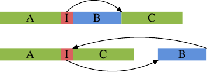

# 6.2.2. 最佳化一階指令快取存取

準備有效使用 L1d 的程式碼需要與有效使用 L1d 類似的技術。不過，問題是，程式設計師通常不會直接影響 L1i 的使用方式，除非她／他以組合語言來撰寫程式。若是使用了編譯器，程式設計師能夠透過引導編譯器建立更好的程式佈局，來間接地決定 L1i 的使用。

程式有跳躍[^譯註]間為線性的優點。在這些期間，處理器能夠有效地預取記憶體。跳轉（jump）打破了這個美好的想像，因為

* 跳轉目標（target）可能不是動態決定的；
* 而且即使它是靜態的，若是它錯失了所有快取，記憶體獲取可能會花上很長一段時間。

這些問題造成了執行中的停頓，可能嚴重地影響效能。這即是為何現今的處理器在分支預測（branch prediction，BP）上費盡心思的原因了。高度特製化的 BP 單元試著盡可能遠在跳轉之前確定跳轉的目標，使得處理器能夠開始將新的位置的指令載入到快取中。它們使用靜態與動態規則、而且越來越擅於判定執行中的模式。

對指令快取而言，盡早將資料拿到快取甚至是更為重要的。如同在 3.1 節提過的，指令必須在它們被執行之前解碼，而且––為了加速（在 x86 與 x86-64 上很重要）––指令實際上是以被解碼的形式、而非從記憶體讀取的位元組／字組的形式被快取的。

為了達到最好的 L1i 使用，程式設計師至少應該留意下述的程式碼產生的面向：

1. 盡可能地減少程式碼量（code footprint）。這必須與像是迴圈展開（loop unrolling）與行內展開（inlining）等最佳化取得平衡。
2. 程式執行應該是沒有氣泡（bubble）的線性的。[^31]
3. 合理的情況下，對齊程式碼。

我們現在要看一些根據這些面向、可用於協助最佳化程式的編譯器技術。

編譯器有啟動不同最佳化層級的選項，特定的最佳化也能夠個別地啟用。在高最佳化層級（gcc 的 -O2 與 -O3）啟用的許多最佳化處理了迴圈最佳化與函數行內展開。一般來說，這些是不錯的最佳化。如果以這些方式最佳化的程式碼佔了程式總執行時間的很重要的一部分，便能夠提升整體的效能。尤其是，函數的行內展開允許編譯器一次最佳化更大的程式碼塊（chunk），從而能夠產生更好地利用處理器的管線架構的機器碼。當程式較大的一部分能被視為一個單一單元時，程式碼與資料的處理（透過死碼消除〔dead code elimination〕或值域傳播〔value range propagation〕、等等）的效果更好。

較大的程式大小意味著 L1i（以及 L2 與更高階層）快取上的壓力更大。這*可能*導致較差的效能。較小的程式可能比較快。幸運的是，gcc 有一個針對於此的最佳化選項。如果使用了 -Os，編譯器將會為程式大小最佳化。已知會增加程式大小的最佳化會被關掉。使用這個選項經常產生驚人的結果。尤其在編譯器無法真的獲益於迴圈展開與行內展開的情況下，這個選項就是首選了。

行內展開也能被個別處理。編譯器擁有引導行內展開的啟發法（heuristic）與限制；這些限制能夠由程式設計師控制。`-finlinelimit` 選項指定了對行內展開而言，必須被視為過大的函數有多大。若是一個函數在多處被呼叫，在所有函數中行內展開它便會導致程式大小的劇增。但還有更多細節。假設一個函數 `inlcand` 在兩個函數 `f1` 與 `f2` 中被呼叫。函數 `f1` 與 `f2` 本身是先後被呼叫的。

<figure>
  <table>
    <tr>
      <td><pre><code>start f1
  code f1
  inlined inlcand
  more code f1
end f1

start f2
  code f2
  inlined inlcand
  more code f2
end f2</code></pre></td>
      <td><pre><code>start inlcand
  code inlcand
end inlcand

start f1
  code f1
end f1

start f2
  code f2
end f2</code></pre></td>
    </tr>
  </table>
  <figcaption>表 6.3：行內展開 Vs 不行內展開</figcaption>
</figure>

表 6.3 顯示了在兩個函數中沒有行內展開與行內展開的情況下，產生的程式碼看起來會怎麼樣。若是函數 `inlcand` 在 `f1` 與 `f2` 中被行內展開了，產生的程式碼的大小為 size `f1` + size `f2` + $$ 2 \times $$ size `inlcand`。如果沒有進行行內展開的話，總大小減少了 size `inlcand`。這即是在 `f1` 與 `f2` 相互在不久後呼叫的話，L1i 與 L2 快取額外所需的量。再加上：若是 `inlcand` 沒被行內展開，程式碼可能仍在 L1i 中，而它就不必被再次解碼了。再加上：分支預測單元或許能更好地預測跳轉，因為它已經看過這段程式了。如果對程式而言，被行內展開的函數大小上限的編譯器預設值並不是最好的，它應該要被降低。

不過，有些行內展開總是合理的情況。假如一個函數只會被呼叫一次，它也應該被行內展開。這給了編譯器執行更多最佳化的機會（像是值域傳播，其會顯著地改進程式碼）。行內展開也許會受選擇限制所阻礙。對於像這樣的情況，gcc 有個選項來明確指定一個函數總是要被行內展開。加上 `always_inline` 函數屬性會命令編譯器執行恰如這個名稱所指示的操作。

在相同的情境下，若是即便一個函數足夠小也不該被行內展開，能夠使用 `noinline` 函數屬性。假如它們經常從多處被呼叫，即使對於小函數，使用這個屬性也是合理的。若是 L1i 內容能被重複使用、並且整體的程式碼量減少了，這往往彌補了額外函數呼叫的附加成本。如今分支預測單元是非常可靠的。若是行內展開能夠促成更進一步的最佳化，情況就不同了。這是必須視情況來決定的。

如果行內展開的程式碼總是會被用到的話，`always_inline` 屬性表現得很好。但假如不是這樣呢？如果偶爾才會呼叫被行內展開的函數會怎麼樣：

```c
void fct(void) {
  ... code block A ...
  if (condition)
    inlfct()
  ... code block C ...
```

為這種程式序列產生的程式碼一般來說與原始碼的結構相符。這表示首先會是程式區塊 A、接著是一個條件式跳轉––假如條件式被求值為否（false），就往前跳轉。接下來是為行內展開的 `inlfct` 產生的程式碼，最後是程式區塊 C。這看起來全都很合理，但它有個問題。

若是 `condition` 經常為否，執行就不是線性的了。中間有一大塊沒用到的程式碼，不僅因為預取污染了 L1i，它也會造成分支預測的問題。若是分支預測錯了，條件表示式可能非常沒有效率。

這是個普遍的問題，而且並不專屬於函數的行內展開。無論在何時用到了條件執行、而且它是不對稱的（即，表示式比起某一種結果還要更常產生另一種結果），就有不正確的靜態分支預測、從而有管線中的氣泡的可能性。這能夠藉由告知編譯器，以將較不常執行的程式碼移出主要的程式路徑來避免。在這種情況下，為一個 `if` 敘述產生的條件分支將會跳轉到一個跳脫順序的地方，如下圖所示。



上半部表示單純的程式佈局。假如區域 B––即，由上面被行內展開的函數 `inlfct` 所產生的––因為條件 I 跳過它而經常不被執行，處理器的預取會拉進包含鮮少用到的區塊 B 的快取行。這能夠藉由區塊的重新排列來改變，其結果能夠在圖的下半部看到。經常執行的程式碼在記憶體中是線性的，而鮮少執行的程式碼被移到不傷及預取與 L1i 效率的某處。

gcc 提供了兩個實現這點的方法。首先，編譯器能夠在重新編譯程式碼的期間將效能分析（profiling）的輸出納入考量，並根據效能分析擺放程式區塊。我們將會在第七節看到這是如何運作的。第二個方法則是藉由明確的分支預測。gcc 認得 `__builtin_expect`：

```c
long __builtin_expect(long EXP, long C);
```

這個結構告訴編譯器，表示式 `EXP` 的值非常有可能會是 `C`。回傳值為 `EXP`。`__builtin_expect` 必須被用在條件表示式中。在幾乎所有的情況中，它會被用在布林表示式的情境中，在這種情況下定義兩個輔助巨集（macro）要更方便一些：

```c
#define unlikely(expr) __builtin_expect(!!(expr), 0)
#define likely(expr) __builtin_expect(!!(expr), 1)
```

然後可以像這樣用這些巨集

```c
if (likely(a > 1))
```

若是程式設計師使用了這些巨集、然後使用了 `-freorder-blocks` 最佳化選項，gcc 會如上圖那樣重新排列區塊。這個選項會隨著 `-O2` 啟用，但對於 `-Os` 會被停用。有另一個重新排列區塊的 gcc 選項（`-freorder-blocks-and-partition`），但它的用途有限，因為它不適用於例外處理。

（本節未完）


[^譯註]: 這裡的「跳躍」與下句的「跳轉」原文都是 jump。但根據前後文來看，前者指的似乎是一個指令接著一個指令循序執行，而後者指的是如條件分支、迴圈、函數呼叫等非循序的指令執行。因此在這裡翻譯為不同的詞彙，以示區隔。

[^31]: 氣泡生動地描述了在一個處理器的管線中執行的空洞，其會在執行必須等待資源的時候發生。關於更多細節，請讀者參閱處理器設計的文獻。

