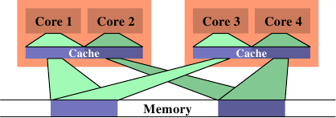
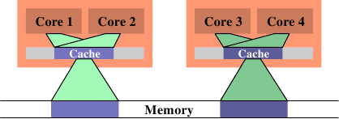

# 6.4.3. 頻寬考量

當使用多條執行緒、並且它們不會因為在不同的處理器核上使用相同的快取行而造成快取爭奪時，仍然會有潛在的問題。每個處理器擁有連接到與這個處理器上所有處理器核與 HT 共享的記憶體的最大頻寬。取決於機器架構（如，圖 2.1 中的那個），多核可能會共享連結到記憶體或北橋的相同的匯流排。

處理器核本身即便在完美的情況下全速運轉，到記憶體的連線也無法在不等待的前提下滿足所有載入與儲存的請求。現在，將可用的頻寬進一步以處理器核、HT、以及共享一條到北橋的連線的處理器的數量劃分，平行突然變成一個大問題。有效率程式的效能可能會受限於可用的記憶體頻寬。

圖 3.32 顯示增加處理器的 FSB 速度能幫上大忙。這就是為什麼隨著處理器核數量的成長，我們也會看到 FSB 速度上的提升。儘管如此，若是程式使用很大的工作集，並且被充分最佳化過，這也永遠不會足夠。程式開發者必須準備好識別由有限頻寬所致的問題。

現代處理器的效能量測計數器能夠觀察到 FSB 的爭奪。在 Core 2 處理器上，`NUS_BNR_DRV` 事件計算一顆處理器核因為匯流排尚未準備就緒而必須等待的週期數。這指出匯流排被重度使用，而且載入或儲存至主記憶體要花費比平常還要更長的時間。Core 2 處理器支援更多事件，能夠計算像 RFO 或一般的 FSB 使用率等特定的匯流排行為。在開發期間研究一個應用程式的可延展性的可能性的時候，後者可能會派上用場。若是匯流排使用率已接近 1.0，可延展性的機會是最小的。

若是識別出一個頻寬問題，有幾件能夠做到的事情。它們有時候是矛盾的，所以某些實驗可能是必要的。一個解法是去買更快的電腦，假如有什麼可買的話。取得更多的 FSB 速度、更快的 RAM 模組、或許還有處理器本地的記憶體，大概 –– 而且很可能會 –– 有幫助。不過，這可能成本高昂。若是程式僅在一台機器（或少數幾台機器）上需要，硬體的一次性開銷可能會比重寫程式的成本還低。不過一般來說，最好是對程式下手。

在最佳化程式碼本身以避免快取錯失之後，達到更好頻寬使用率的唯一剩餘選項是將執行緒更妥善地放在可用的處理器核上。預設情況下，系統核心中的排程器會根據它自己的策略，將一條執行緒指派給一個處理器。將一條執行緒從一顆處理器核移到另一顆是被盡可能避免的。不過，排程器並不真的知道關於工作負載的任何事情。它能夠從快取錯失等收集資訊，但這在許多情況下並不是非常有幫助。

<figure>
  
  <figcaption>圖 6.13：沒效率的排程</figcaption>
</figure>

一個可能導致很大的記憶體匯流排使用率的情況，是在二條執行緒被排程在不同的處理器（或是在不同快取區域的核）上、而且它們使用相同的資料集的時候。圖 6.13 顯示這種狀況。處理器核 1 與 3 存取相同的資料（以相同顏色的存取指示與記憶體區域表示）。同樣地，處理器核 2 與 4 存取相同的資料。但執行緒被排程在不同的處理器上。這表示每次資料集都必須要從記憶體讀取二次。這種狀況能夠被更好地處理。

<figure>
  
  <figcaption>圖 6.14：有效率的排程</figcaption>
</figure>

在圖 6.14 中，我們看到理想上來看應該要是怎麼樣。現在被使用的總快取容量減少，因為現在處理器核 1 與 2 以及 3 與 4 都在相同的資料上運作。資料集只需從記憶體讀取一次。

這是個簡單的例子，但透過擴充，它適用於許多情況。如同先前提過的，作業系統核心中的排程器對資料的使用並沒有深刻的理解，所以程式開發者必須確保排程是被有效率地完成的。沒有很多作業系統核心的介面可用於傳達這個需求。事實上，只有一個：定義執行緒親和性。

執行緒親和性表示，將一條執行緒指派給一顆或多顆處理器核。排程器接著將會在決定在哪執行這條執行緒的時候，（只）在那些處理器核中選擇。即使有其它閒置的處理器核，它們也不會被考慮。這聽來可能像是個缺陷，但這是必須償付的代價。假如太多執行緒排外地執行在一組處理器核上，剩餘的處理器核可能大多數都是閒置的，而除了改變親和性之外就沒什麼能做的。預設情況下，執行緒能夠執行在任一處理器核上。

有一些查詢與改變一條執行緒的親和性的介面：

```c
#define _GNU_SOURCE
#include <sched.h>
int sched_setaffinity(pid_t pid, size_t size,
                      const cpu_set_t *cpuset);
int sched_getaffinity(pid_t pid, size_t size,
                      cpu_set_t *cpuset);
```

這二個介面必須要被用在單執行緒的程式上。`pid` 引數指定哪個行程的親和性應該要被改變或測定。呼叫者顯然需要適當的權限來做這件事。第二與第三個參數指定處理器核的位元遮罩。第一個函數需要填入位元遮罩，使得它能夠設定親和性。第二個函數以選擇的執行緒的排程資訊來填充位元遮罩。這些介面都被宣告在 `<sched.h>` 中。

`cpu_set_t` 型別也和一些操作與使用這個型別物件的巨集一同被定義在這個標頭檔中。

```c
#define _GNU_SOURCE
#include <sched.h>
#define CPU_SETSIZE
#define CPU_SET(cpu, cpusetp)
#define CPU_CLR(cpu, cpusetp)
#define CPU_ZERO(cpusetp)
#define CPU_ISSET(cpu, cpusetp)
#define CPU_COUNT(cpusetp)
```

`CPU_SETSIZE` 指定有多少 CPU 能夠以這個資料結構表示。其它三個巨集運用 `cpu_set_t` 物件。要初始化一個物件，應該使用 `CPU_ZERO`；其它二個巨集應該用以選擇或取消選擇個別的處理器核。`CPU_ISSET` 測試一個指定的處理器是否為集合的一部分。`CPU_COUNT` 回傳集合中被選擇的處理器核數量。`cpu_set_t` 型別為 CPU 數量的上限提供一個合理的預設值。隨著時間推移，肯定會證實它太小；在這個時間點，這個型別將會被調整。這表示程式必須一直將這個容量放在心上。上述的便利巨集根據 `cpu_set_t` 的定義，隱式地處理這個容量。若是需要更動態的容量管理，應該使用一組擴充的巨集：

```c
#define _GNU_SOURCE
#include <sched.h>
#define CPU_SET_S(cpu, setsize, cpusetp)
#define CPU_CLR_S(cpu, setsize, cpusetp)
#define CPU_ZERO_S(setsize, cpusetp)
#define CPU_ISSET_S(cpu, setsize, cpusetp)
#define CPU_COUNT_S(setsize, cpusetp)
```

這些介面接收一個對應於這個容量的額外參數。為了能夠分配動態容量的 CPU 集，提供三個巨集：

```c
#define _GNU_SOURCE
#include <sched.h>
#define CPU_ALLOC_SIZE(count)
#define CPU_ALLOC(count)
#define CPU_FREE(cpuset)
```

`CPU_ALLOC_SIZE` 巨集的回傳值為，必須為一個能夠處理 CPU 計數的 `cpu_set_t` 結構而分配的位元組數量。為了分配這種區塊，能夠使用 `CPU_ALLOC` 巨集。以這種方式分配的記憶體必須使用一次 `CPU_FREE` 的呼叫來釋放。這些巨集可能會在背後使用 `malloc` 與 `free`，但並不是非得要維持這種方式。

最後，定義了一些對 CPU 集物件的操作：

```c
#define _GNU_SOURCE
#include <sched.h>
#define CPU_EQUAL(cpuset1, cpuset2)
#define CPU_AND(destset, cpuset1, cpuset2)
#define CPU_OR(destset, cpuset1, cpuset2)
#define CPU_XOR(destset, cpuset1, cpuset2)
#define CPU_EQUAL_S(setsize, cpuset1, cpuset2)
#define CPU_AND_S(setsize, destset, cpuset1,
                  cpuset2)
#define CPU_OR_S(setsize, destset, cpuset1,
                 cpuset2)
#define CPU_XOR_S(setsize, destset, cpuset1,
                  cpuset2)
```

這二組四個巨集的集合能夠檢查二個集合的相等性，以及對集合執行邏輯 AND、OR、與 XOR 操作。這些操作在使用一些 libNUMA 函數（見附錄 D）的時候會派上用場。

一個行程能夠使用 `sched_getcpu` 介面來確定它目前跑在哪個處理器上：

```c
#define _GNU_SOURCE
#include <sched.h>
int sched_getcpu(void);
```

結果為 CPU 在 CPU 集中的索引。由於排程的本質，這個數字並不總是 100% 正確。在回傳結果的時間、與執行緒回到使用者層級的時間之間，執行緒可能已經被移到一個不同的 CPU 上。程式必須總是將這種不正確的可能性納入考量。在任何情況下，更為重要的是被允許執行執行緒的那組 CPU。這個集合能夠使用 `sched_getaffinity` 來查詢。集合會被子執行緒與行程繼承。執行緒不能指望集合在生命週期中是穩定的。親和性遮罩能夠從外界設置（見上面原型中的 `pid` 參數）；Linux 也支援 CPU 熱插拔（hot-plugging），這意味著 CPU 能夠從系統中消失 –– 因此，也能從親和 CPU 集消失。

在多執行緒程式中，個別的執行緒並沒有如 POSIX 定義的正式行程 ID，因此無法使用上面二個函數。作為替代，`<pthread.h>` 宣告四個不同的介面：

```c
#define _GNU_SOURCE
#include <pthread.h>
int pthread_setaffinity_np(pthread_t th,
                           size_t size,
                           const cpu_set_t *cpuset);
int pthread_getaffinity_np(pthread_t th,
                           size_t size,
                           cpu_set_t *cpuset);
int pthread_attr_setaffinity_np(
                           pthread_attr_t *at,
                           size_t size,
                           const cpu_set_t *cpuset);
int pthread_attr_getaffinity_np(
                           pthread_attr_t *at,
                           size_t size,
                           cpu_set_t *cpuset);
```

前二個介面基本上與我們已經看過的那二個相同，除了它們在第一個參數拿的是一個執行緒的控制柄（handle），而非一個行程 ID。這能夠定址在一個行程中的個別執行緒。這也代表這些介面無法在另一個行程使用，它們完全是為了行程內部使用的。第三與第四個介面使用一個執行緒屬性。這些屬性是在建立一條新的執行緒的時候使用的。藉由設置屬性，一條執行緒能夠在開始時就被排程在一個特定的 CPU 集合上。這麼早選擇目標處理器 –– 而非在執行緒已經啟動之後 –– 能夠在許多不同層面上受益，包含（而且尤其是）記憶體分配（見 6.5 節的 NUMA）。

說到 NUMA，親和性介面在 NUMA 程式設計中也扮演著一個重要的角色。我們不久後就會回到這個案例。

目前為止，我們已經談過二條執行緒的工作集重疊、使得在相同處理器核上擁有二條執行緒是合理的情況。反之亦然。假如二條執行緒在個別的資料集上運作，將它們排程在相同的處理器核上可能是個問題。二條執行緒為相同的快取鬥爭，因而相互減少快取的有效使用。其次，二個資料集都得被載入到相同的快取中；實際上，這增加必須載入的資料總量，因此可用的頻寬被砍半。

在這種情況中的解法是，設置執行緒的親和性，使得它們無法被排程在相同的處理器核上。這與先前的情況相反，所以在做出任何改變之前，理解試著要最佳化的情況是很重要的。

針對快取共享最佳化以最佳化頻寬，實際上是將會在下一節涵蓋的 NUMA 程式設計的一個面相。只要將「記憶體」的概念擴充至快取。一旦快取的層級數增加，這會變得越來越重要。基於這個理由，NUMA 支援函式庫中提供一個多核排程的解決方法。在不寫死系統細節、或是鑽入 `/sys` 檔案系統的深度的前提下，決定親和性遮罩的方法請參閱附錄 D 中的程式例子。

