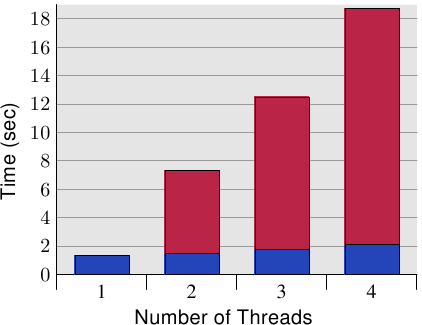
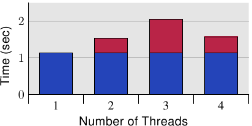

# 6.4.1. 並行最佳化

一開始，我們將會在本節討論兩個個別的議題，其實際上需要對立的最佳化。一個多執行緒應用程式在一些它的執行緒中使用共有的資料。一般的快取最佳化要求將資料保存在一起，使得應用程式的記憶體使用量很小，從而最大化在任意時間塞得進快取的記憶體總量。[^譯註1]

不過，使用這個方法有個問題：若是多條執行緒寫入到一個記憶體位置，每個相對應核心的 L1d 中的快取行必須處於「E」（獨占）狀態。這表示會送出許多的 RFO 訊息。在最糟的情況下，每次寫入存取都會送出一個訊息。所以一個普通的寫入將會突然變得非常昂貴。若是使用了相同的記憶體位置，同步就是必須的（可能透過原子操作的使用，其會在下個章節討論到）。不過，當所有執行緒都使用了不同的記憶體位置、並且可能是獨立的時候，問題也顯而易見。

<figure>
  
  <figcaption>圖 6.10：並行快取行存取的間接成本</figcaption>
</figure>

圖 6.10 顯示了這種「假共享（false sharing）」的結果。測試程式（顯示於 A.3 節）建立了若干執行緒，其除了遞增一個記憶體位置（5 億次）外什麼也不做。量測的時間是從程式啟動、直到程式等待最後一條執行緒結束之後。執行緒被釘在獨立的處理器上。機器擁有四個 P4 處理器。藍色值表示被指派到每條執行緒的記憶體分配位在個別快取行上的執行時間。紅色部分為執行緒的位置被移到僅一個快取行時出現的損失。

藍色的量測（使用獨立的快取行時所需的時間）與預期的相符。程式在無損失的情況下延展至多條執行緒。每個處理器都將它的快取行保存在它擁有的 L1d 中，而且沒有頻寬問題，因為不必讀取太多程式碼或資料（事實上，它們全都被快取了）。量測的些微提升其實是系統的雜訊、和可能的一些預取影響（執行緒使用連續的快取行）。

使用唯一一個快取行所需的時間、以及每條執行緒一個個別的快取行所需的時間相除所計算出的量測的間接成本分別是 390%、734%、以及 1,147%。乍看之下，這些很大的數字可能很令人吃驚，但考慮到需要的快取交互影響，這應該很顯而易見。已經完成寫入到快取行之後，就從一個處理器的快取拉出快取行。[^譯註2]在任何給定的時刻，除了擁有快取行的處理器以外，所有處理器都會被延遲，無法做任何事。每個額外的處理器都會導致更多的延遲。

<figure>
  
  <figcaption>圖 6.11：四核的間接成本</figcaption>
</figure>

由於這些量測，清楚的是這種情況必須在程式中避免。考慮到巨大的損失，在許多情況下，這個問題是很顯而易見的（至少，效能分析會顯示程式位置），但有個使用現代硬體的陷阱。圖 6.11 顯示了當程式執行在一台單處理器、四核心的機器上（Intel Core 2 QX 6700）的等價量測。即使使用這個處理器的兩個個別的 L2，測試案例也沒有顯示出任何可延展性的問題。當相同的快取行被使用超過一次時有些許的間接成本，但它並沒有隨著核心的數量增加。[^36]若是用了多於一個這種處理器，我們自然會看到類似於那些在圖 6.10 中的結果。儘管越來越多多核處理器的使用，許多機器還是會繼續使用多處理器。因此，正確的處理這種狀況是很重要的，這可能意味著要在真實的 SMP 機器上測試程式。

有個針對這個問題的非常簡單的「修正」：將每個變數擺在它們自己的快取行。這是與先前提到的發揮作用的最佳化的衝突之處，具體來說就是應用程式的記憶體使用量會增加許多。這是不能忍受的；因此有必要想出一個更聰明的解法。

需要確定哪些變數一次只會被唯一一條執行緒使用到，始終只有一條執行緒使用的那些變數、也可能是那些不時會被爭奪的變數。針對這些情況的每一個的不同解法是可能而且有用的。以變數的區分來說，最基本的標準是：它們是否曾被寫入過、以及這有多常發生。

不曾被寫入、以及那些僅會被初始化一次的變數基本上是常數（constant）。由於僅有寫入操作需要 RFO 訊息，因此能夠被在快取中共享常數（「S」狀態）。所以，不必特別處理這些變數；將它們歸在一起很好。若是程式設計師正確地以 `const` 標記這些變數，工具鏈將會把這些變數從普通的變數移出到 `.rodata`（唯讀資料）或 `.data.rel.ro`（重定位〔relocation〕後唯讀） 資料段（section）。[^37]不需其他特別的行為。若是出於某些理由，變數無法正確地以 `const` 標記，程式設計師能夠藉由將它們指派到一個特殊的資料段來影響它們的擺放。

當連結器構造出最後的二元檔時，它首先會附加來自所有輸入檔、具有相同名稱的資料段；那些資料段接著會以連結器腳本所決定的順序排列。這表示，藉由將所有基本上為常數、但沒被這樣標記的變數移到一個特殊的資料段，程式設計師便能夠將那些變數全部群組在一起。它們之中不會有個經常被寫入的變數。藉由適當地對齊在這個資料段中的第一個變數，就可能保證不會發生假共享。假定這個小例子：

```c
int foo = 1;
int bar __attribute__((section(".data.ro"))) = 2;
int baz = 3;
int xyzzy __attribute__((section(".data.ro"))) = 4;
```

假如被編譯的話，這個輸入檔定義了四個變數。有趣的部分是，變數 `foo` 與 `baz`、以及 `bar` 與 `xyzzy` 被各自群組在一起。少了那個屬性定義，編譯器就會以原始碼中定義的順序將四個變數全都分配在一個叫做 `.data` 的資料段中。[^38]使用現有這段程式，變數 `bar` 與 `xyzzy` 會被放置在一個叫做 `.data.ro` 的資料段中。將這個資料段叫做 `.data.ro` 或多或少有些隨意。一個 `.data.` 的前綴保證 GNU 連結器會將這個資料段與其它資料段擺在一起。

相同的技術能被用於分離出主要是讀取、但偶爾也會被寫入的變數。只要選擇一個不同的資料段名稱就可以了。在某些像是 Linux 系統核心的情況中，這種分離看起來很合理。

若是一個變數永遠僅會被一條執行緒用到的話，有另一個指定變數的方式。在這種情況下，使用執行緒區域變數（thread-local variable）是可能而且有用的（見 [8]）。gcc 中的 C 與 C++ 語言允許使用 `__thread` 關鍵字將變數定義為各條執行緒的。

```c
int foo = 1;
__thread int bar = 2;
int baz = 3;
__thread int xyzzy = 4;
```

變數 `bar` 與 `xyzzy` 並非被分配在普通的資料段中；而是每條執行緒擁有它自己的、儲存這種變數的分離區域。這些變數能夠擁有靜態初始子（static initializer）。所有執行緒區域變數都能夠被所有其它的執行緒定址，但除非一條執行緒將執行緒區域變數的指標傳遞給那些其它的執行緒，其它執行緒也沒法找到這個變數。由於變數為執行緒區域的，假共享就不是個問題––除非程式人為地造成問題。這個解法很容易設置（編譯器與連結器做了所有的事），但它有它的成本。當建立執行緒時，它必須花上一些時間來設置執行緒區域變數，這需要時間與記憶體。此外，定址執行緒區域變數通常比使用全域或自動變數更昂貴（如何自動地將成本最小化––如果可能的話––的解釋見 [8]）。

另一個使用執行緒區域儲存區（thread-local storage，TLS）的缺點是，假如變數的使用轉移給另一條執行緒，在舊執行緒的當前值是無法被新執行緒取得的。每條執行緒的變數副本都是不同的。通常這根本不是問題，但假如是的話，轉移到新的執行緒就需要協調，能夠在這個時刻複製當前值。

一個更大的問題是可能浪費資源。假如在任何時候都僅有一條執行緒會使用這個變數，所有執行緒都必須付出記憶體的代價。若是一條執行緒不使用任何 TLS 變數的話，TLS 記憶體區域的惰性分配（lazy allocation）會防止它成為問題（除了在應用程式本身的 TLS）。若是一條執行緒僅在 DSO 中使用了一個 TLS 變數，所有在這個物件中的其它 TLS 變數也都會被分配記憶體。假如大規模地使用 TLS，這可能會潛在地累加。

一般來說，可以給出的最好的建議是

1. 至少分離唯讀（初始化之後）與讀寫變數。可能將這種分離擴展到，以主要是讀取的變數作為第三種類別。
2. 將一起用到的讀寫變數一起群組在一個結構中。使用結構，是確保在某種程度上，被所有 gcc 版本一致翻譯成，所有那些變數的記憶體區域都緊靠在一起的唯一方法。
3. 將經常被不同執行緒寫入的讀寫變數移到它們自己的快取行。這可能代表要在末端加上填充，以填滿快取行的剩餘部分。若是結合步驟 2，這經常不是真的浪費。擴展上面的例子，我們可能會產生下列程式（假定 `bar` 與 `xyzzy` 要一起使用）：

    ```c
    int foo = 1;
    int baz = 3;
    struct {
      struct al1 {
        int bar;
        int xyzzy;
      };
      char pad[CLSIZE sizeof(struct al1)];
    } rwstruct __attribute__((aligned(CLSIZE))) =
      { { .bar = 2, .xyzzy = 4 } };
    ```

    某些程式的改變是必要的（`bar` 的參考必須被取代為 `rwstruct.bar`，`xyzzy` 亦同），但就這樣了。編譯器與連結器會做完剩下的事情。[^39]
4. 若是一個變數被多條執行緒用到，但每次使用都是獨立的，則將變數移入 TLS。


[^譯註1]: 因為快取的最小單位為快取行。因此若是資料擺在一起，代表它們所佔用的快取行數量較少，因此一次能快取的資料量就變多了。

[^譯註2]: 因為所有執行緒寫入的資料都在同個快取行內。因此剛寫入的快取行立刻就會因為其它執行緒也要對相同的快取行進行寫入，而變為「I（無效）」狀態。

[^36]: 我無法解釋在四顆核心全都用上時的較低的數字，但它是能夠重現的。

[^37]: 資料段，由它們的名字所識別，為一個 ELF 檔案中包含程式與資料的原子單元。

[^38]: 這並不受 ISO C 標準保證，但 gcc 是這麼做的。

[^39]: 到目前為止，這段程式都必須在命令列以 `-fms-extensions` 編譯。

