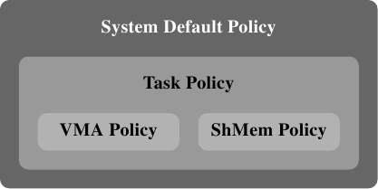

# 6.5.1. 記憶體策略

定義一個記憶體策略背後的構想是，令現有的程式在不大幅度修改的情況下，能夠在一個 NUMA 環境中適度良好地運作。策略由子行程繼承，這使得我們能夠使用 numactl 工具。這個工具的用途之一是能夠用來以給定的策略來啟動一支程式。

Linux 系統核心支援下列策略：

<dl>
    <dt><code>MPOL_BIND</code></dt>
    <dd>記憶體只會從一組給定的節點分配。假如不能做到，則分配失敗。</dd>

    <dt><code>MPOL_PREFERRED</code></dt>
    <dd>記憶體最好是從一組給定的節點分配。若是這失敗，才考慮來自其它節點的記憶體。</dd>

    <dt><code>MPOL_INTERLEAVE</code></dt>
    <dd>記憶體是平等地從指定的節點分配。節點要不是針對基於 VMA 的策略，以虛擬記憶體區域中的偏移量來選擇、就是針對基於任務（task）的策略，透過自由執行的計數器來選擇。</dd>

    <dt><code>MPOL_DEFAULT</code></dt>
    <dd>根據記憶體區域的預設值來選擇分配方式。</dd>
</dl>

<figure>
  
  <figcaption>圖 6.15：記憶體策略階層結構</figcaption>
</figure>

這份清單似乎遞迴地定義策略。這對了一半。事實上，記憶體策略形成一個階層結構（見圖 6.15）。若是一個位址被一個 VMA 策略所涵蓋，就會使用這個策略。一種特殊的策略被用在共享的記憶體區段上。假如沒有針對特定位址的策略，就會使用任務的策略。若是連這也沒有，便使用系統的預設策略。

系統預設是分配請求記憶體的那條執行緒本地的記憶體。預設不會提供任務與 VMA 策略。對於一個有著多條執行緒的行程，本地節點為首先執行行程的「家」節點。上面提到的系統呼叫能夠用來選擇不同的策略。

