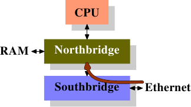

# 6.3.5. 直接快取存取

在現代 OS 中，快取錯失的一個來源是到來的資料流量的處理。像網路介面卡（Network Interface Card，NIC）與硬碟控制器等現代硬體，能夠在不涉及 CPU 的情況下，直接將接收或讀取的資料寫入到記憶體中。這對於我們現今擁有的裝置的效能而言至關重要，但它也造成了問題。假使有個從網路傳入的封包：OS 必須檢查封包的標頭（header）以決定要如何處理它。NIC 將封包擺進記憶體，然後通知處理器它的到來。處理器沒有機會去預取資料，因為它並不知道資料將何時抵達，甚至可能不會確切知道它將會被存在哪。結果是在讀取標頭時的一次快取錯失。

Intel 已經在它們的晶片組與 CPU 中加上了技術以緩解這個問題 [14]。構想是將封包的資料填入將會被通知到來的封包的 CPU 的快取。封包的承載內容在這裡並不重要，這個資料一般將會由更高階的函數––要不是在系統核心中、就是在使用者層級––處理。封包標頭被用來決定封包必須以什麼方式處理，因此這個資料是立即所需的。

網路 I/O 硬體已有 DMA 以寫入封包。這表示它直接地與潛在整合在北橋中的記憶體控制器進行溝通。記憶體控制器的另一邊是通過 FSB 到處理器的介面（假設記憶體控制器沒有被整合到 CPU 自身）。

<figure>
  <figure class="sub-figure">
    
    <figcaption>(a) 啟動 DMA</figcaption>
  </figure>
  <figure class="sub-figure">
    
    <figcaption>(b) 執行 DMA 與 DCA</figcaption>
  </figure>
  <figcaption>圖 6.9：直接快取存取</figcaption>
</figure>

直接快取存取（Direct Cache Access，DCA）背後的想法是，擴充 NIC 與記憶體控制器之間的通訊協定。在圖 6.9 中，第一張圖顯示了在一台有著南北橋的正規機器上的 DMA 傳輸的起始。NIC 被連接到南橋上（或作為其一部分）。它啟動了 DMA 存取，但提供了關於封包標頭的新資訊，其應該被推進處理器的快取中。

在第二步中，傳統的行為僅會是以連結到記憶體的連線完成 DMA 傳輸。對於被設置 DCA 旗標的 DMA 傳輸，北橋會以特殊的、新的 DCA 旗標在 FSB 上同時送出資料。處理器一直窺探著 FSB，並且若是它認出了 DCA 旗標，它會試著將寄給處理器的資料載入到最低階快取中。事實上，DCA 旗標是個提示；處理器能夠自由地忽略它。在 DMA 傳輸完成之後，會以信號通知處理器。

在處理封包時，OS 必須先確定是哪種封包。若是 DCA 提示沒有被忽略的話，OS 必須執行、以識別封包的載入操作很有可能會命中快取。將每個封包數以百計個循環的節約，乘上每秒能處理的成千上萬個封包，節省的加總量是個非常可觀的數字，尤其在談到等待時間的時候。

少了 I/O 硬體（在這個例子中為 NIC）、晶片組與 CPU 的整合，這種最佳化是不可能的。因此，假如需要這個技術的話，確保明智地挑選平台是必要的。

