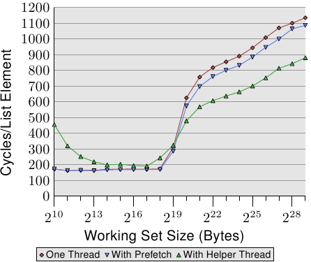

# 6.3.4. 輔助執行緒

在嘗試使用軟體預取時，往往會碰到程式複雜度的問題。若是程式必須迭代於一個資料結構上（在我們的情況中是個串列），必須在同個迴圈中實作二個獨立的迭代：執行作業的普通迭代、與往前看以使用預取的第二個迭代。這輕易地變得足夠複雜到容易產生失誤。

此外，決定要往前看多遠是必要的。太短的話，記憶體將無法及時被載入。太遠的話，剛載入的資料可能會被再一次逐出。另一個問題是，雖然它不會阻擋或等待記憶體載入，但預取指令很花時間。指令必須被解碼，假如解碼器太忙碌的話 –– 舉例來說，由於良好撰寫／產生的程式碼 –– 這可能很明顯。最後，迴圈的程式大小會增加。這降低 L1i 的效率。若藉由一次發出多個預取指令來試著避免部分成本，則會碰到顯著的預取請求數的問題。

一個替代方法是完全獨立地執行一般的操作與預取。這能使用二條普通的執行緒來進行。執行緒顯然必須被排程，以令預取執行緒填充一個被二條執行緒存取的快取。有二個值得一提的特殊解法：

* 在相同的處理器核上使用 HT （見 3.3.4 節，Hyper-Threading）。在這種情況下，預取能夠進入 L2（或者甚至是 L1d）。
* 使用比 SMT 執行緒「更愚笨的（dumber）」執行緒，其除預取與其它簡單的操作之外什麼也不做。這是個處理器廠商可能會探究的選項。

HT 的使用是尤其令人感興趣的。如同我們已經在 3.3.4 節看到的，假如 HT 執行獨立的程式碼的話，快取的共享是個問題。反而，在一條執行緒被用作一條預取輔助執行緒（helper thread）時，這並不是個問題。與此相反，這是個令人渴望的結果，因為最低層級的快取被預載。此外，由於預取執行緒大多是空閒或者在等待記憶體，所以假如不必自己存取主記憶體的話，其餘 HT 的一般操作並不會太受干擾。後者正好是預取輔助執行緒所預防的。

唯一棘手的部分是確保輔助執行緒不會往前跑得太遠。它不能完全污染快取，以致最早被預取的值被再次逐出。在 Linux 上，使用 `futex` 系統呼叫 [7] 或是 –– 以稍微高一些的成本 –– 使用 POSIX 執行緒同步基本指令（primitive），是很容易做到同步的。

<figure>
  
  <figcaption>圖 6.8：使用輔助執行緒的平均，NPAD=31</figcaption>
</figure>

這個方法的好處能夠在圖 6.8 中看到。這是與圖 6.7 中相同的測試，只不過加上額外的結果。新的測試建立一條額外的輔助執行緒，往前執行大約 100 個串列項目，並讀取（不只預取）每個串列元素的所有快取行。在這種情況下，我們每個串列元素有二個快取行（在一台有著 64 位元組快取行大小的 32 位元機器上，`NPAD`=31）。

二條執行緒被排程在相同處理器核的二條 HT 上。測試機僅有一顆處理器核，但結果應該與多於一顆處理器核的結果大致相同。親和性函式 –– 我們將會在 6.4.3 節介紹 –– 被用來將執行緒綁到合適的 HT 上。

要確定作業系統知道哪二個 (或更多) 處理器為 HT ，可以使用來自 libNUMA 的 `NUMA_cpu_level_mask` 介面（見附錄 D）。

```c
#include <libNUMA.h>
ssize_t NUMA_cpu_level_mask(size_t destsize,
                            cpu_set_t *dest,
                            size_t srcsize,
                            const cpu_set_t*src,
                            unsigned int level);
```

這個介面能用來決定透過快取與記憶體連結的 CPU 階層架構。這裡感興趣的是對應於 HT 的一階快取。為在二條 HT 上排程二條執行緒，能夠使用 libNUMA 函式（為簡潔起見，省略錯誤處理）：

```c
cpu_set_t self;
NUMA_cpu_self_current_mask(sizeof(self),
                           &self);
cpu_set_t hts;
NUMA_cpu_level_mask(sizeof(hts), &hts,
                    sizeof(self), &self, 1);
CPU_XOR(&hts, &hts, &self);
```

在執行這段程式之後，我們有二個 CPU 位元集。`self` 能用來設定目前執行緒的親和性，而 `hts` 中的遮罩能被用來設定輔助執行緒的親和性。這在理想上應該在執行緒被建立前發生。在 6.4.3 節，我們會介紹設定親和性的介面。若是沒有可用的 HT ，`NUMA_cpu_level_mask` 函式會回傳 1。這能夠用以作為避免這個最佳化的徵兆。

這個基準測試的結果可能出乎意料（也可能不會）。若是工作集塞得進 L2，輔助執行緒的間接成本將效能降低 10% 到 60% 之間（主要在比較低的那端，再次忽略最小的工作集大小，雜訊太多）。這應該在預料之中，因為若是所有資料都已經在 L2 快取中，預取輔助執行緒僅僅使用系統資源，卻沒有對執行有所貢獻。

不過，一旦不再足夠的 L2 大小耗盡，情況就改變。預取輔助執行緒協助將執行時間降低大約 25%。我們仍舊看到一條上升的曲線，只不過是因為無法足夠快速地處理預取。不過，主執行緒執行的算術操作與輔助執行緒的記憶體載入操作彼此互補。資源衝突是最小的，其導致這種相輔相成的結果。

這個測試的結果應該能夠被轉移到更多其它的情境。由於快取污染而經常無用的 HT ，在這些情境中表現出眾，並且應該被善用。附錄 D 介紹的 NUMA 函式庫令執行緒兄弟的找尋非常容易（見這個附錄中的範例）。若是函式庫不可用，`sys` 檔案系統令一支程式能夠找出執行緒的兄弟（見表 5.3 的 `thread_siblings` 欄位）。一旦能夠取得這個資訊，程式就必須定義執行緒的親和性，然後以二種模式執行迴圈：普通的操作與預取。被預取的記憶體總量應該視共享的快取大小而定。在這個例子中，L2 大小是有關的，程式能夠使用

`sysconf(_SC_LEVEL2_CACHE_SIZE)`

來查詢大小。輔助執行緒的進度是否必須被限制取決於程式。一般來說，最好確定有一些同步，因為排程細節可能會導致顯著的效能降低。

