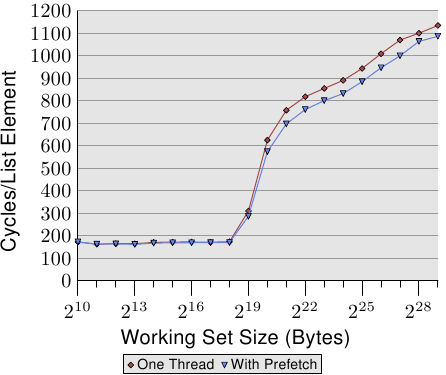

# 6.3.2. 軟體預取

硬體預取的優勢在於不必調整程式。缺點如同方才描述的，存取模式必須很直觀，而且預取無法橫跨分頁邊界進行。因為這些原因，我們現在有更多可能性，軟體預取它們之中最重要的。軟體預取不需藉由插入特殊的指令來修改原始碼。某些編譯器支援編譯指示（pragma）以或多或少地自動插入預取指令。
在 x86 和 x86-64，intrinsic 函式會由編譯器產生特殊的指令:

```c
#include <xmmintrin.h>
enum _mm_hint
{
  _MM_HINT_T0 = 3,
  _MM_HINT_T1 = 2,
  _MM_HINT_T2 = 1,
  _MM_HINT_NTA = 0
};
void _mm_prefetch(void *p,
                  enum _mm_hint h);
```

程式能夠在程式中的任何指標上使用 `_mm_prefetch` intrinsic 函式。許多處理器（當然包含所有 x86 與 x86-64 處理器）都會忽略無效指標產生的錯誤，這令程式開發者的生活好過非常多。若是被傳遞的指標指向合法的記憶體，會命令預取單元將資料載入到快取中，並且––必要的話––逐出其它資料。不必要的預取應該被確實地避免，因為這會降低快取的有效性，而且它會耗費記憶體頻寬（在被逐出的快取行是髒的情況下，可能需要兩個快取行的頻寬）。

要與 `_mm_prefetch` 一起使用的不同提示（hint）是由實作定義的。這表示每個處理器版本能夠（稍微）不同地實作它們。一般能說的是，`_MM_HINT_T0` 會為包含式快取將資料獲取到所有快取層級，並為獨占式快取獲取到最低層級的快取。若是資料項目在較高層級的快取中，它會被載入到 L1d 中。`_MM_HINT_T1` 提示將資料拉進 L2 而非 L1d。若是有個 L3 快取，`_MM_HINT_T2` 能做到類似於此的事情。不過，這些是沒怎麼被明確指定的細節，需要對所使用的實際處理器進行驗證。一般來說，若是資料在使用 `_MM_HINT_T0` 之後立刻被用到就沒錯。當然這要求 L1d 快取大小要大得足以容納所有被預取的資料。若是立即被使用的工作集大小太大，將所有東西預取到 L1d 就是個壞點子，而應該使用其它兩種提示。

第四種提示，`_MM_HINT_NTA` 能夠吩咐處理器特殊地對待預取的快取行。NTA 代表非暫存對齊（non-temporal aligned），我們已經在 6.1 節解釋過。程式告訴處理器應該盡可能地避免以這個資料污染快取，因為資料只在一段很短的期間內會被使用。對於包含式快取實作，處理器因而能夠在載入時避免將資料讀取進較低層級的快取。當資料從 L1d 逐出時，資料不必被推進 L2 或更高層級的快取中，但能夠直接寫到記憶體中。可能有其它處理器設計師在給定這個提示時能夠佈署的其它手法。程式開發者必須謹慎地使用這個提示：若是目前的工作集大小太大，並強制逐出以 NTA 提示載入的快取行，就要重新從記憶體載入。

<figure>
  
  <figcaption>圖 6.7：使用預取的平均，NPAD=31</figcaption>
</figure>

圖 6.7 顯示使用現已熟悉的指標追逐框架（pointer chasing framework）的測試結果。串列是隨機地被擺放在記憶體中的。與先前測試的不同之處在於，程式真的會在每個串列節點上花一些時間（大約 160 週期）。如同我們從圖 3.15 的數據中學到的，一旦工作集大小大於最末層快取，程式的效能就會受到嚴重的影響。

我們現在能夠試著在計算之前發出預取請求來改善這種狀況。即，我們在迴圈的每一輪預取一個新元素。串列中被預取的節點與正在處理的節點之間的距離必須被謹慎地選擇。假定每個節點在 160 週期內被處理、並且我們必須預取兩個快取行（`NPAD`=31），五個串列元素的距離便足夠。

圖 6.7 的結果顯示預取確實有幫助。只要工作集大小不超過最後一階快取的大小（這台機器擁有 512kB = 2<sup>19</sup>B 的 L2），數字就是相同的。預取指令並不會增加能量測出來的額外負擔。一旦超過 L2 大小，預取省下 50 到 60 週期之間，高達 8%。預取的使用無法隱藏任何損失，但它稍微有點幫助。

AMD 在它們 Opteron 產品線的 [10h 家族](https://en.wikipedia.org/wiki/AMD_10h)實作另一個指令：`prefetchw`。在 Intel 這邊迄今仍沒有這個指令的等價物，也不能透過 intrinsic 使用。`prefetchw` 指令要求 CPU 將快取行預取到 L1 中，就如同其它預取指令一樣。差異在於快取行會立即變成「M」狀態。若是之後沒有接著對快取行的寫入，這將會是個不利之處。但若是有一或多次寫入，它們將會被加速，因為寫入操作不必改變快取狀態––其在快取行被預取時就被設好。這對於競爭的快取行尤為重要，其中在另一個處理器的快取中的快取行的一次普通的讀取操作會先在兩個快取中將狀態改成「S」。

預取可能有比我們這裡達到的微薄的 8% 還要更大的優勢。但它是眾所皆知地難以做得正確，尤其是在預期相同的二元檔在各種各樣的機器上都表現良好的情況。由 CPU 提供的效能計數器能夠幫助程式開發者分析預取。能夠被計數並取樣的事件包含硬體預取、軟體預取、有用的／使用的軟體預取、在不同層級的快取錯失、等等。在 7.1 節，我們將會介紹這些事件。這所有的計數器都是機器特有的。

在分析程式時，應該要先看看快取錯失。找出大量快取錯失來源的所在時，應該試著針對碰上問題的記憶體存取加上預取指令。這應該一次處理一個地方。每次修改的結果應該藉由觀察量測有用預取指令的效能計數器來檢驗。若是那些計數器沒有提升，那麼預取可能是錯的，它並沒有給予足夠的時間來從記憶體載入，或者預取從快取逐出仍然需要的記憶體。

gcc 現今能夠在唯一一種情況下自動發出預取指令。若是一個迴圈疊代在一個陣列上，能夠使用下面的選項：

`-fprefetch-loop-arrays`

編譯器會計算出預取是否合理，以及––如果是的話––它應該往前看多遠。對小陣列而言，這可能是個不利之處，而且若是在編譯期不知道陣列的大小的話，結果可能更糟。gcc 手冊提醒道，這個好處極為仰賴於程式碼的形式，而在某些情況下，程式可能真的會跑得比較慢。程式開發者必須謹慎地使用這個選項。

